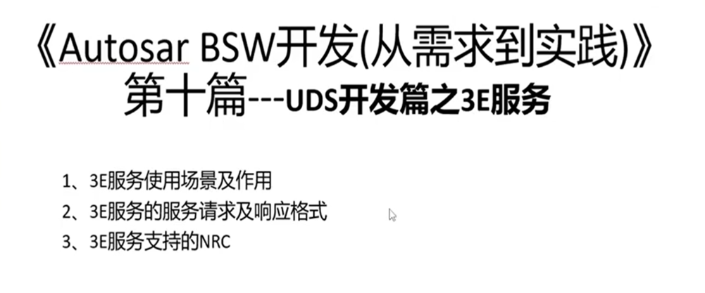
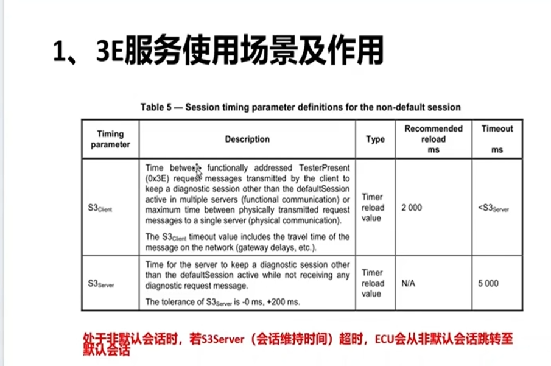
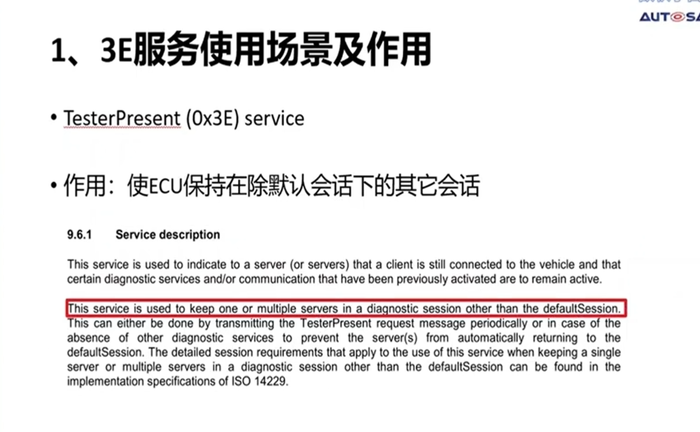
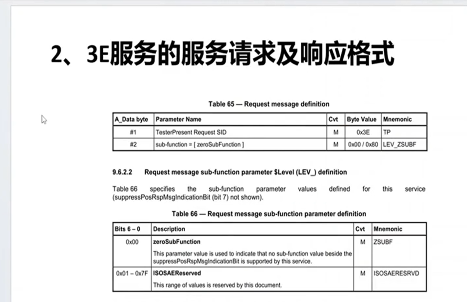
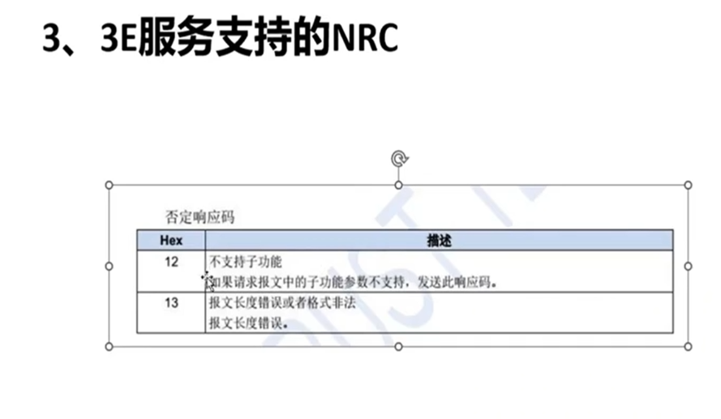
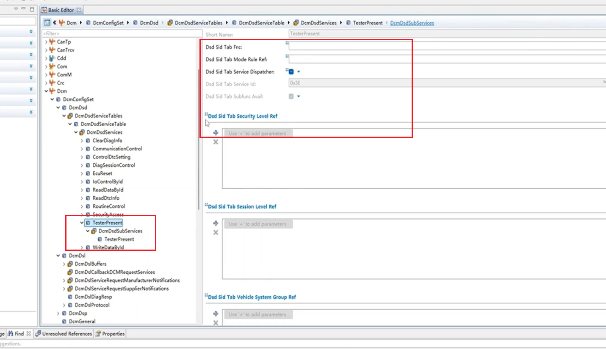

## 03 3e服务开发
> 目录
> 
> 非常简单
> 任何的服务请求都会刷新s3 server的服务请求
> 3e用来维持时间不会超时，3e服务没有任何其他作用
> test present
> 
> **使用场景及作用**
> 
> 
> **3e服务的服务请求及响应格式**
> 3e 80 肯定响应抑制位
> 
> **支持的NRC**
> 
> **BSW中配置**
> 只在dsl有定义
> 
> 