## 04  port dio 点亮led
> ### 4.1 对port引脚配置
> 主要关注三个属性
> 引脚方向、引脚电平、引脚功能
> 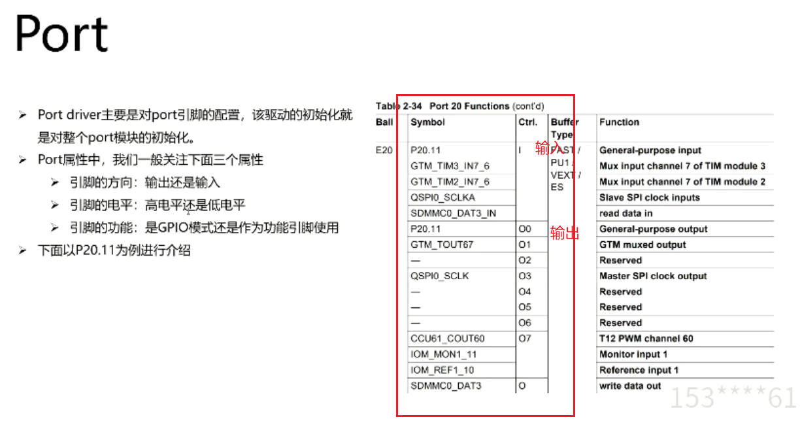
> ### 4.2 dio 模块
> port driver中没有给出控制引脚电平的API函数，当需要对引脚的电平进行操作时，需要通过DIO来实现
> 主要关注  dio port id和dio channel id
> 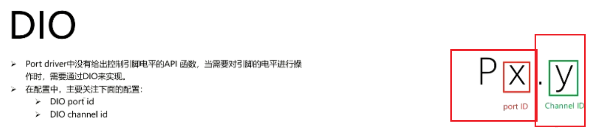
> 特别注意函数中调用的channelId是配置中两个id的组合
> channelid 是 dio_channel_2_5
> 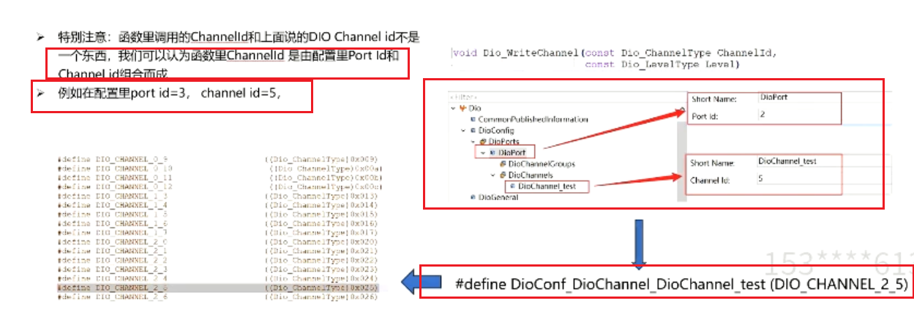
> ### 4.3 实操部分
> 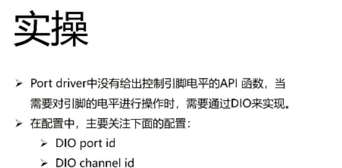
> mcal 配置
> 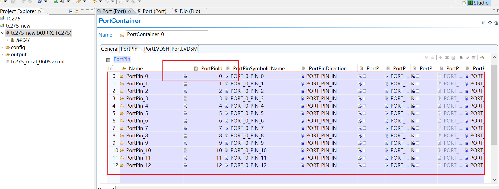
> davinci配置port和dio
> 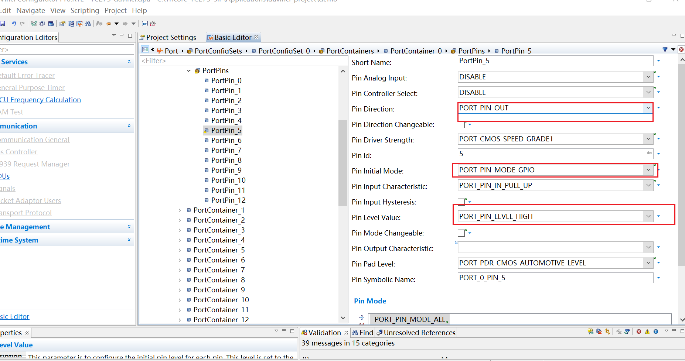
> 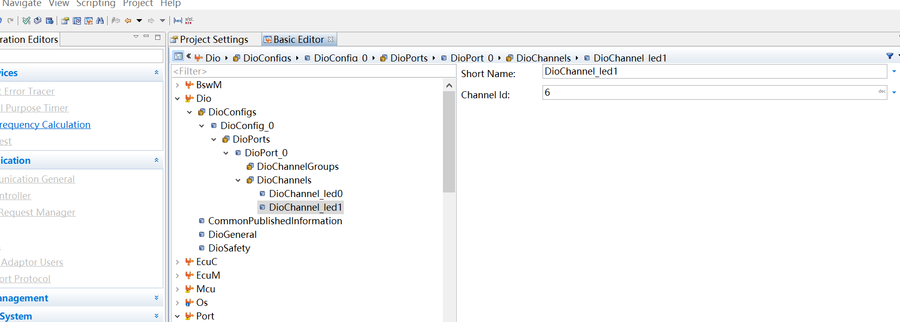
> 配置初始化
> 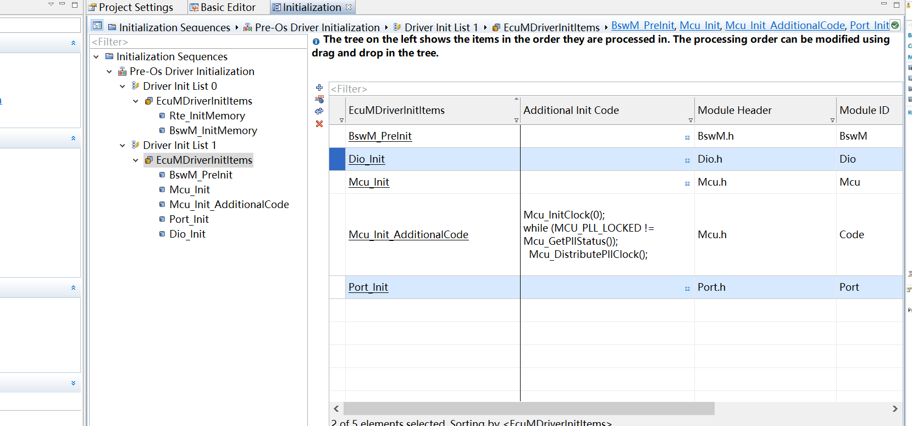
> developer中配置1s的任务
> 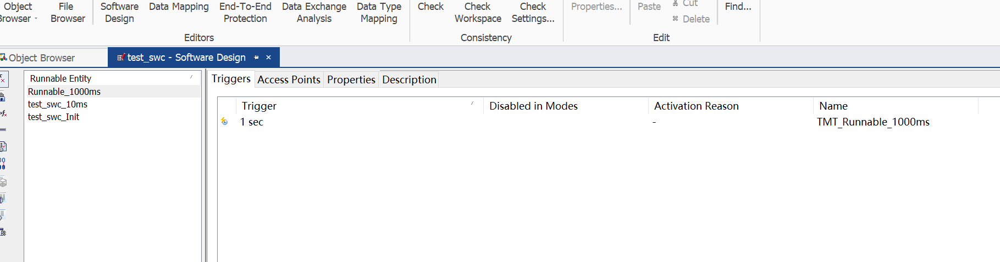
> bsw中添加task mapping 和 alarm
> 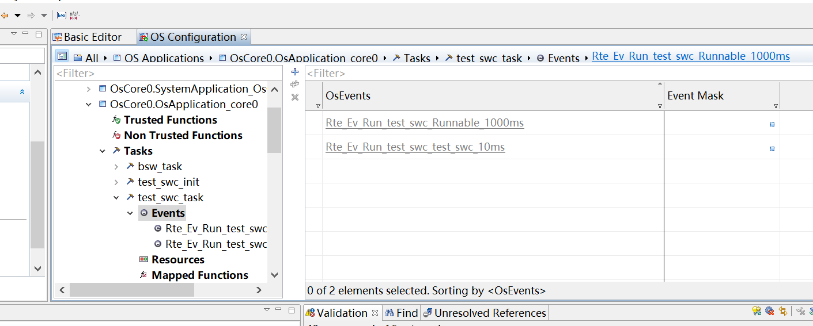
> 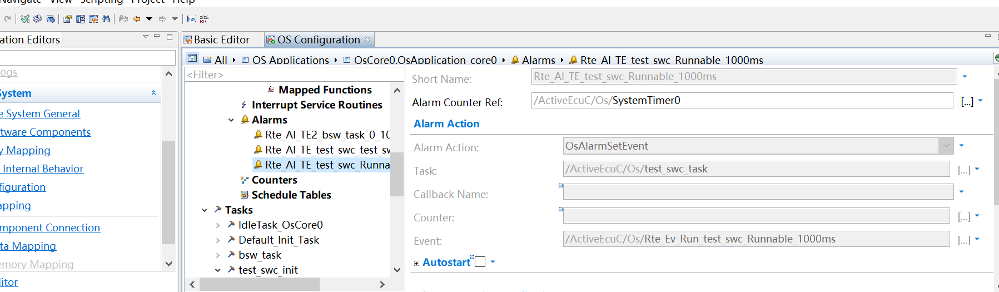
> swc中添加代码
> DIO autosar资料 sws
> 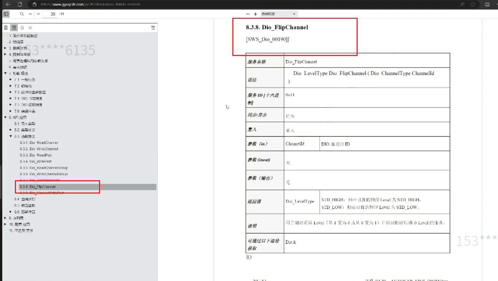
> 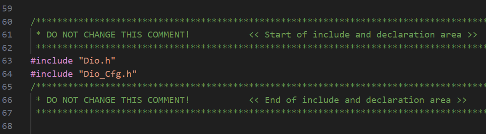
> 
> 编译配置中打开 dio
> 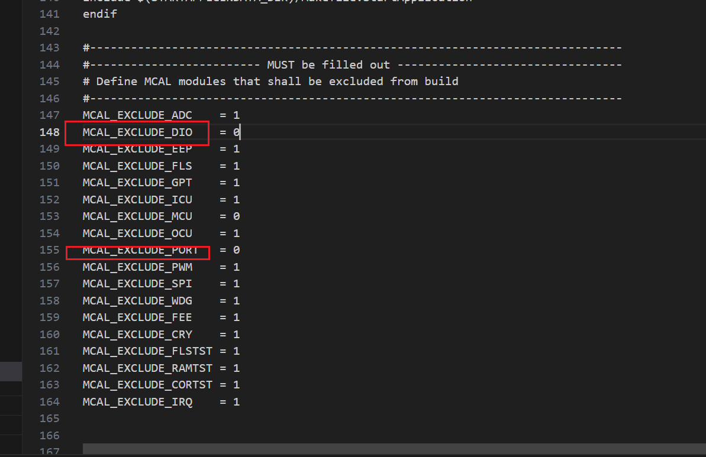