## 05 mcu时钟配置
> ### 5.1 概述
> 主要内容：时钟源，倍频，时钟分配
> 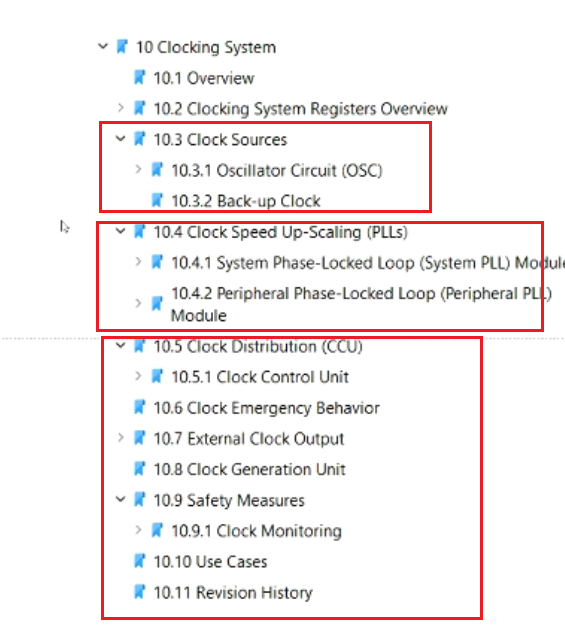
> 时钟分布图
> 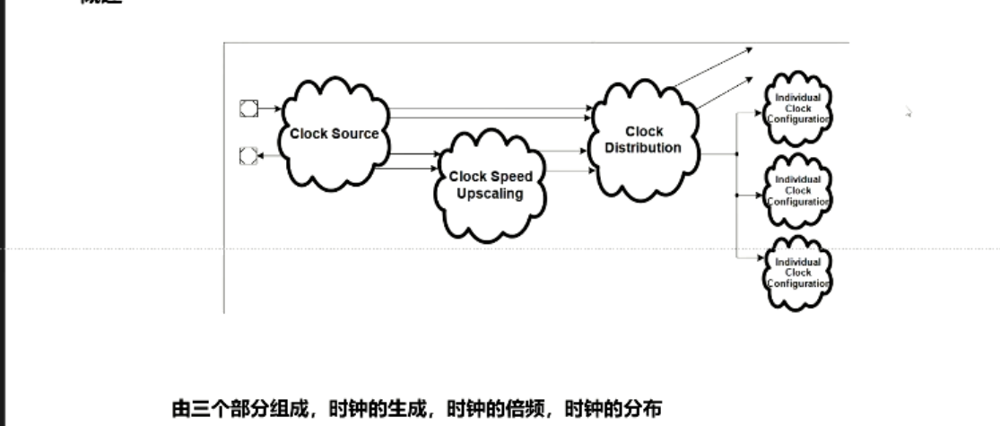
> ### 5.2 时钟生成
> 时钟源一般有两个（外部晶振，内部backup）
> 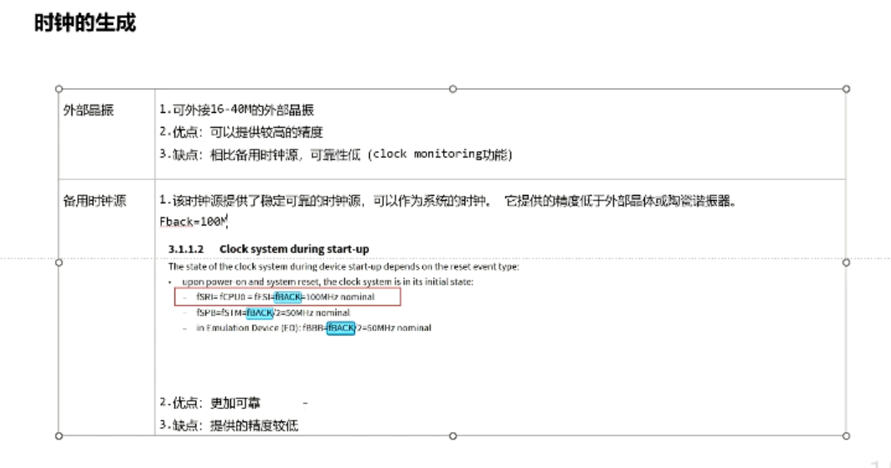
> ### 5.3 时钟倍频
> 由系统pll和外设pll构成
> 20M倍频到300M
> 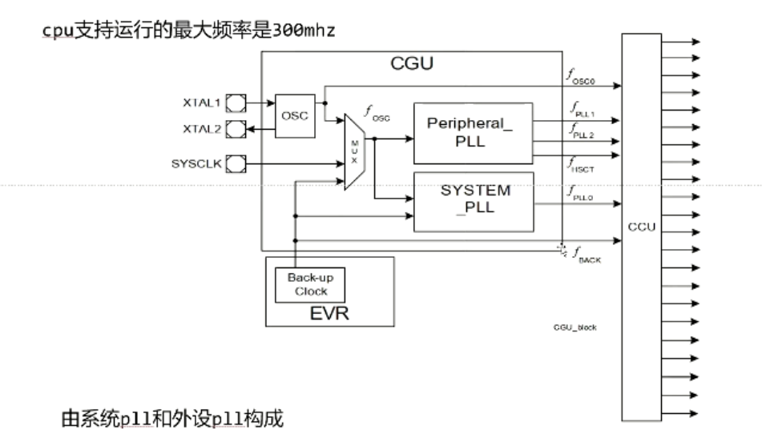
> 系统pll为例子，计算公式
> fpll0 由 N P K2计算得到
> 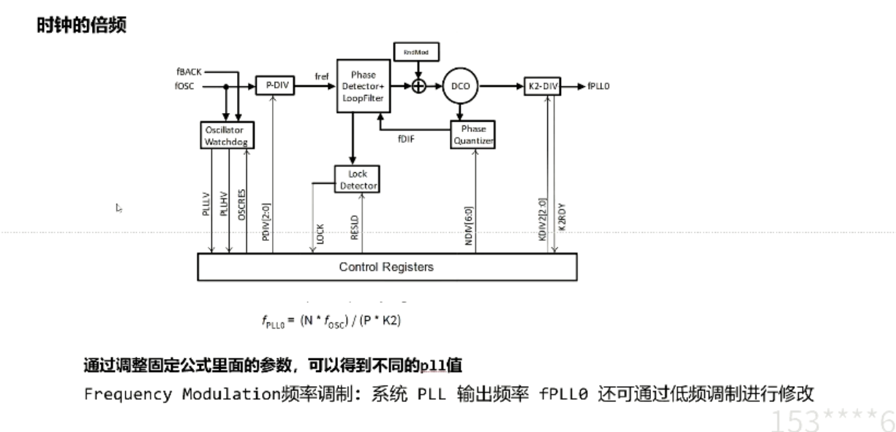
> 系统pll和外设pll异同点
> 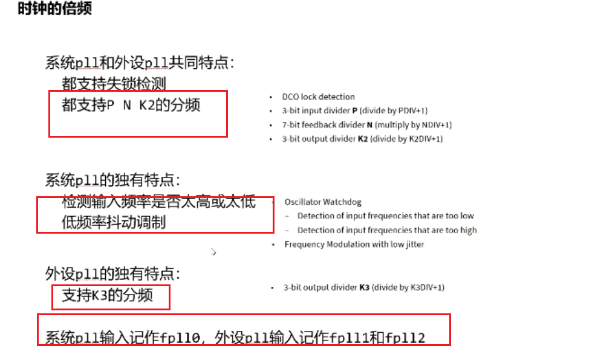
> ### 5.4 时钟分配
> 主要关注两点（时钟源是哪个，如何倍频）
> 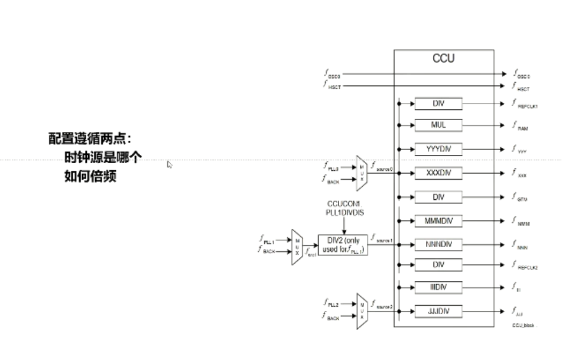
> 外部时钟输入
> 通过引脚提供两个外部时钟
> 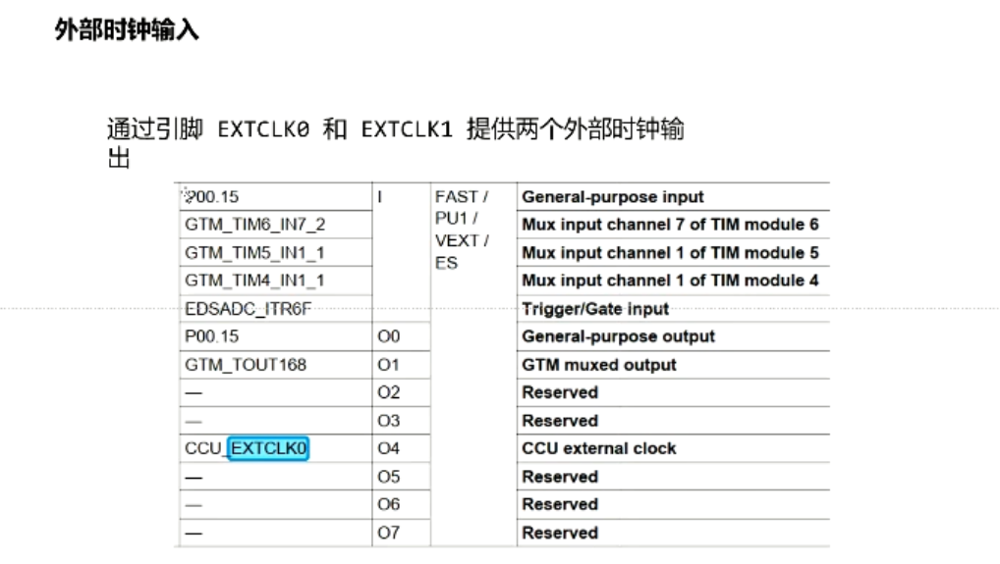
> clock monitoring 时钟监控
> 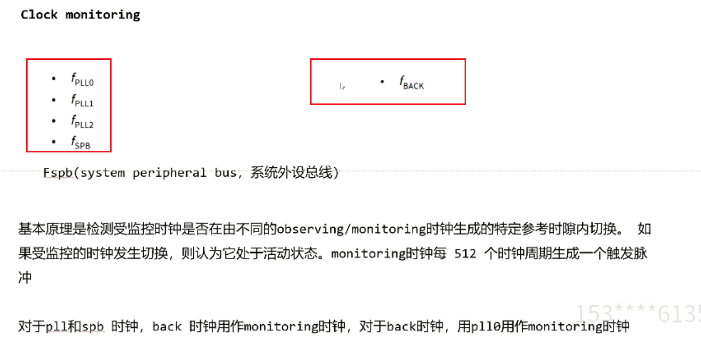
> ### 5.5 Mcan时钟分频过程
> 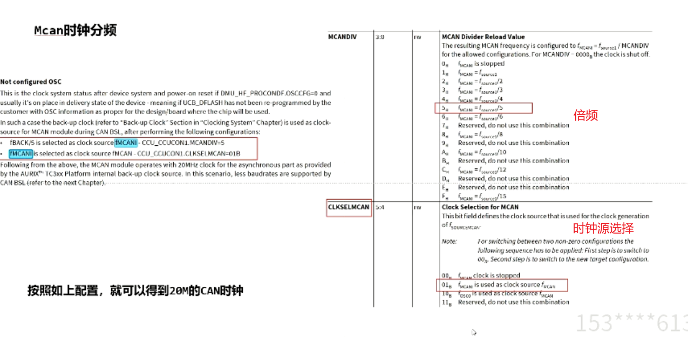
> ### 5.6 STM时钟分配
> 300M输入，1/3分配 得到100M时钟
> 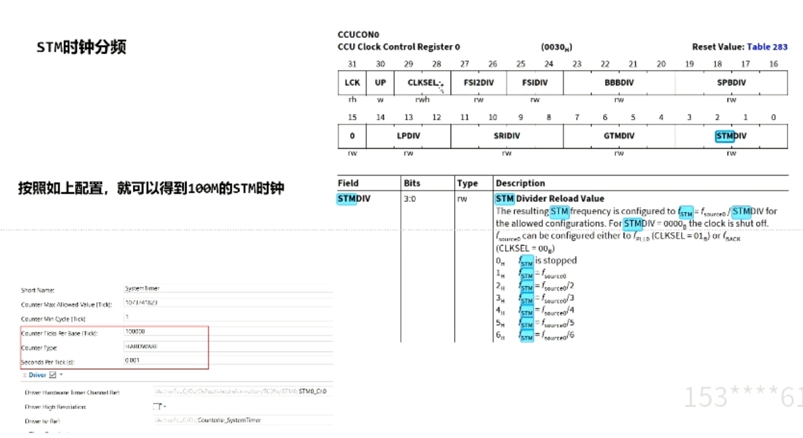
> ### 5.7 davinci配置
> 系统时钟配置
> 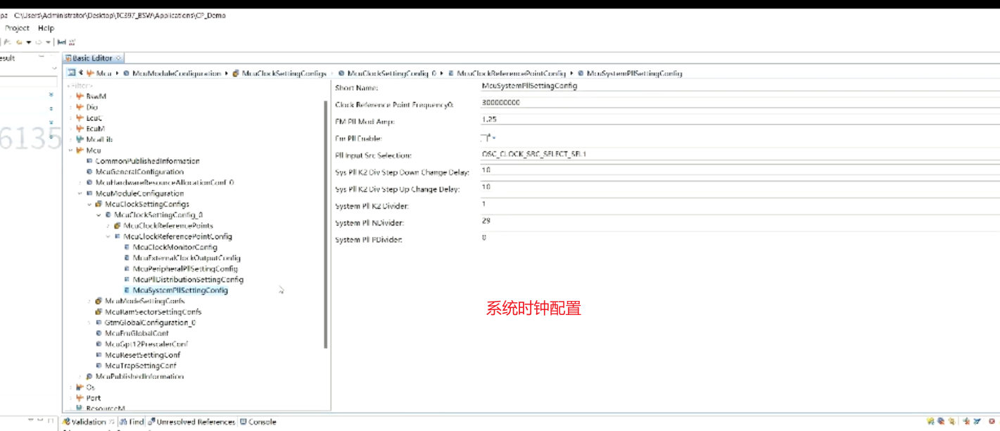
> 时钟分配
> 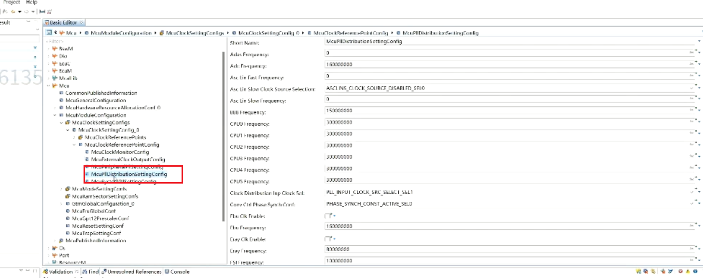
> mcan配置 时钟选择
> 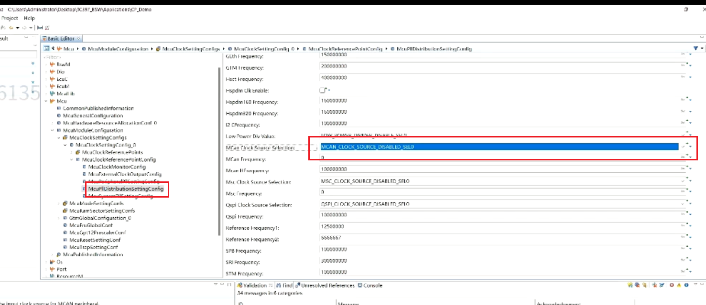
> stm时钟配置
> 
> 系统pll的配置
> 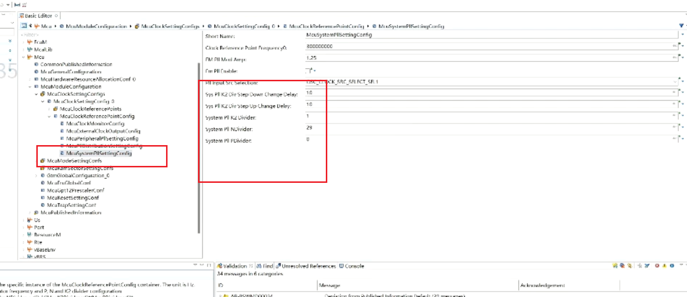
> 外设pll的配置，多了k3的配置
> 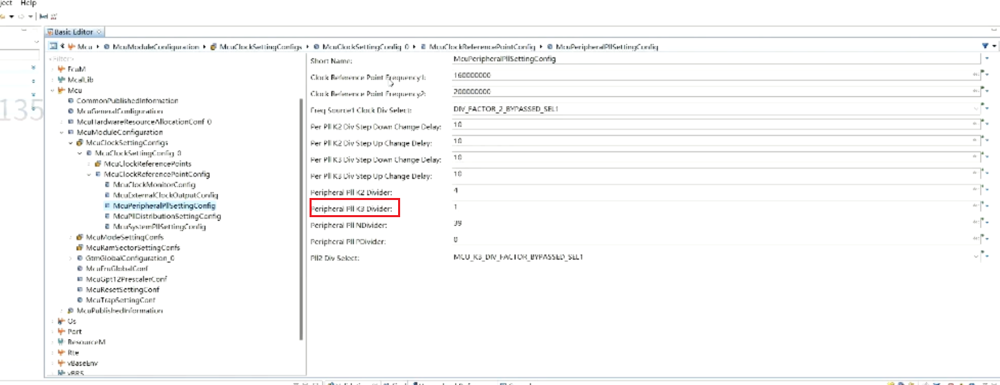
> ### 5.8修复时钟不准bug
> 修改vbrs中的system timer配置,配置成计算的100M（只是宏观参考，不会对板子有影响）
> 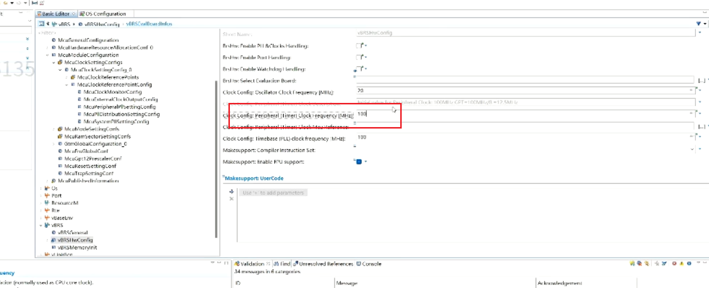
> 计数器对应更改
> 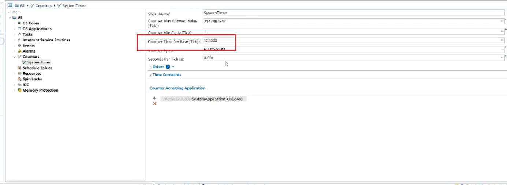