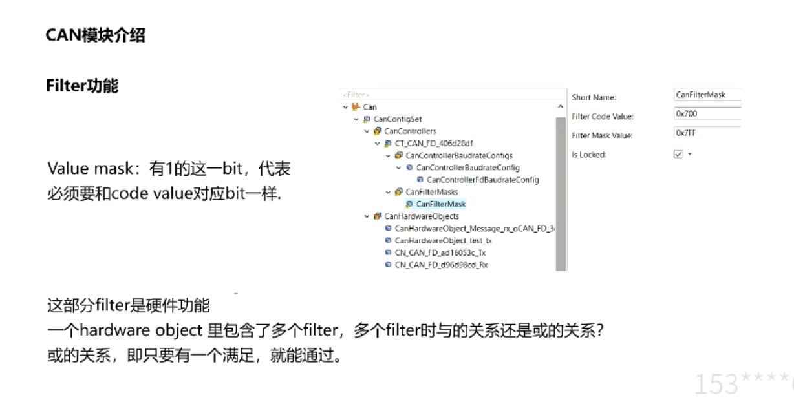

## 08 CAN模块高阶
> ### 1 硬件介绍
> 硬件
> 
> 内部有一段RAM区域作为发送与接收的缓冲区
> 通过寄存器设置，就可以将这些区域划为
> 配置不同的缓冲区
> 
> Mcan硬件介绍
> Tx Buffer
> 
> 总结
> 硬件单元有一段RAM区域作为发送和接收报文数据的缓冲区。这部分区域是有很多的寄存器来进行管理，配置buffer有数量限制
> 
> ### 2 CAN模块介绍
> can controllers 配置讲解
> 
> 基础地址选择
> 
> 引脚复用寄存器
> 
> tx rx的处理
> 
> 硬件配置 波特率 各个段
> 
> HarwareObjects 和 mailbox
> 属于软件部分的概念
> HWobject 包含CAN ID、DLC、Data等信息的RAM区
> HRH HTH 接收发送句柄 总称 HOH
> 
> 各个层之间的关系
> 
> ### 3 FULL CAN实操
> basic can 和 full can(只有一个ID，不需要filter)
> 循环消息配成fullCAN 事件型可以配成BasicCAN(诊断报文)
> Rx先不需要配置报文
> 
> 
> Txpdu buffer
> 
> buffer 又对应到了 hardware transimit handle，之后又关联到can hardware object
> 
> ### 4 Rx full can 配置 （硬件层 ）
> Rx 的full can 配置
> 
> 在filter选项中勾选full can
> 
> davinci中自动生成
> 公用的hoh 又自动创建了hoh
> 
> 
> filter功能 CAN ID过滤
> Code base 是基础 ，mask code是（掩码，1代表必须符合 0代表不关注）
> 各个fiter之间是或的关系
> 
> 
> 
> ### 6 API函数功能介绍
> Hardware loop check功能介绍
> 为避免无限循环，设置计数避免超时
> generic Pre Transmit
> 在write前 临时把数据 dlc等进行修改
> 
> generic confimation
> 接收后，首先对数据进行检查，不满足就不会进一步传递给上层
> 
> generic precopy ,类似上个函数
> 
> CAN ram相关功能
> 在can初始化前会把ram区域初始化，防止ecc问题
> ecc问题：在flash区域写之前就开始读，会报busoff,ecc问题
> 
> Ram check
> 每次调用 init controller前，内部调用CAN控制器RAM check
> 
> 中断相关 互相中断 nested can interrupts
> 
> interrupt lock 对can中断的禁止
> 哪个模块可以对CAN中断 disable和restore
>一般来说driver可以，但在某些安全等级下，can处于user mode,不能访问中断控制器，这时就只能用appl控制
> 
> 
> 
> safety相关的功能
> 获取外设寄存器的时候，会先调用一段os代码，使程序进入supervisor模式
> 
> safe bsw checks
> 执行函数之前检查无效参数，对于此组件映射到ASIL分区的安全项目，必须启用此属性
> 
> 其他API
> change baudrate api
> get status
> versionInfo Api
> Overrun Notification(接收报文时丢失)
> 
> ### 7 CANIF模块介绍
> 总体架构图
> 主要有两个配置，HOH、Pdus
> 
> 对应cfg配置
> 
> 
> CANIF模块 是对can controller模式进行管理
> 分为四个状态
> 
> 
> 模式切换，切换后再传给上一层cansm
> 