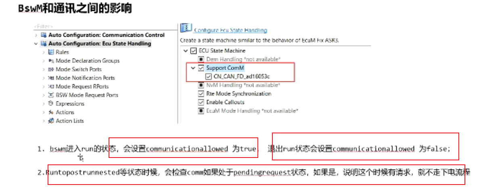

## 12 bswm_comm_comsm_busoff
> 通讯控制
> 
> 通讯控制整体介绍
> swc请求 comm_requestcommode
> communication control功能打开
> 
> 
> 
> 整体流程调用框图
> 
> ### 1 canif com模块回顾
> **canif controller模式**
> 通过canif_setcontrollermode进行切换，切换后会调用canif_controllermodeindication来通知上层
> 
> **canif pdu模式**
> 一般都是在set controller后，在indication中设置pdu模式
> 
> 
> **com模块 - ipdu group**
> 启用和禁用com ipdu的接收与传输
> 
> ### 2 bswm和通讯控制相关内容介绍
> bswm_genericstate:用来存自己的状态和其他模块的情况
> pending request 有获取与使用的地方
> state存bswm自己的状态，即流程图的状态
> 
> 
> 第二个变量 bswm_commchannelstate,表示comm的状态，只有是nocom的状态，才能退出run状态
> 
> cansm发出模式切换后，在indicatioN中告知comm,并存到comm_bussmstate,告知不是nocom，只有是nocom,才能从run到postrun
> 
> **配置工具**
> 判断是否有pending request
> 
> **action list**
> condition,每次评估规则时都执行操作列表
> trigger，每次评估结果发生变化时都执行动作列表
> 
> 
> **bswM和通讯之间的影响**
> **communication control**
> 勾选操作的意义
> 
> 
> 主要是bswm和cansm之间关联的过程
> 如果ipdu是关闭的情况下，则根据action不会发送
> 勾选的目的是打开ipdu
> rx_dm (deadline monitoring)
> 
> 
> 
> 
> 疑问点
> 
> 
> **support comm**
> 
> 
> wakeup to run 条件
> 
> comm allow action
> 告诉comm可以进行通讯
> 
> **comm和bsw之间的影响**
> 
> pending request 和 commchannelstate 表示com状态
> 
> cansm和bswm间也有参数会开启关闭ipdu group
> 
> 
> ### 3 comm
> status有三个：no com \silent com\full com （与bswm相关）
> 三个大状态下还有子状态 channel state
> silentcom 用户不能直接请求
> 
> 相关变量（comm_userreqfullcom comm_activecommode comm_comallowed comm_buscommodereq comm_bussmstate）
> 
> **内部处理过程**
> 内部处理过程
> 计算出最高的commode
> 
> 
> 真正模式切换的部分
> 
> 
> **与其他模块交互**
> 与swc的交互，通过rte连起来
> 
> service port 服务接口
> 
> 与bswm和cansm的交互
> 
> ### 4 canSM
> cansm状态机 （fullcom prefullcom prenocom ..）
> 
> cansm 状态变量（cansm_channelvarrecordc）
> 
> 
> 
> 
> cansm_universaltimer 用于保存一些时间参数
> 
> 
> lastvalidbaudrate 
> requestedcommode,对cansm请求的mode
> indicatedcommode,上次cansm上报comm的mode
> currentstate:非常重要，当前cansm的状态
> modeindicationresponsible，表明哪个function对cansm进行状态处理，必须等这个函数处理完了或nobody才能下个函数
> bswmindicatedstate和bswmnewstate,通知bswm新的状态
> busoff flag，busoff发生的次数
> **通讯控制相关处理流程**
> mainfunction,universaltimer为0后再进行状态切换
> 
> cansm_checkmodeindication
> mode进行比对，上报给bswm
> 
> 与其他模块的交互
> 
> **演示 full com request流程**
> 
> 断点调试 caninit函数 （no com 0x40）
> 
> 
> mainfunction中处理的地方
> 
> 
> 先屏蔽掉 fullcommution请求
> 
> 
> 没有请求full communication请求，稳定nocom 状态
> 