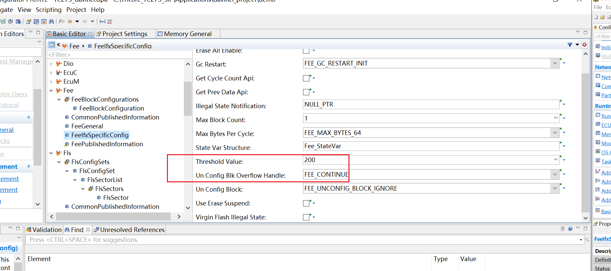
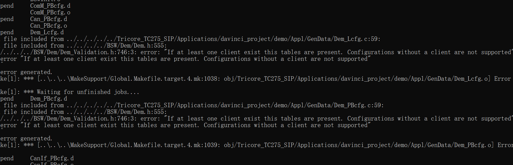
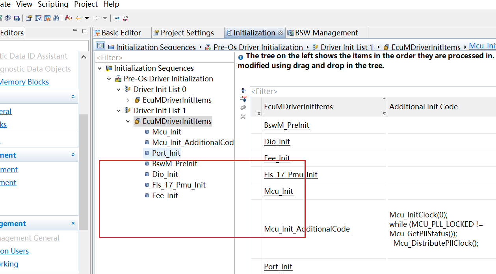

### 13 memory基础
> **目录**
> 
> ### 1 memory相关硬件知识介绍
>  共有15个segment 
> 所用的pflash就在segment 8,
>  每个pf就是一个bank
> 
> bank相当于一个更小的segment
> 单个bank不支持边读边写
> 
> sector 逻辑扇区 物理扇区
> 最小可擦除单元
> 
> page,最小可写单元
> 
> 
> burst模式，更大容量的写
> 
> 
> **memory中相关硬件知识**
> 
> ecc问题
> 
> ecc机制 会自动生成safety ecc code
> 
> ecc影响
> 对于ram重新写，对于flash 数据填充或禁用ecc
> 
> ### 2 存储模块整体介绍
> 存储相关模块整体介绍
> nvm:nonvolatile memory manager,统一按照block编号，不关心底层数据类型
> 
> 调用关系（同步调用）
> 
> 异步调用，真正写会有fls_mainfunciton中写 
> 
> ### 3 fls模块介绍
> api规范
> 
> 有的芯片需要check
> 
> **操作模式**：normal 和 fast
> 
> **access load** job开始时候，把flash access的代码放在ram中，最后卸载
> 
> ### 4 fee模块
> 尽可能使各处flash同时达到使用寿命  
> 最常用double-sector算法
> 
> double sector算法
> 每个sector有两个类型，stage page(erased valid)和data blocked(blk)
> 
> stage page(sector擦除、sector有效)
> 
> data block
> 
> **sector switch 过程**
> 
> 
> 
> **准静态数据块**
> 准静态数据块单独有管理器处理，数据量大，较少更新
> 
> 
> 有了qs之后的flash分布情况
> 
> **virtual page size**
> 避免误操作相邻芯片，设计一个虚拟地址
> 达到隔离的目的，应为物理地址的整数倍
> erase all enable选项
> 
> **两个工程数据共享**
> 要保证两个工程之前的配置完全相同
> 
> blank check功能
> 
> ### 5 nvm模块
> **实操部分**
> **添加fls fee memif nvm**
> **配置mcal**
> 
> 
> **添加函数映射**
> 
> **把对应的模块添加**
> 
> **添加dem模块避免编译报错，添加nvmblock**
> 
> 
> 
> 
> 
> **添加一个dem client**
> 
> 
> **配置初始化**
> 
> 
> **新建几个测试的block,注意readall配置**
> 
> 
> 
> **nvm关联到swc ,打开service port**
> 
> 
> 
> **swc层配置 打开enable api usage**
> 
> 
> 
> **解决一些编译问题（ramblock没有找到）**
> 
> 
> 
> 
> **调试过程**
> 测试nvm读写
> 、
> 出现问题 det error id 0x15
> 
> 
> 调试，观察fee_write是否有被调用
> 
> fls read write未被调用
> 
> 查看fee_mainfunction是否调用
> 
> 
> 排查后发现，fls完成后需要notify,非常关键的配置(fls和fee模块都要配置)
> 
> 
> 
> 重新再擦除下dflash后
> 
> 测试结果正常
> 