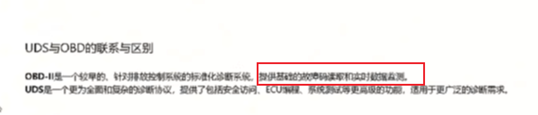
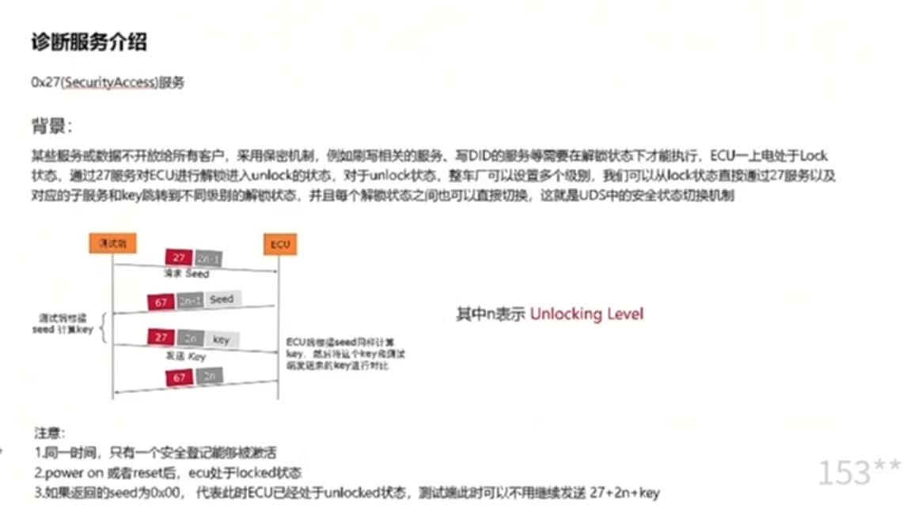
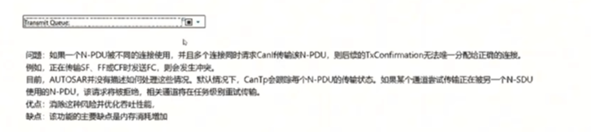
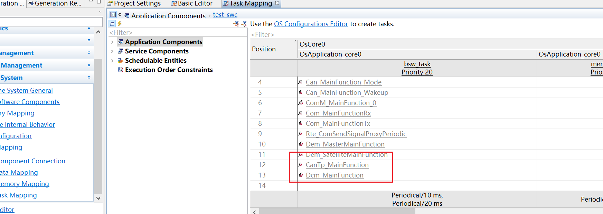

## 诊断概述
> 目录
> 
> ### 1 概述 诊断报文类型介绍
> UDS unified diagnostic services
> 
> 
> 整体架构（重要14229-1：基本规范和要求 15765-2：分包组包 11898 can协议）
> 
> 物理寻址（1对1）和功能寻址（1对多）
> 
> uds和obd（更早的协议）
> 
> 诊断报文类型（单帧 多帧(首帧 连续帧 流控帧））
> 流控帧 告知发送端的接收能力
> 
> 
> 
> 首帧
> 
> 流控帧 注意block size
> 
> 连续帧
> 
> 报文类型介绍
> 
> stmin 当为0时立即发送
> 
> ### 2 诊断服务介绍
> service id
> 
> 四种服务类型
> 
> 负响应 7f + sid +nrc码
> 
> 时间参数 p2 p2*(收到78后，参数切到p2*)
> 
> 诊断服务 10服务 诊断会话
> 
> 时间参数s3 不发送请求下保持活跃的最大时间
> 保持需要发送3e服务
> 
> 11服务 ecu reset
> powerdown time，标识ecu处于断电状态的时间
> 
> 27服务 securityaccess
> 
> 22服务 did服务
> 有些did被uds定义，有些预留给主机厂
> 
> 压抑正响应
> 3e服务，不需要响应
> 
> 刷写序列
> 
> **UDS ON CAN  autosar框架介绍**
> 多了cantp
> 
> ### 3 cantp层
> **cantp层介绍**
> 分为发送和接收 dcm->pdur->cantp->canif 异步
> 第一阶段 start connect
> 第二阶段 copy 发送
> 第三阶段 confirmation(有数据还会继续发送，否则通知上层)
> 
> 接收过程 异步接收
> 
> non-strict length check
**> 非严格限制的长度检查**
> 
> **only notifiy informed app**
> 根据规范来的，打开功能后可以避免过多的回调
> 
> **reject stmin**
> 带有无效STmin的流控帧会终止正在进行的传输
> 
> **dynamic channel assignment**
> 每个n-sdu应分配一个连接通道，但并非都要处理，cantp提供可以并行使用的通道数量的选项
> 减少运行时开销
> 谨慎使用
> 
> **single rx buffer optimize**
> 只使用一个缓冲区 谨慎使用
> 
> **transmit queue**
> 用在双工的情况下，同时发送接收
> 建议打开
> 
> **sych trans**
> 同步传输
> 
> **stmin by application callout**
> 使用条件，配置stmin小于cantp的周期
> 解决方法：cantp提供一个可选的调用接口，需要stmin时，会通知应用程序(外部计数器)
> 
> **channel mode**
> 全双工 半双工
> 
> **constant block size**
> 定义了接收过程中块大小bs保持不变
> 节约资源
> 
> **block size**
> 定义流控帧之间传输最大的帧数
> 配置的稍微大一些
> 
> **rx wft max**
> 指定接收方可以连续发送多少个状态为wait的流控帧（fc）
> 当值为0时，不允许延迟接收，
> 
> **时间参数**
> stmin 收到txconfirmation后开始计算，当stmin为0时，每个ce会在前一个cf之后立即传输
> 
> ar br cr 等时间参数
> 
> 可能会产生抖动的现象，注意问题排查
> 
> **canfd相关的配置 padding activation 选项**
> 
> **配置建议**
> cantp没有重发机制，建议在canif中启用缓冲功能
> 
> **其他功能 不是在davinci中配置 cantp中定义**
> 
> 
> 中断中会发送流控帧
> 
> ### 4 dcm 模块 非常重要
> dsl->pdur
> 
> 添加cantp和dcm(属于communication) dem属于diagnostic
> 
> 主要是 dsp(diag service process) dsd(diag service dispatch) dsl(diag session layer)
> 
> 10服务为例
> 报文处理在dcm_diagtaskworker
> dcm_service10processor 处理10服务
> dcm_diagtasktx，为发送报文准备，将回复的报文组合
> dcm_nettasktx,最终调用pdur发送报文
> 
> 
> **dcm发送流程**
> confirmation在中断中
> dcm_diagtasktx中处理
> 
> **api介绍**
> notification函数
> 
> 
> 主机厂和供应商的notification开关
> 
> indication function 开始处理时调用
> confirmation function 服务结束时调用
> 
> **0x10有关功能介绍**
> 参数配置p2 p2*
> 可以通过p2 server adjust和server adjust来调节发送端延迟的问题（相当于提前一个周期）
> 
> 
> 
> service table定义
> 
> session 定义 
> 
> **session changed**
> 如何获取session changed(可以通过rte接口，或是callback)
> 
> **0x11服务 reset**
> 
> powerdown time 配置
> 
> **配置session table**
> 
> **22服务**
> 
> ### 5 dcm 进阶功能介绍
> **27 服务**
> 解锁功能 level delay time是否在nvm中
> 
> 
> 
> **和response有关的功能**
> response all request(有些正相应的id,不应该被使用)
> 
> on second request(并行发送nrc)
> 
> 每个客户端需要保留ram供dcm通信使用
> 
> 限制回复nrc78的数量
> 
> **dcm和comm之间的交互**
> 
> dcm通过调用接口让comm处于活跃或是非活跃的状态
> 
> keep alive time (ms) (非默认会话生效)
> 
> **其他功能**
> split tasks enable ,拆分主函数，放在不同的优先级中
> 
> 函数周期的设置
> 
> dsl定义的值
> 两个或多个协议共享同一缓存区
> 
> 一些重要信息下电前的保存与恢复
> 
> 实现nrc保存的功能
> specific cause code enabled
> 
> ### 6 dcm 实操介绍
> 创建3e服务
> 
> 选择buffer
> 
> 新建六个pdu
> 
> 
> 配置物理寻址，ecuc pdu buffer
> 
> 配置pdur 路由表
> 
> 配置canif buffer
> 
> 配置pdur mode
> 
> cantp dcm task mapping 
> 
> 初始化
> 
> 编译出错
> 
> 添加函数
> 
> 完成验证
> 
> **搭建10服务**
> 
> **配置27服务**
> 
> 配置security 
> 
> 添加compare key ,gen seed
> 
> 
> **配置22服务**
> 
> 添加did
> 
> 
> 选择fix length
> 
> did帧中也配成16bit
> 
> 使用同步的port口
> 
> 增加一个读的权限
> 
> **DCM 发1002 后下电流程**
> 有些数据需要存储，fbl使用
> 
> testsourceaddress
> 
> 这个两个函数非常重要，与fbl交互，传递很多信息
> 