## 开发环境准备
> 产品命名规则
> 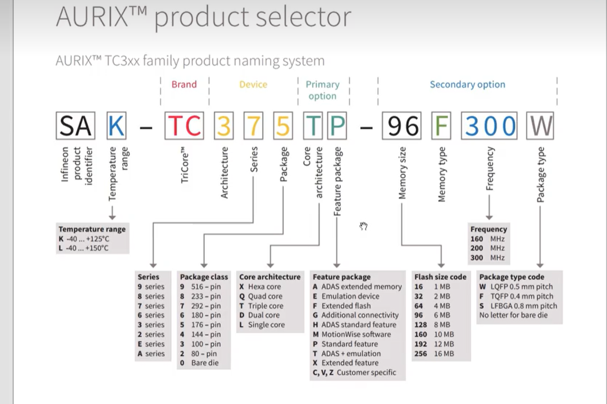
> 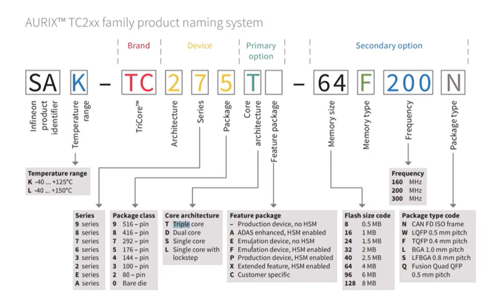
> TC275数据手册
> 两个p核 一个E核，（包括两个锁步核）
> 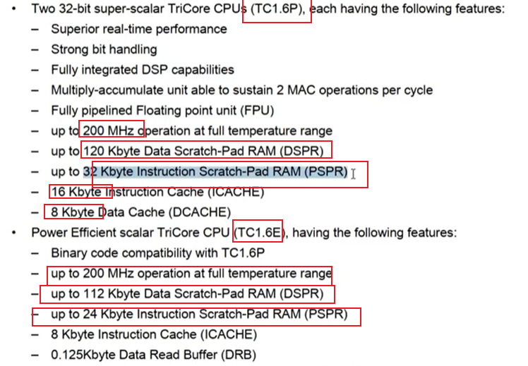
> 4M pflash 384k dflash 32K Memory( LMU )
> 
> 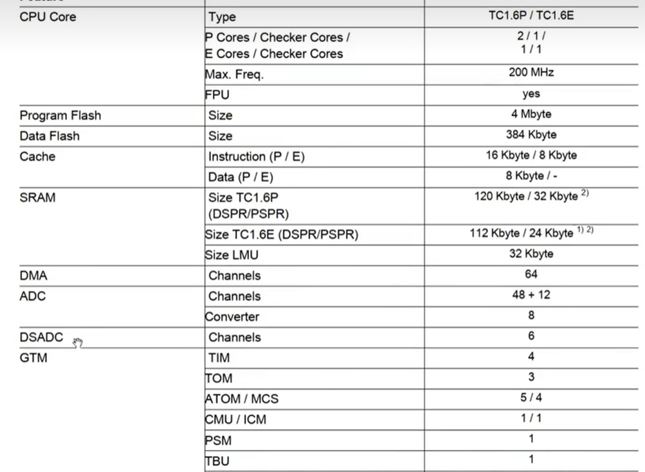
> 四路can
> 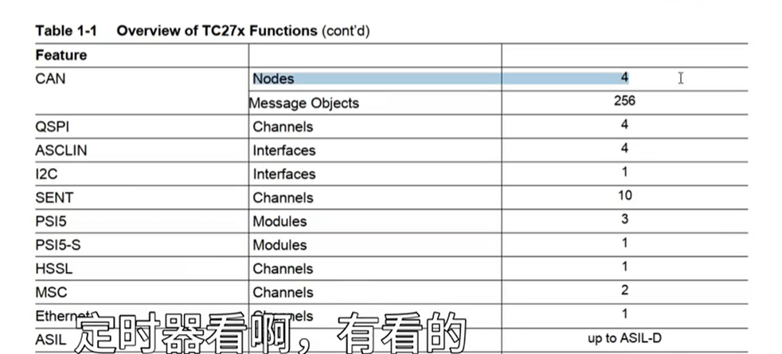
> 数据下载
> 
> #### 创建工程模板
> 文件组织结构
> 
> ### can通讯学习
> 数据手册
> 
> can资源 （4个node 共享 256个mo）
> 
> 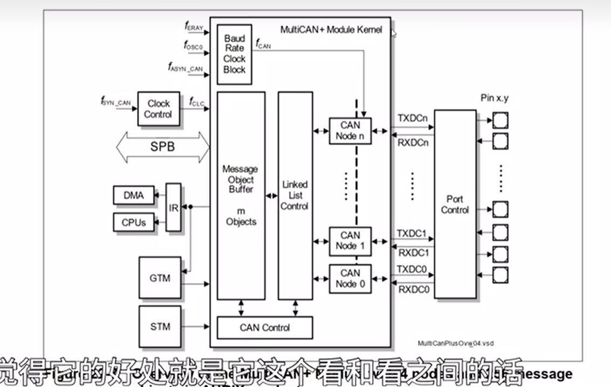
> structure
> 
> 回环模式是挂载到内部虚拟can上和stm32有所区别
> 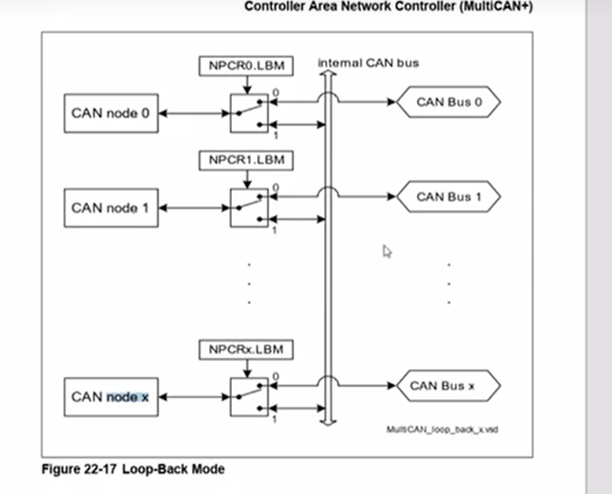
> 配置成fifo模式
> 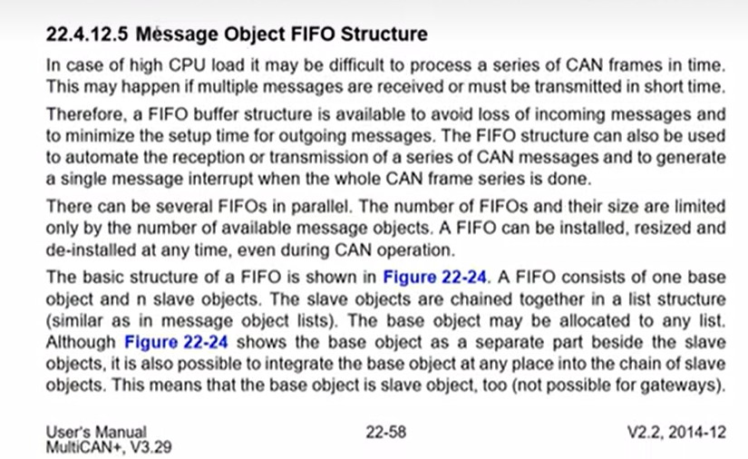
> 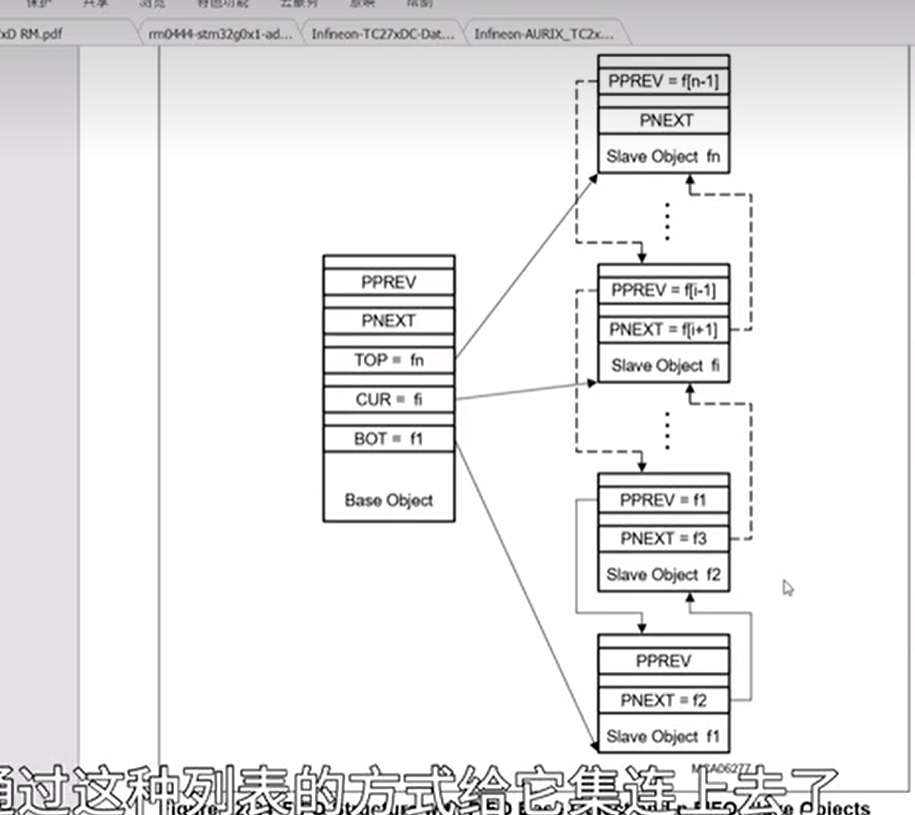
> 使用步骤
> 
> 
> 内部寄存器
> 
> 中断
> 
> 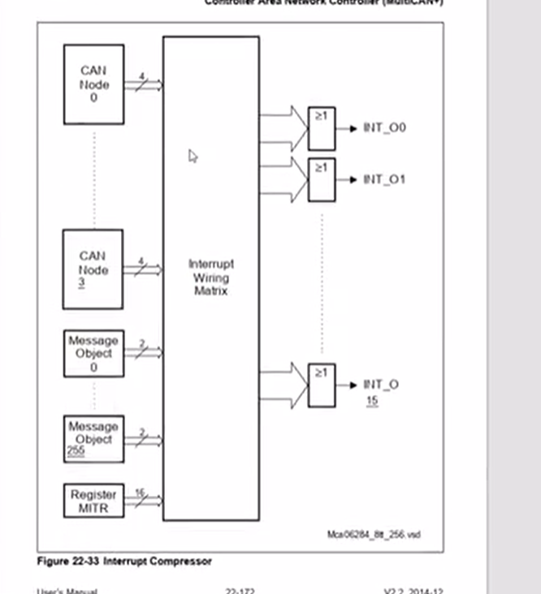
> 
> 资源的分配（自定义）
> 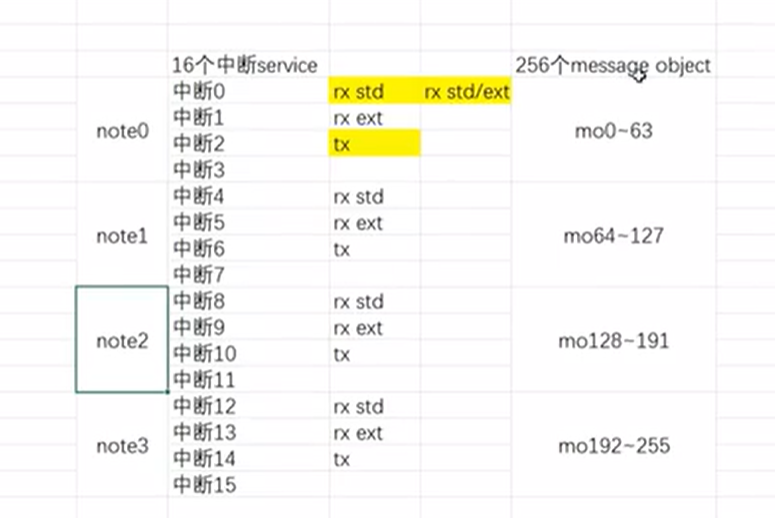
> api
> 
> 
> #### memap 和 flash操作
> ram空间
> 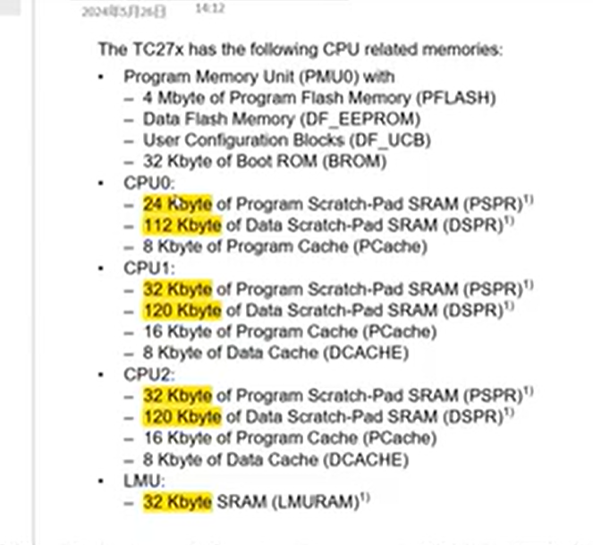
> flash资源
> 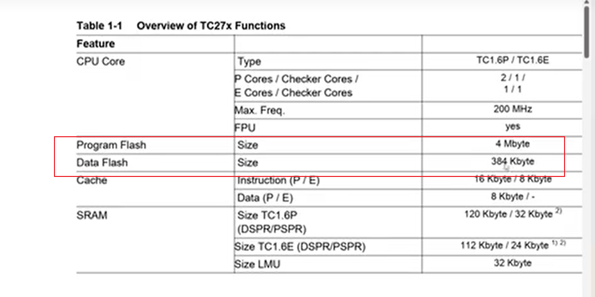
> bootrom
> 四个启动地址 依次遍历是否有头
> 四个启动地址只在pf0中
> 
> 
> 
> 启动流程判断
> 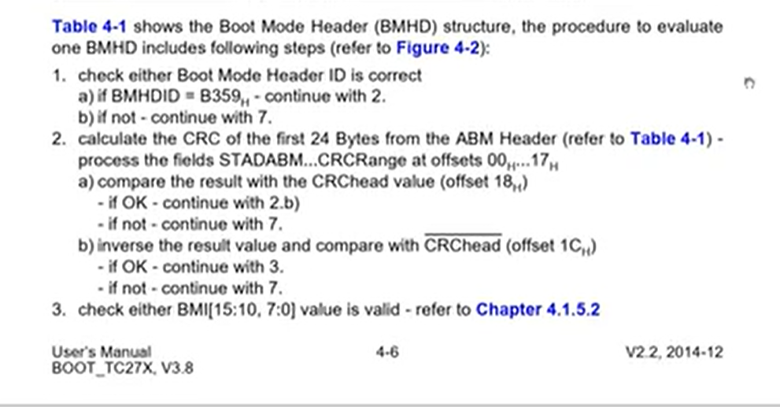