## can 驱动学习
> can模块架构
> 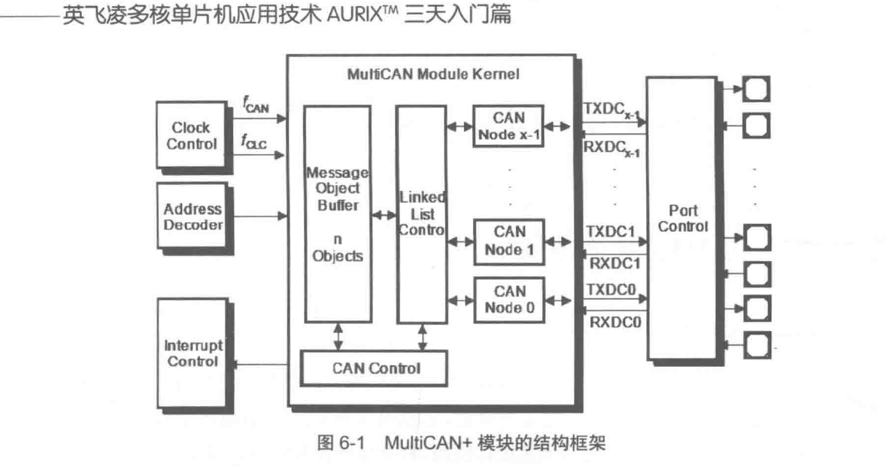
> 由can节点、报文控制器、列表控制器组成
> 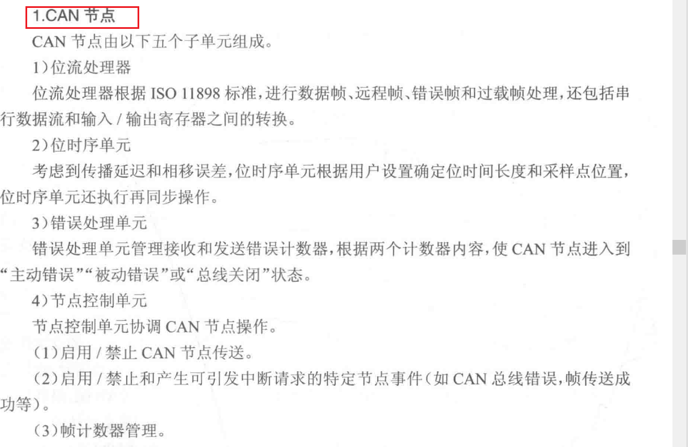
> Message Object 报文控制器
> 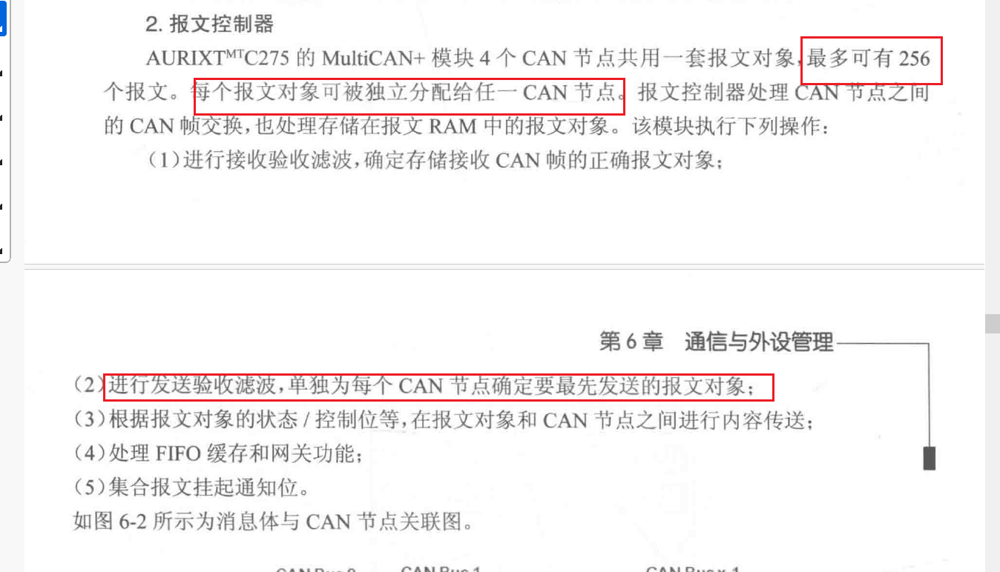
> 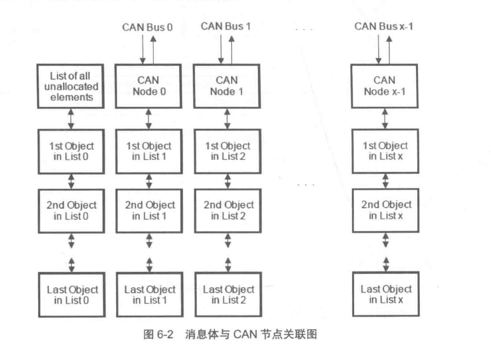
> 列表控制器，按照双链列表形式组织
> 执行所有双链报文对象的修改操作
> 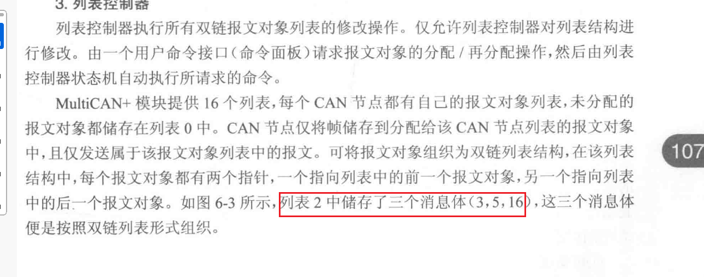
> 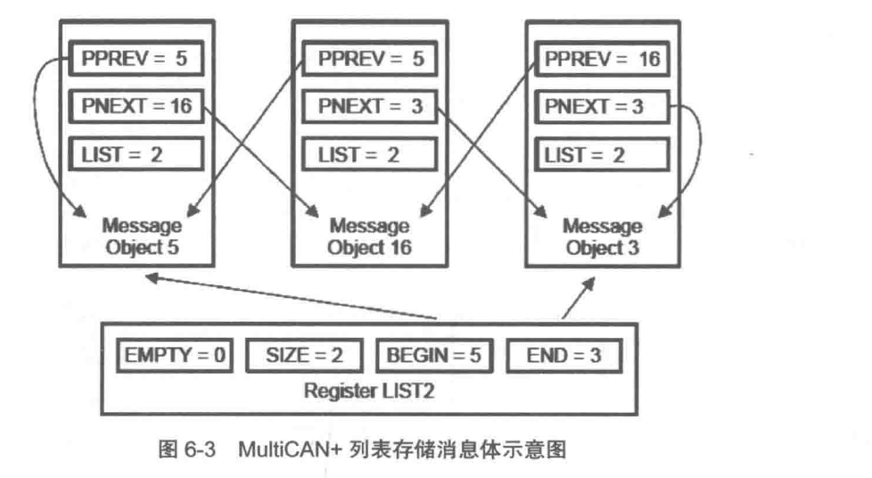
> ### 主要寄存器
> 主要有三组寄存器：全局模块寄存器、节点寄存器（针对节点）和报文对象寄存器（针对MO）
> 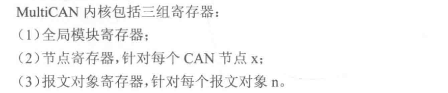
> 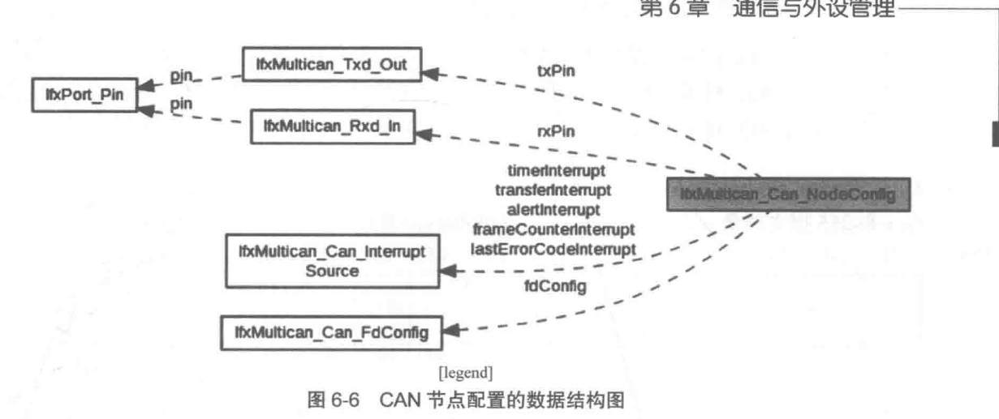
> ### 配置过程
> 配置分成六步：首先定义CAN模块必须的全局变量，分别针对can模块、can节点、发送/接收结构体进行初始化，确定can功能正常使用，然后调用发送函数把采集到的变量消息以消息体形式发送出去，调用接收函数来接收CAN消息
> 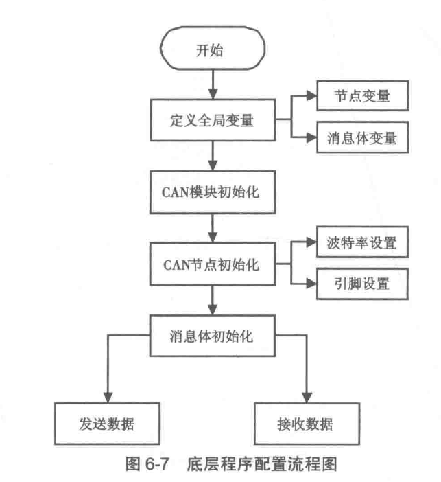
> ### 实际运用
> 1、定义全局变量
> 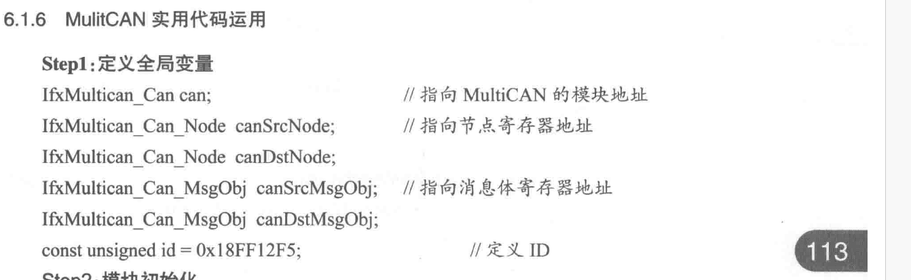
> 2、模块初始化
> 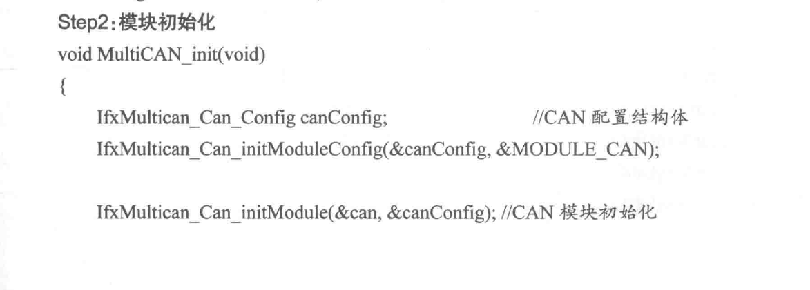
> 3、CAN节点配置初始化
> 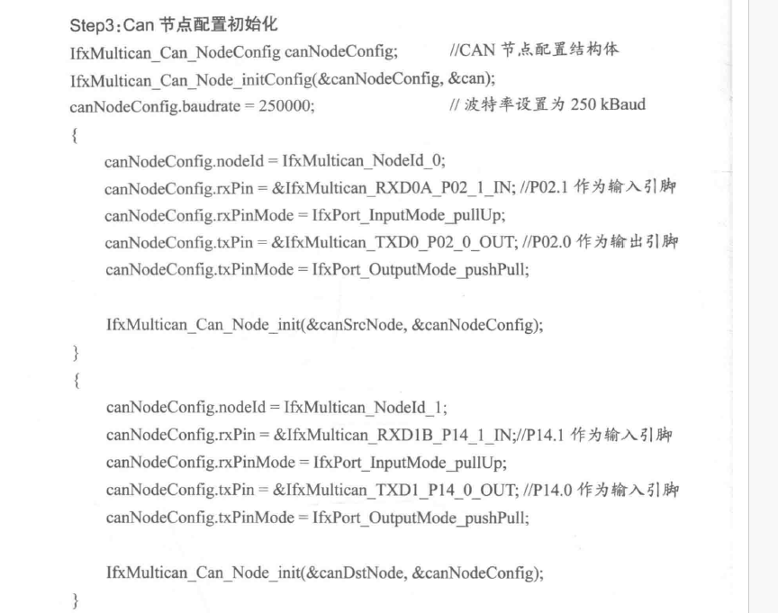
> 4、 can消息体初始化，包括消息体ID、帧格式、数据长度
> 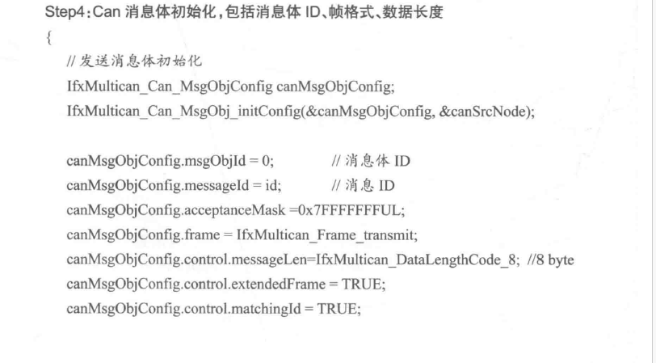
> 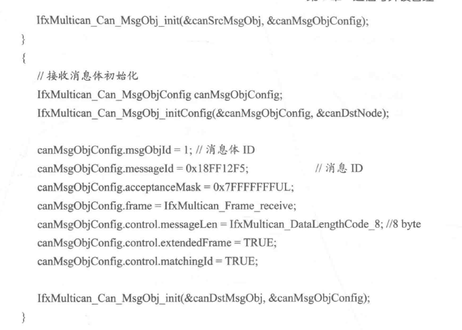
> 5 发送数据
> 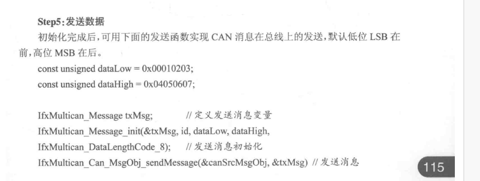
> 6 接收数据
> 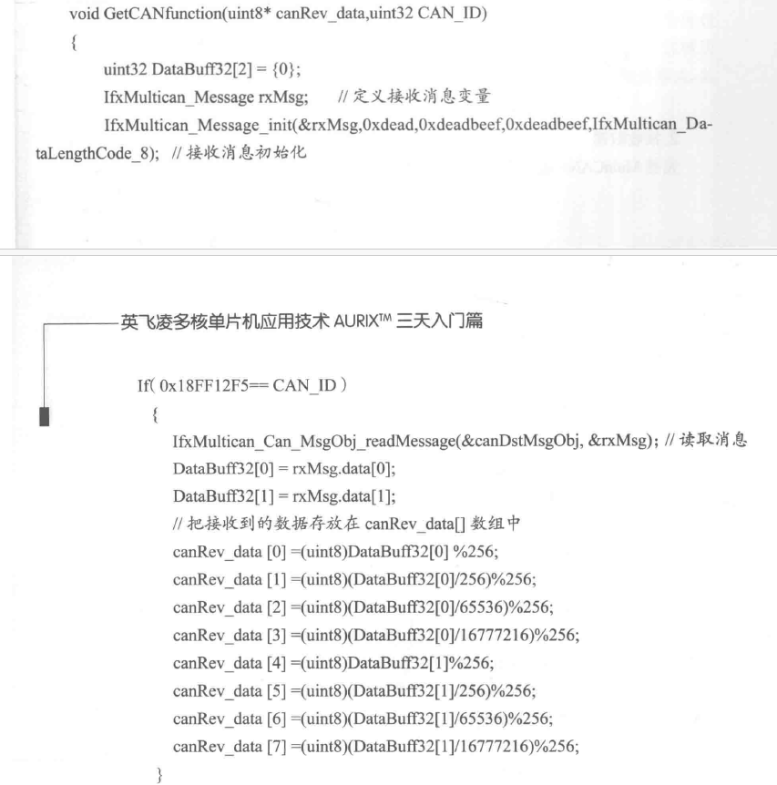