## VIT
### 01 transformer发家史介绍
> 在cv中火了
> 
> 发家史
> 
### 02对图像数据构建patch序列
> 回忆工作原理
> 
> 
> 整体架构分析
> 先分成小块，通过卷积向量化，在通过全连接层
> 
### 03 VIT整体架构解读（encoder任务制作backbone解决分类任务）
> 整体架构 每个位置也有个位置编码（空间坐标的形式，或也可以不加）
> 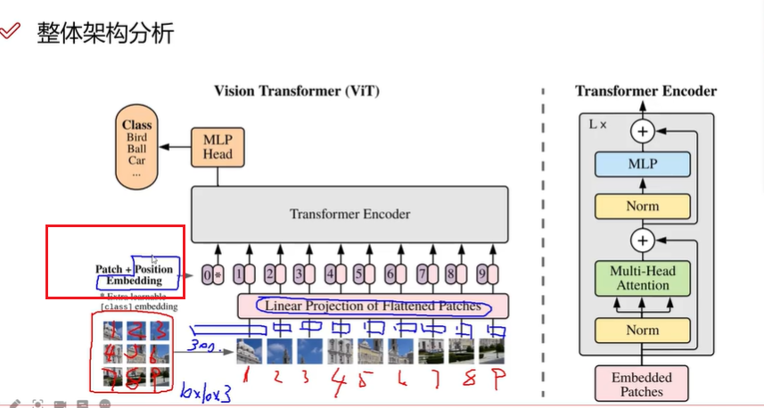
> 分类任务
> 最终输出也是1，2，3，4，5，6，7，8，9的编码（更高维度）
> 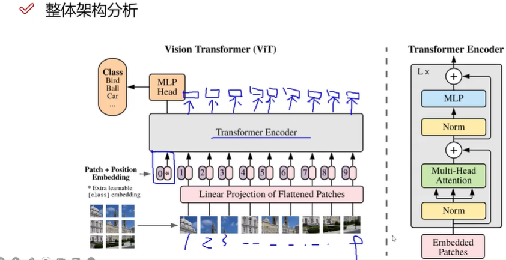
> 多加一个头，获取全局编码
> 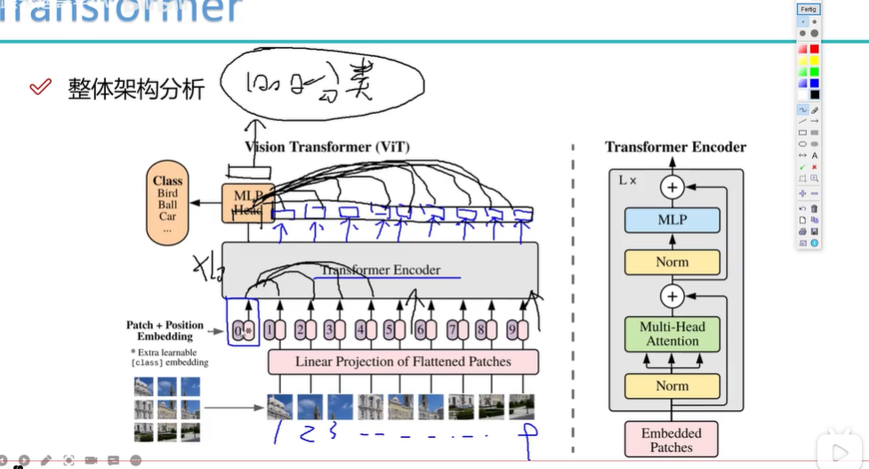
### 04 CNN最大的问题
> 感受野 卷积层数增加 感受野增大
> 传统卷积需要堆叠大量的卷积层
> > > transformer 不需要堆叠，直接可以获得全局信息
> 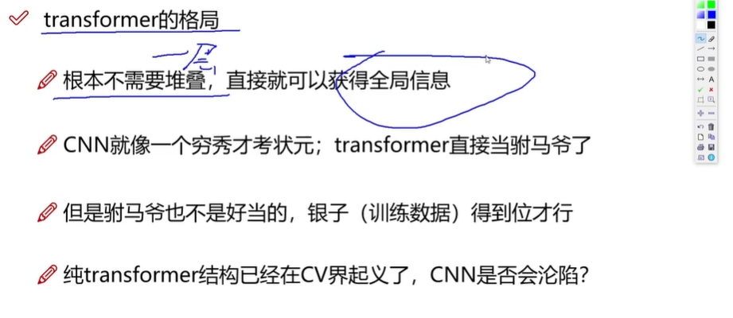
### 05 计算公式解读
> 公式介绍 z0输入 y输出
> 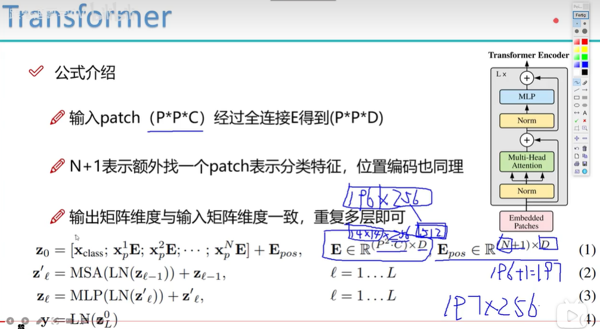
### 06 位置编码与TNT模型
> transformer 格局很大 能感受更深的视野
> 全局信息丰富
> 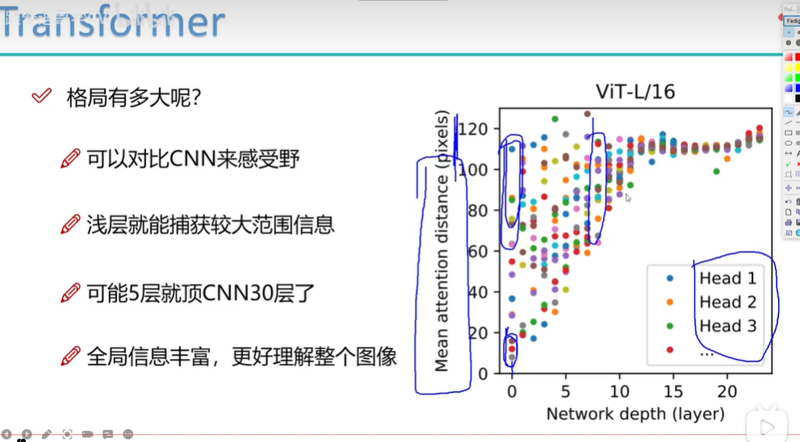
> 位置编码（用简单的就行）
> 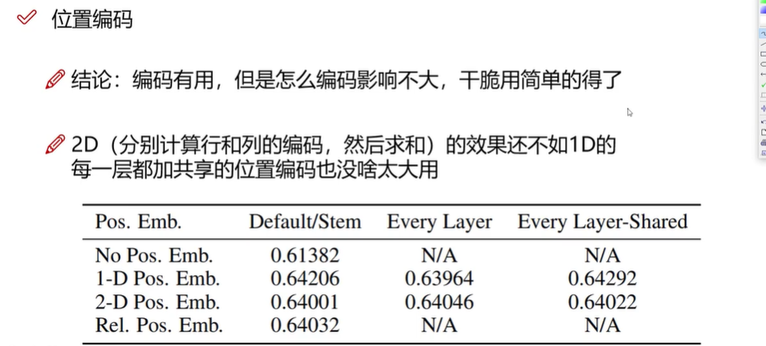
> 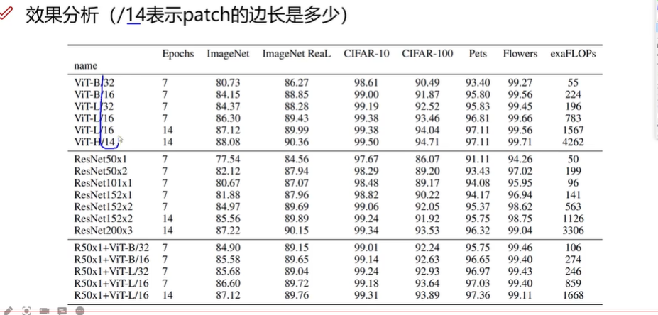
> TNT transformer in transformer(拆分更细的patch)
> 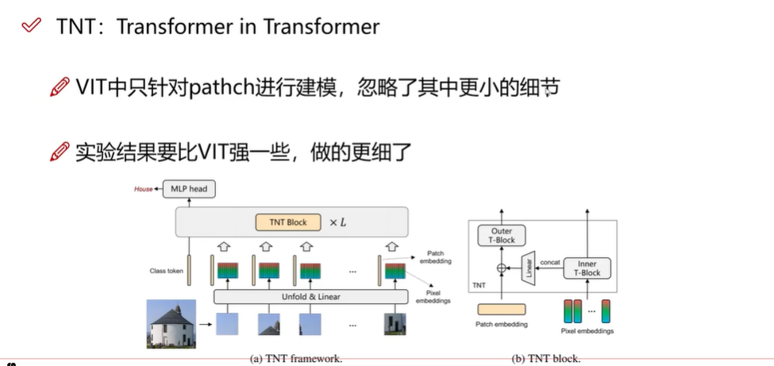
> 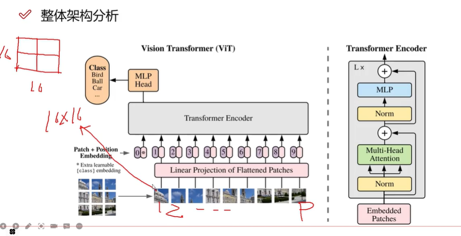
### 07 TNT模型细节分析
> TNT基础组成
> 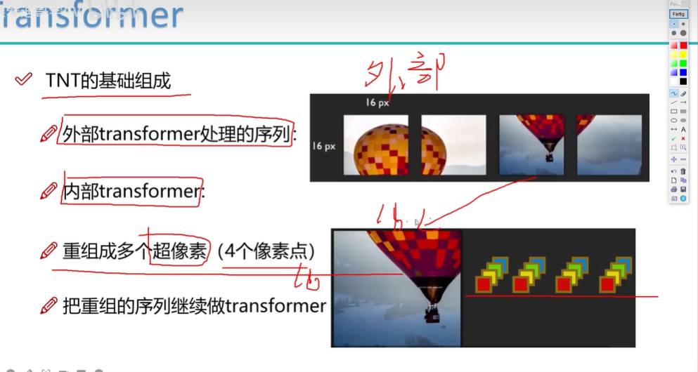
> TNT序列构建
> 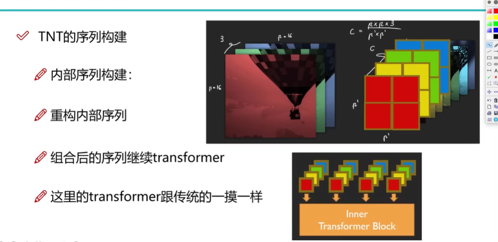
> 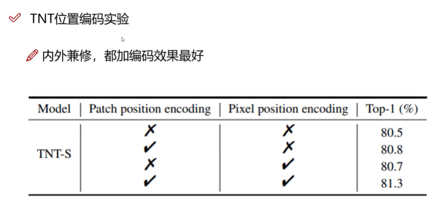

### 08 项目配置说明
> 输入序列
> VIT-B_16 不同的窗口大小
> 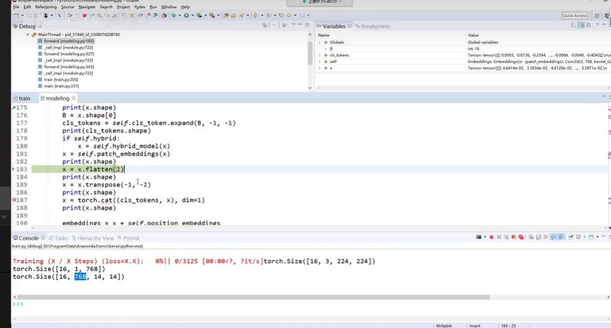