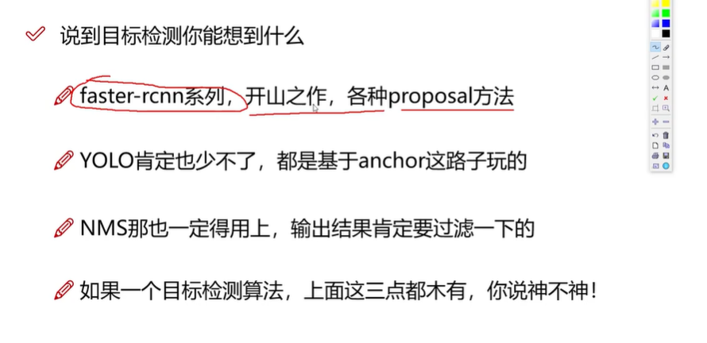
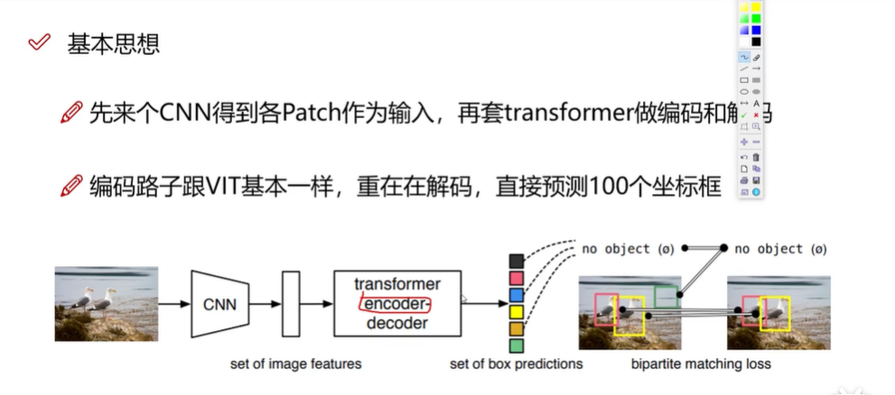
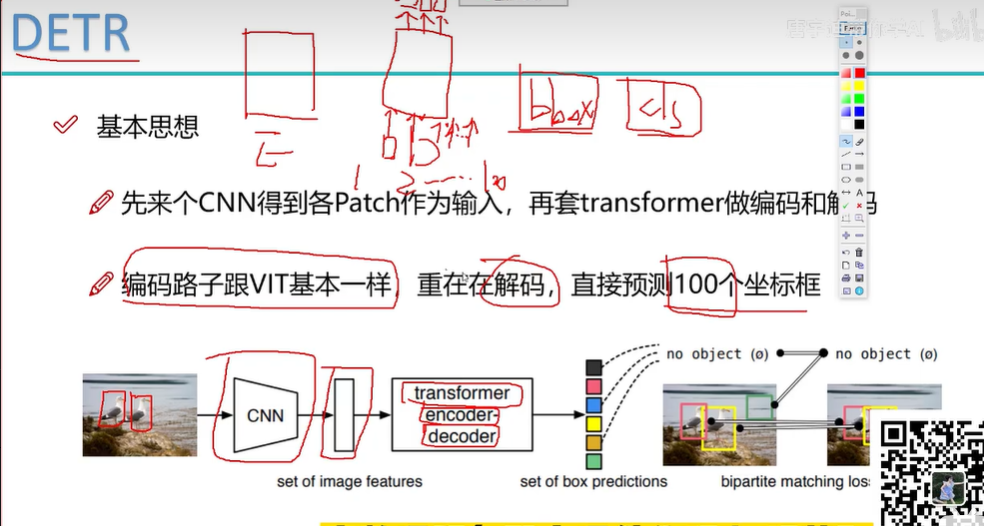
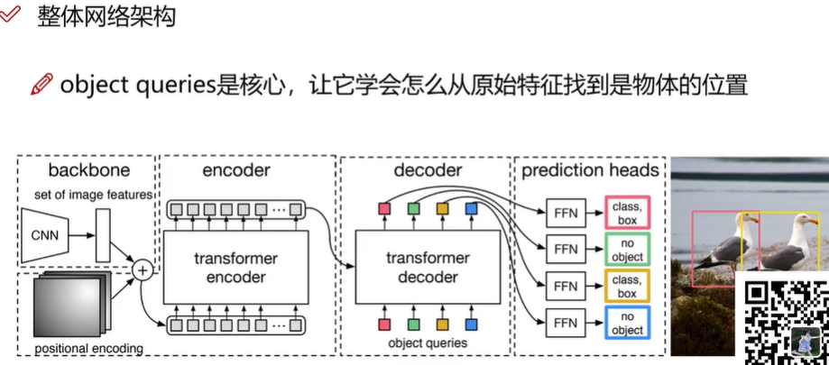
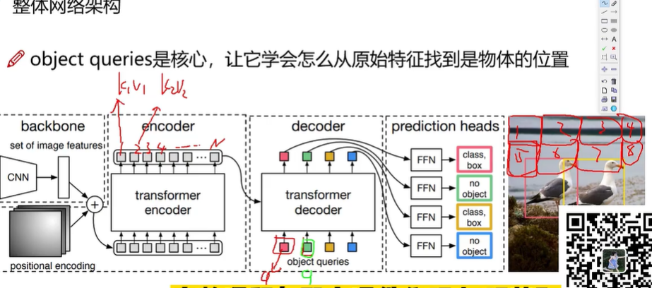
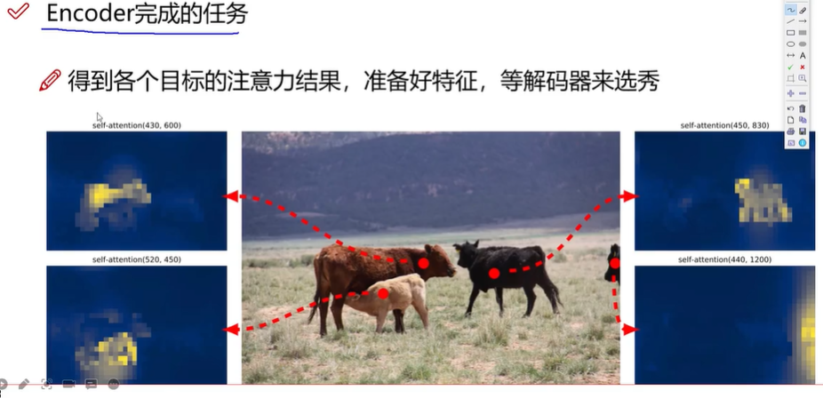
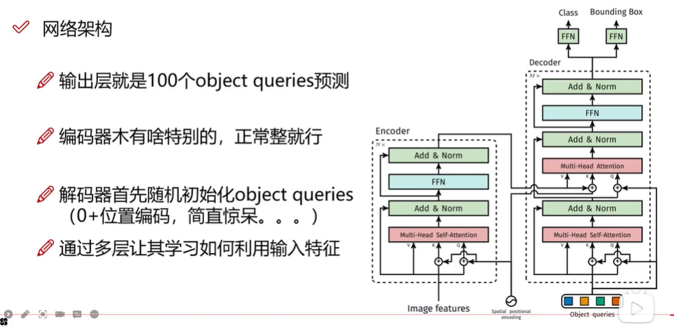
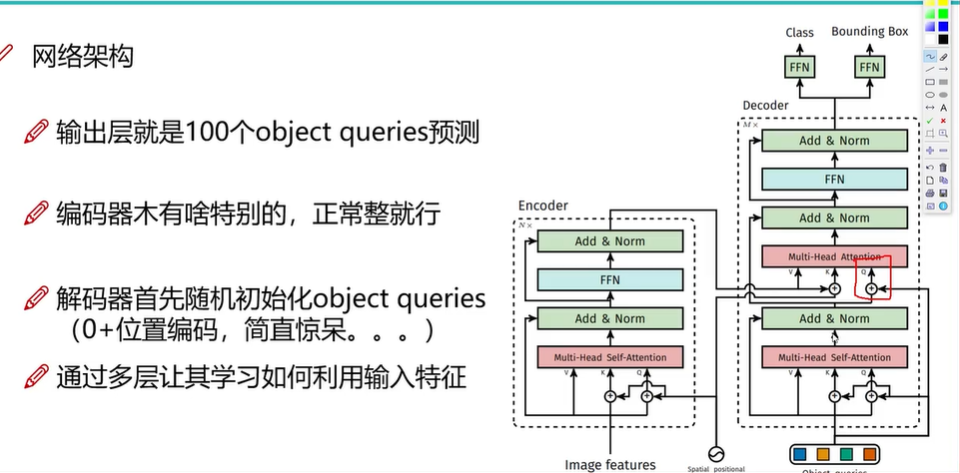
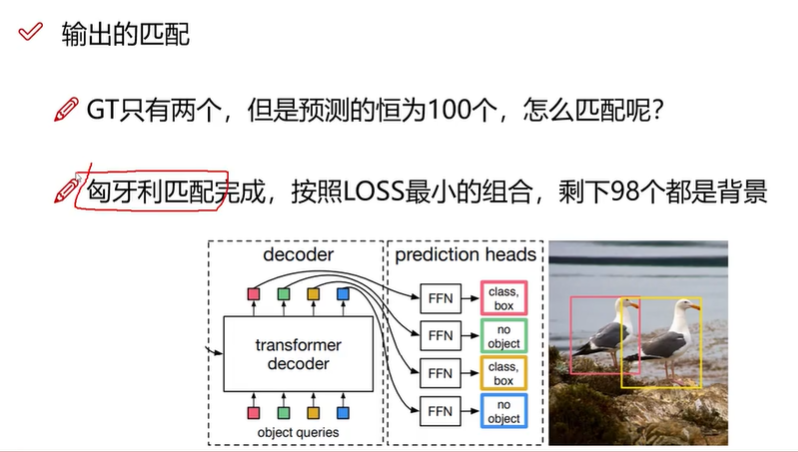
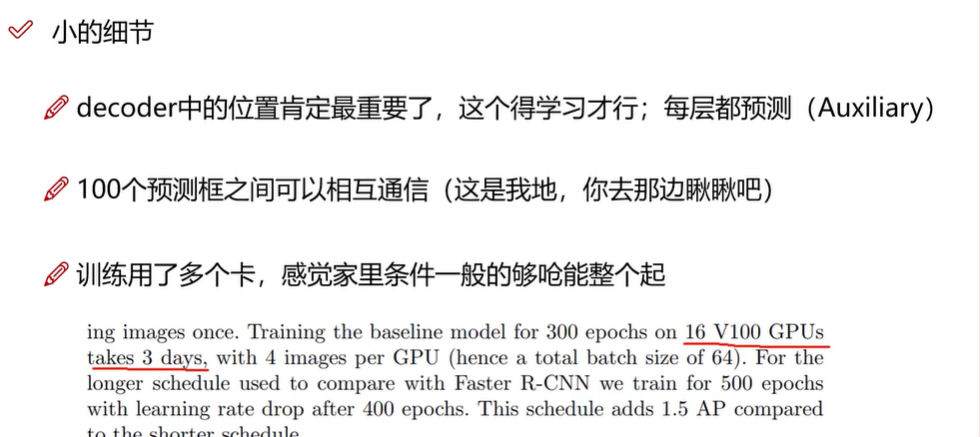

## detr
### 01 DETR 目标检测
> 
> 基本思想
> 套用transformer
> 重点在于decoder
> 
### 02 整体网络框架分析
> 解码器并行预测100个坐标框
>  
> 整体网络架构
> 
> object queries是核心
> 解码器提供q 编码器提供k v
> 
### 03 位置信息初始化query 向量
> encoder完成的任务
> 
> 整体网络架构
> object queries 0+位置编码初始化
> 
### 04 注意力机制的作用方法
> 有自注意力机制和注意力机制  
> 最后连上两个全连接一个分类一个回归任务
> 
### 05 训练过程的策略
> 输出的匹配
> 
> 小的细节
> 

### detr 源码实现
> 