## **数学模型推导**
> **01 目录**
> 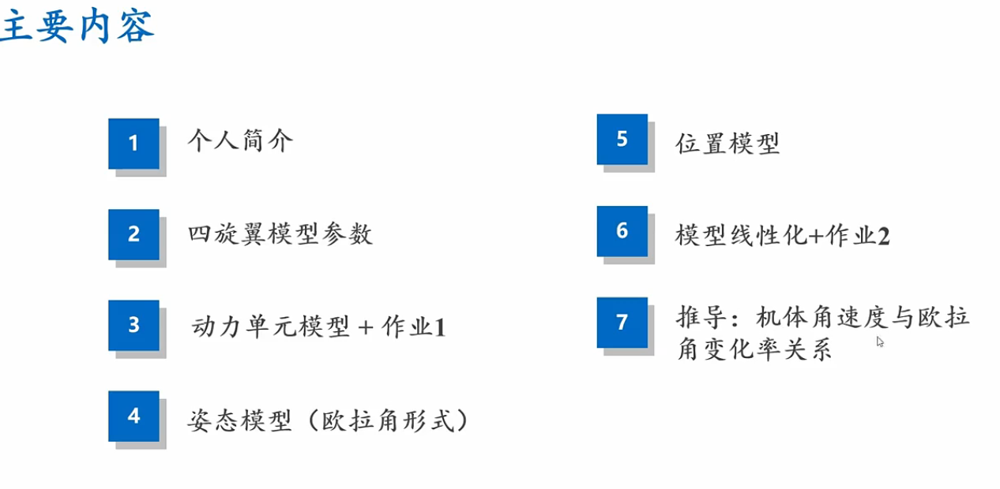
> **2 模型参数**
> 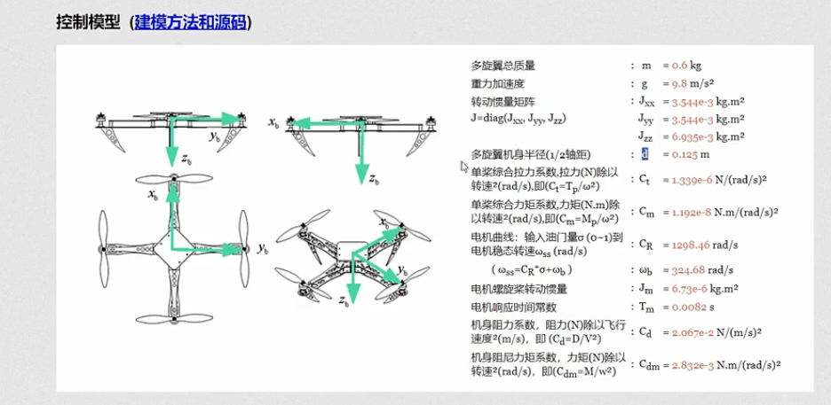
> **3 动力单元模型 总览**
> 输入是四个电机的油门 sigma1-4 输出四个电机转速 w1-4 
> 不同的转速会有不同的升力，会对三轴产生对应的力矩
> 输出是机体升力和力矩
> 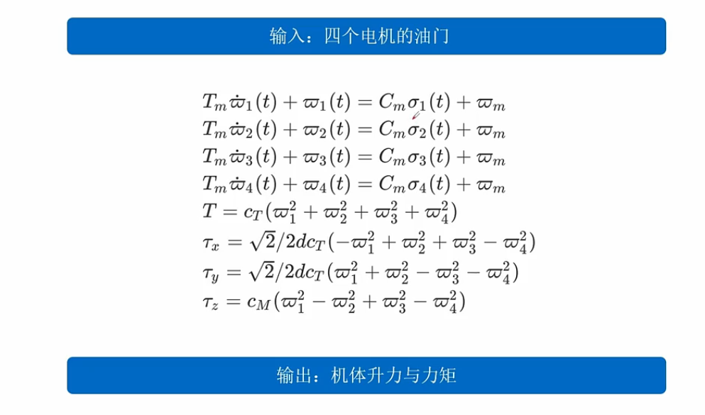
> **4 具体解读-电机模型**
> 电机模型
> tm是电机时间常数，实际希望tm越小越好，容易很快达到稳态
> 决定的是斜率
> 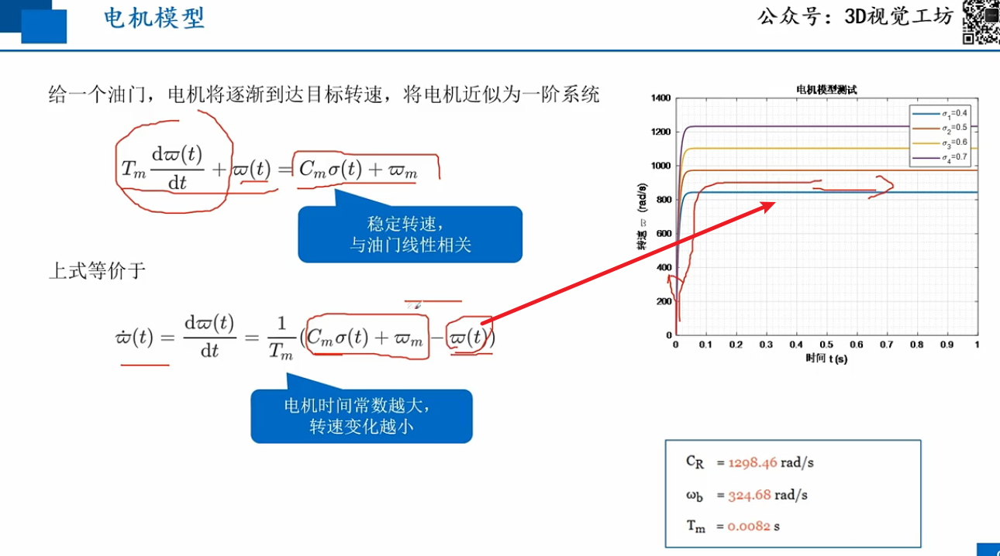
> **5 具体解读-升力模型**
> 单个螺旋桨产生的升力与转速成正比
> 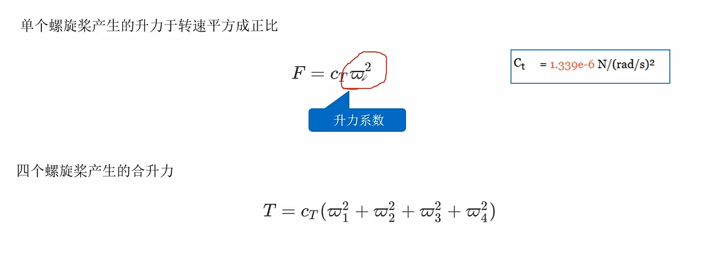
> **5 具体解读-力矩模型**
> 采用的是前右下的机体坐标系
> 全局坐标系是北东地坐标系
> xy轴合力矩
> 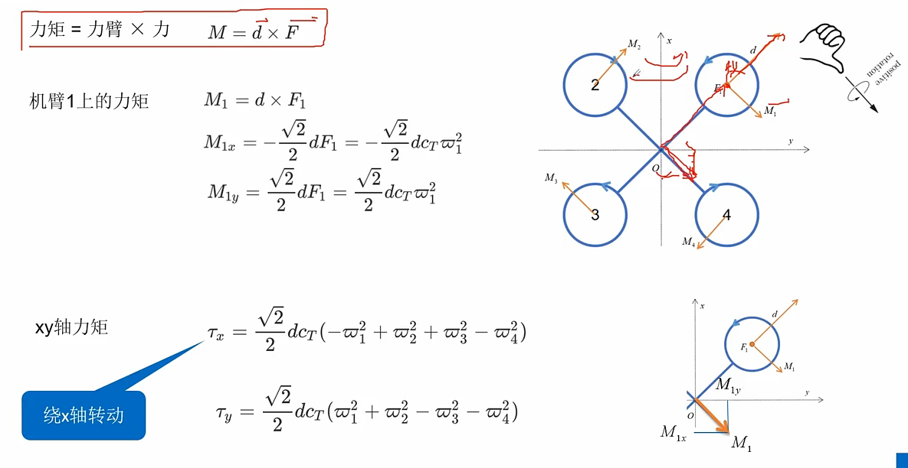
> z轴力矩理解（阻力矩产生的绕z轴转动的力矩）
> 阻力矩是平行于z轴的，纯力偶可以随意平移
> 因此对于单旋翼的力矩可以平移到四旋翼的中心上
> 绕z轴旋转可以采用降低m2 m4转速 提高m1 m3转速
> 总升力不变，但有z轴力矩
> 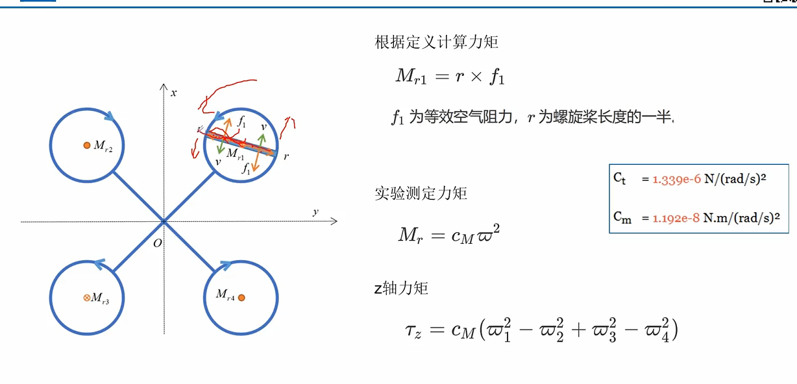
> 实验测 cm 参数，要比x，y轴的参数小1-2个数量级
> 绕z轴较难转动
> **6 计算例子**
> 1 计算无人机的最大升力
> 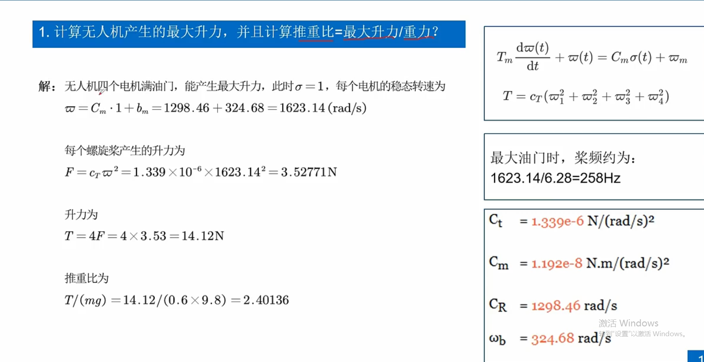
> 2 计算力矩
> z轴力矩会比较小
> 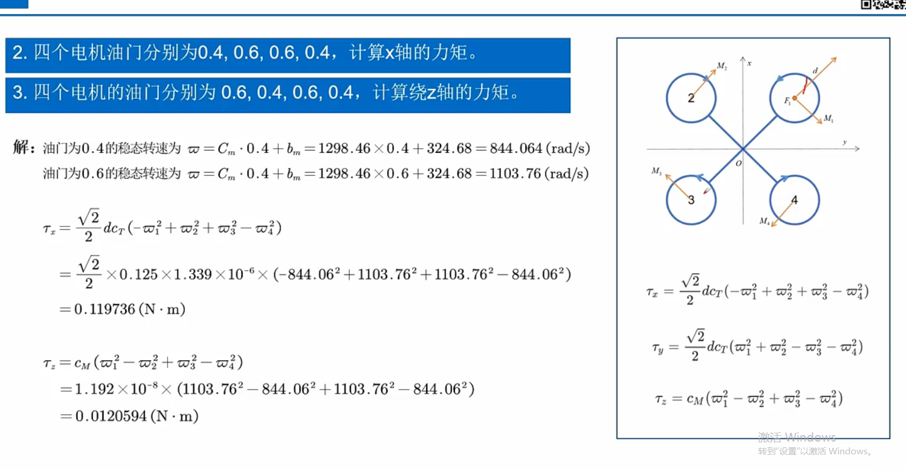
> **7 代码实战**
> 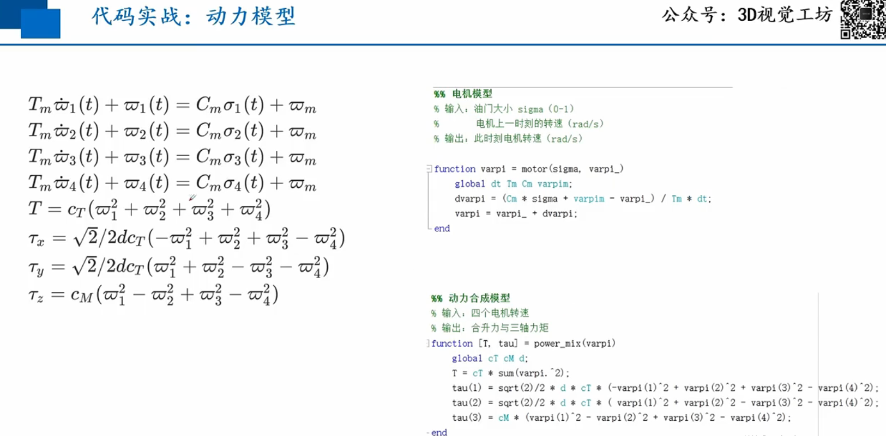
> 模型测试
> 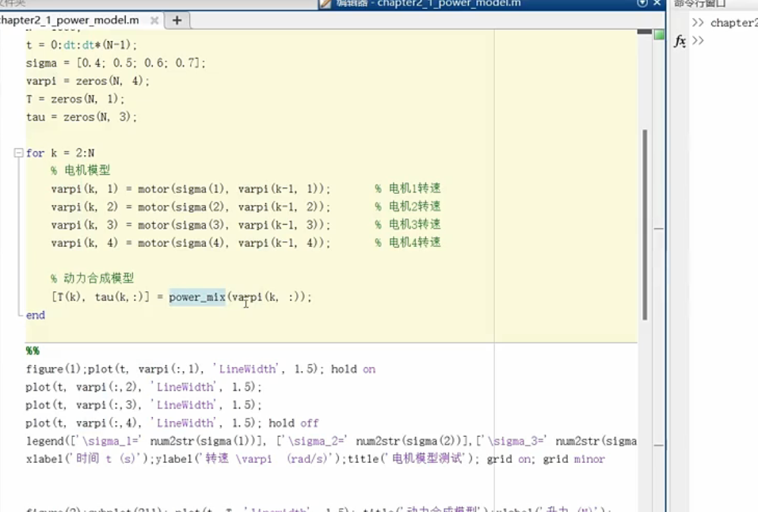
> 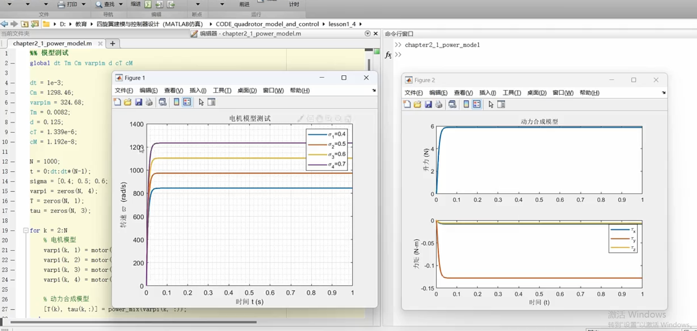
> 电机模型（离散模型）
> 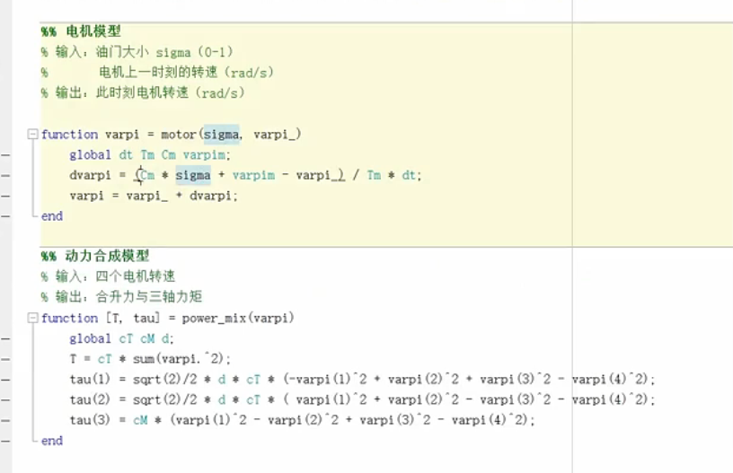
> 动力合成
> 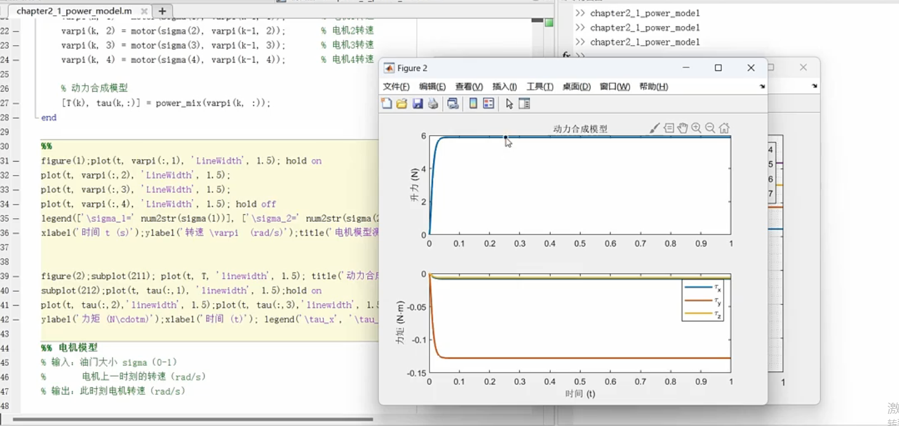