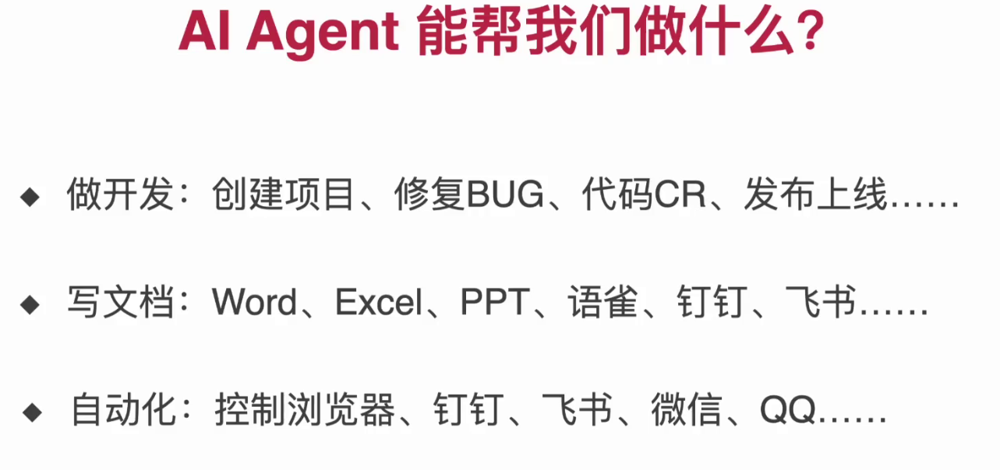
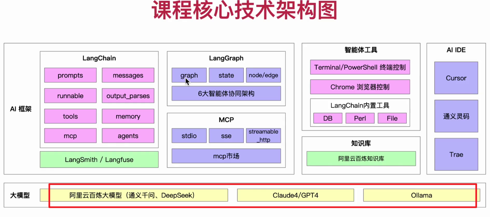
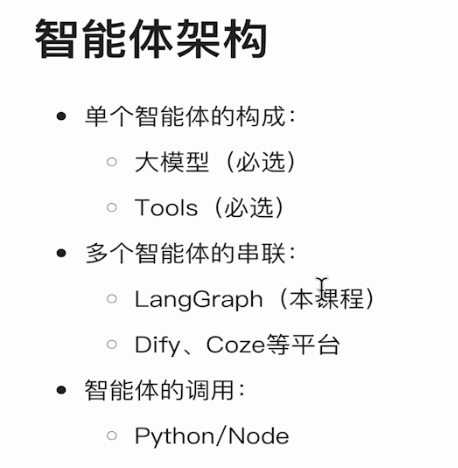

> ## 01 背景
> 
> ai agent 基本原理
> 
> ai agent 运行流程 思考->行动->观察
> 
> 具体示例
> 
> 能做到的内容
> 
> 核心技术栈
> 三种大模型部署方式
> ai框架 langchain langgraph
> mcp工具
> 观测 langSimth/langfuse
> 智能体工具：自己开发 chrome浏览器控制，terminal/powershell 终端控制、langchain内置db perl file、知识库
> 
> 学习收获
> 掌握langchain+langgraph的最新ai agent开发技术栈
> 整合大模型、mcp、rag、自动化工具，实现复杂的智能体工具，让智能体具备感知，决策和行动的能力
> 
> **AI agent介绍**
> 自主感知环境，做出决策并执行行动
> 
> 自主性、反应性、交互性、主动性
> 
> 智能体和大模型区别
> 智能体是ai技术落地的系统级应用形式
> 
> **Agents的类型**
> 一共五个级别：chat-bot、实用工具、专家助手、团队合作者、通用人工智能（AGI）
> 
> 
> **智能体架构**
> 单个智能体、多个智能体串联、智能体调用
> 
> 整体架构如下
> 
> **知识框图**
> 
> 