# **1 大模型调用**
> 环境安装 （uv,项目级别包管理工具）
> 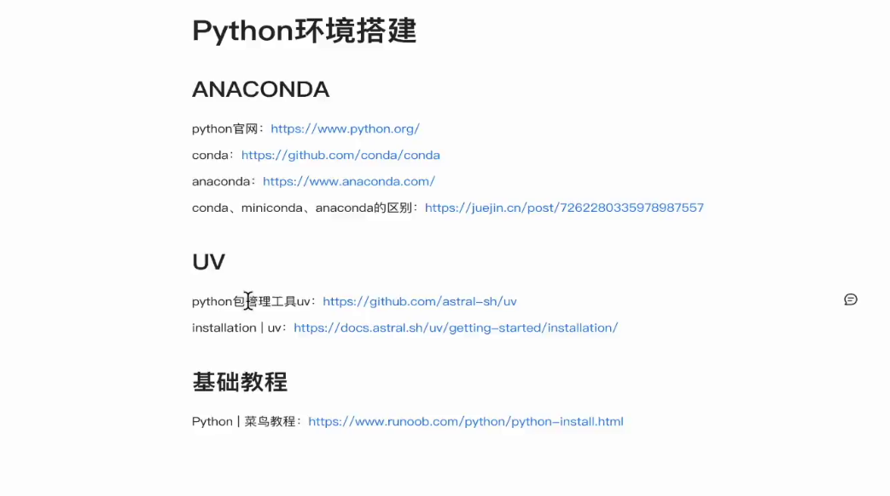
> 一些 uv的使用
> 会创建一个.venv的文件夹用于管理当前项目环境
> 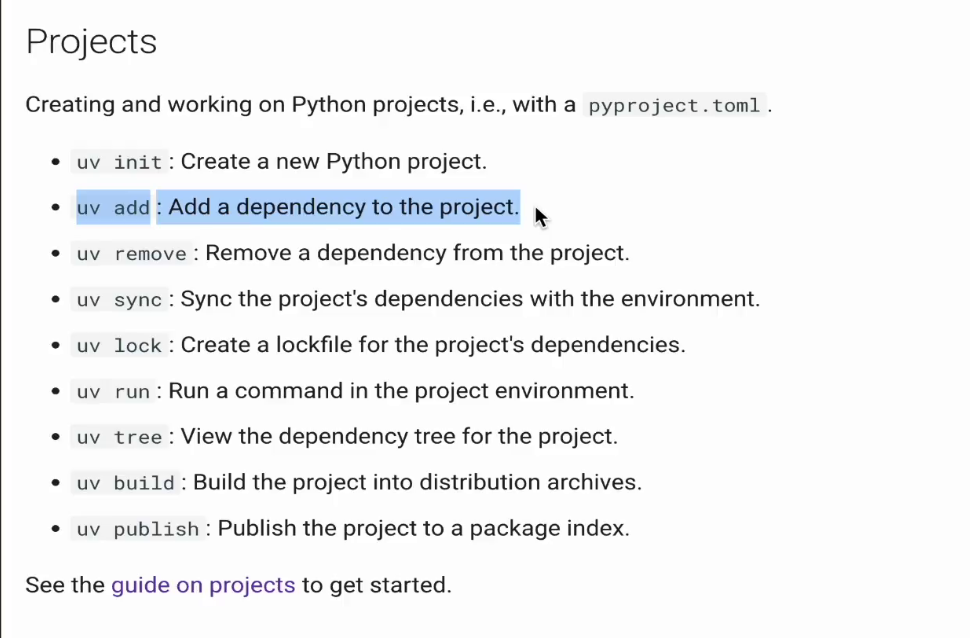
> 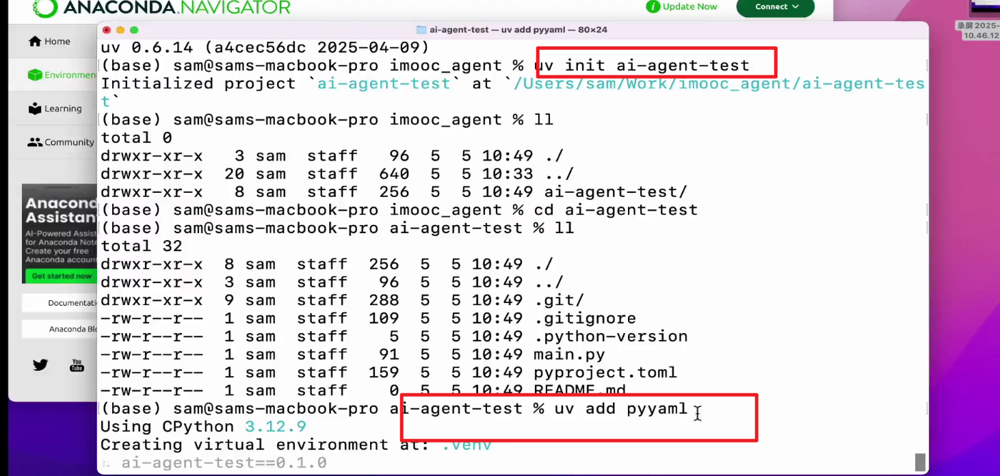
> **2 智能体开发流程**
>  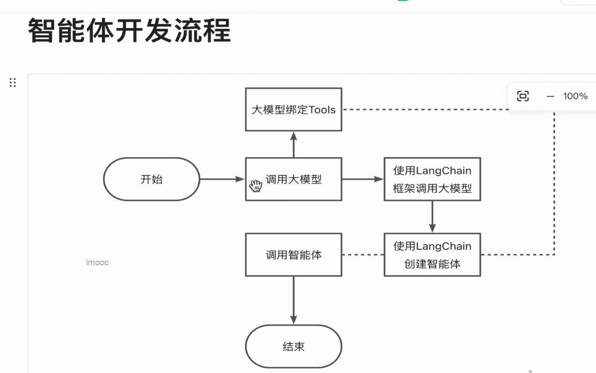
> 调用ollama本体化调用
> 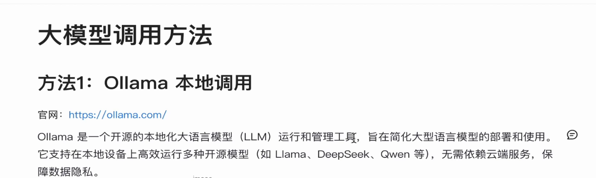
> 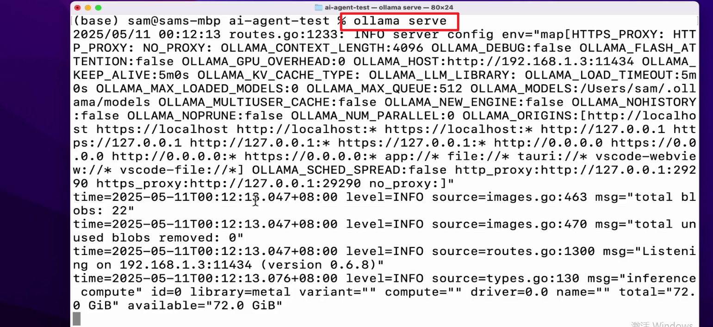
> 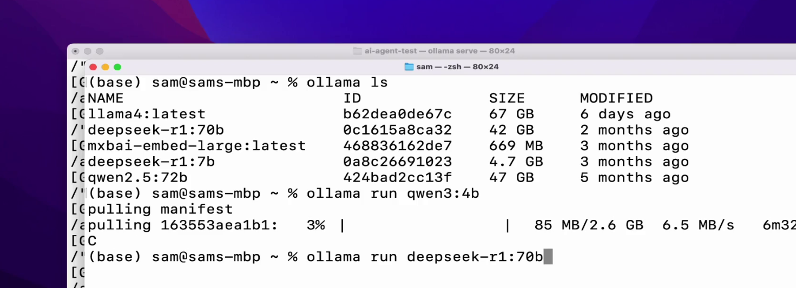
> **3 使用langchain脚本**
> 添加langchain-ollama库
> 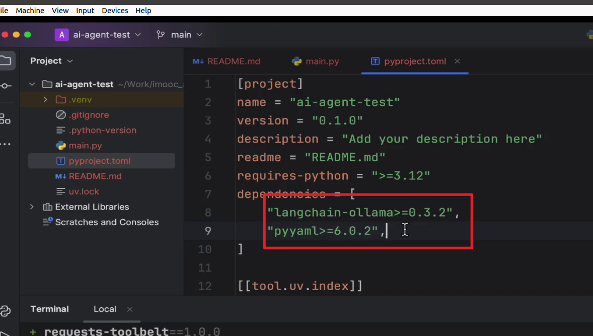
> ollama初始化和使用
> 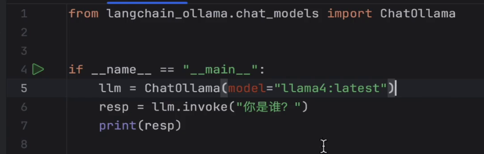
> 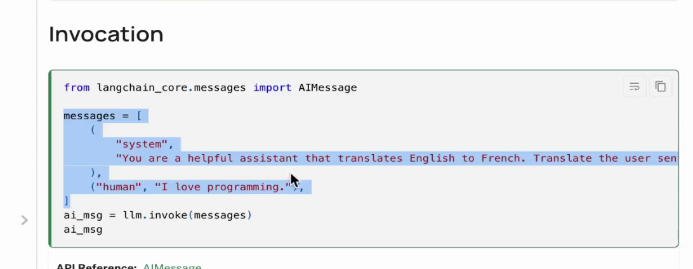
> chaining特性
> 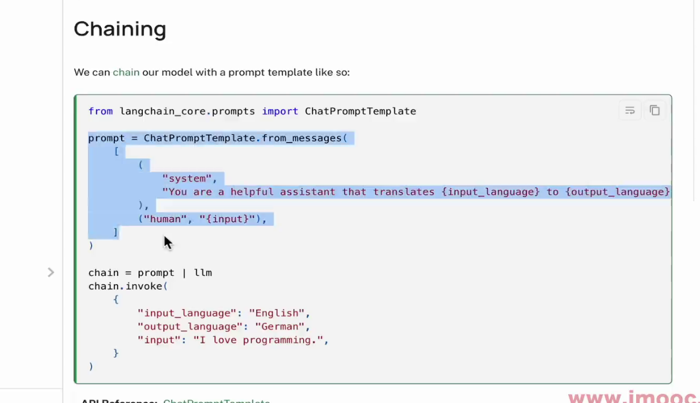
> **4 流式打印**
> chunk ，一个字一个字输出
> 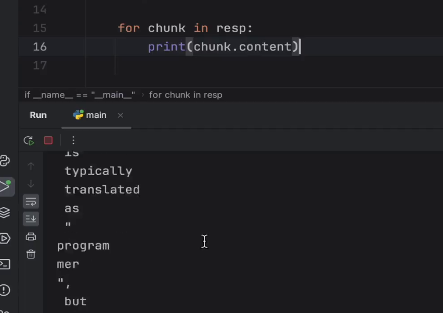
> **5 阿里云百炼api调用**
> uv安装open-ai库
> 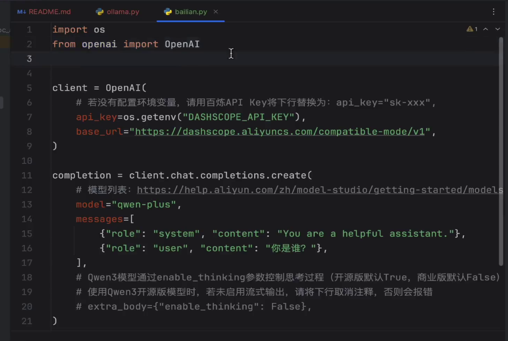
> 获取apikey
> 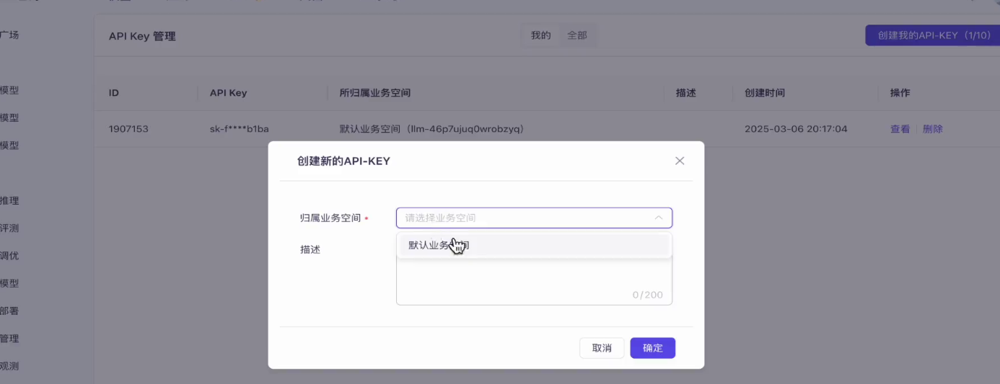
> base_url 大模型api的固定网址
> 替换大模型名称
> **6 推理模型的使用**
> qvq 理解视频
> 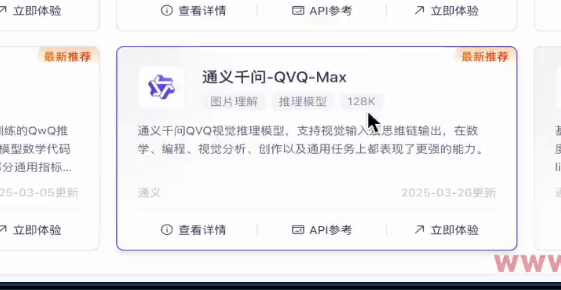
> 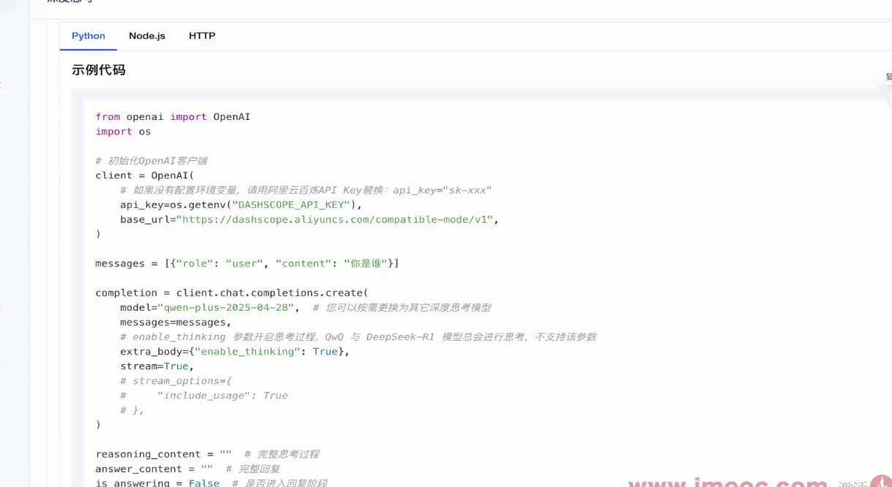
> 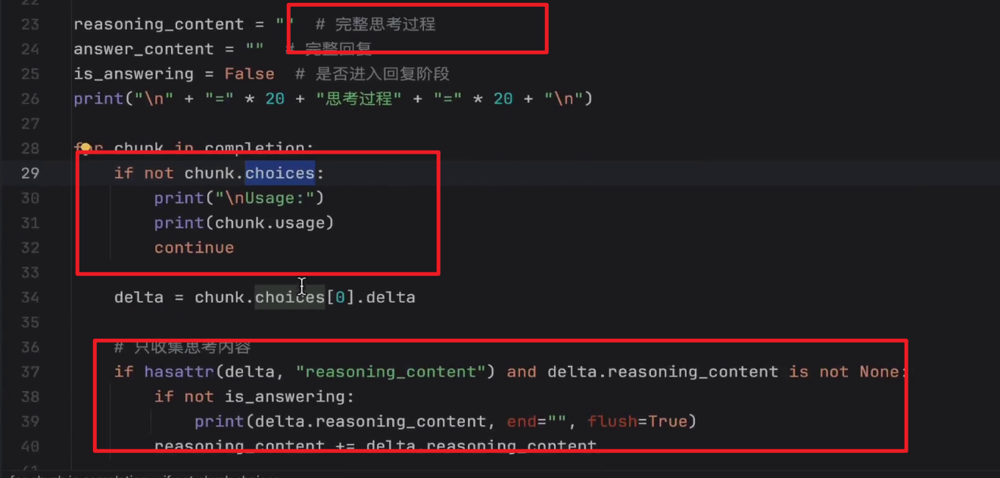
> 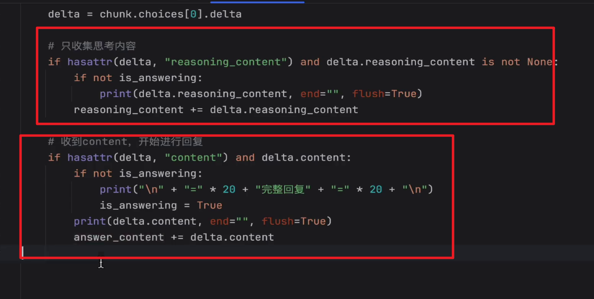
> **7 langchain框架**
> nodejs版本和python版本
> 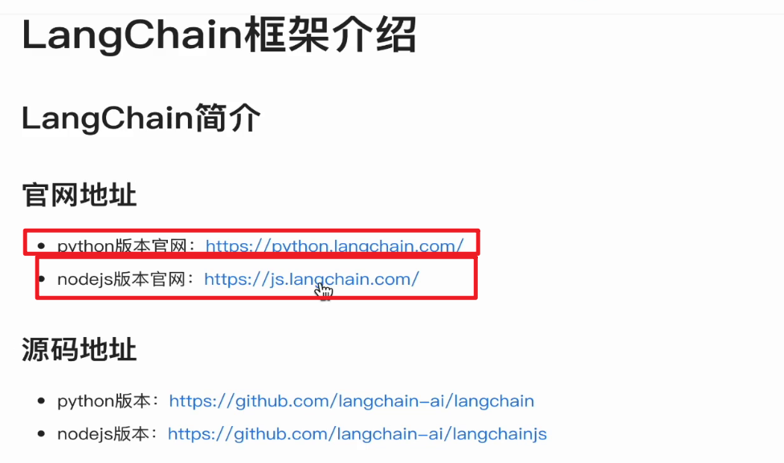
> 简化大模型语言开发
> 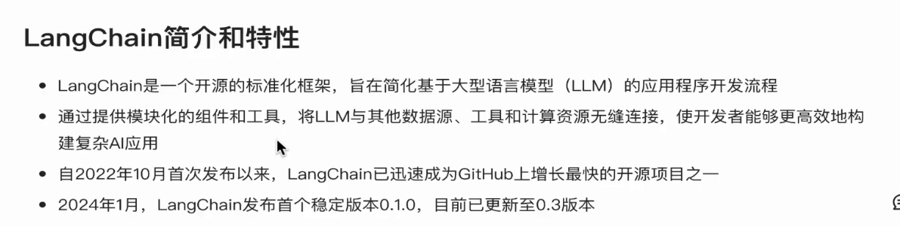