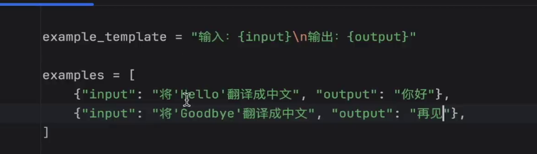
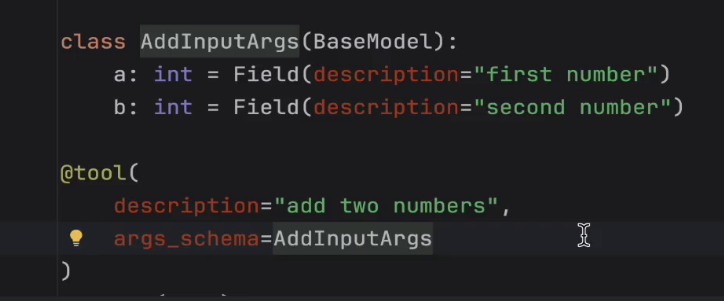

> ## **langchain框架调用**
>目录 使用langchain调用通义千问
> 
> 绑定自定义工具
> 
> **实例化大模型**
> 大模型实例化
> 
> 使用secretstr对api进行加密
> 
> **大模型调用**
> 第一种方式，比较简单的场景
> 
> 
> 第二种方式 使用提示词模板功能
> 
> promptTemlate字符串提示模板，适用于文本补全任务
> 
> 使用示例
> 
> 
> 使用示例2 文本替换
> 创建提示词模板-》创建提示词
> 
> **chatprompttemplate 聊天提示器模板**
> 适用于聊天木星，输入是多轮对话的消息列表
> 
> 使用示例 
> 传入数组
> 
> 
> **chatmessageprompttemplate 消息模板**
> 抽象模板中的某一条消息
> 系统消息抽象 用户消息抽象
> 
> 
> 使用方法
> 
> **fewshotprompttemplate,少样本提示模板**
> 控制输出格式
> 用于少样本学习，包含示例，帮助模型推理任务
> 
> 使用示例
> 
> 
> 推理过程
> 
> **链式调用大模型**
> 重用模板类和使用场景
> 
> 链式调用
> 
> **自定义工具调用**
> 使用步骤
> 
> 第一二步 工具函数转为tool对象
> 
> 绑定对象
> 
> 调用大模型
> 
> 生成结果：
> tool_calls
> 只会生成一串message去自行进行调用
> 
> 最后一步：调用工具，通过智能体调用，而非大模型调用
> 
> 
> **tool装饰器注册工具+args_schema精确控制工具入参**
> 第二步转为tool对象，有两种方式
> 
> 第二种方式是通过装饰器，需要提供注释
> 
> 
> 
> 精确传入类型 args_schema
> 