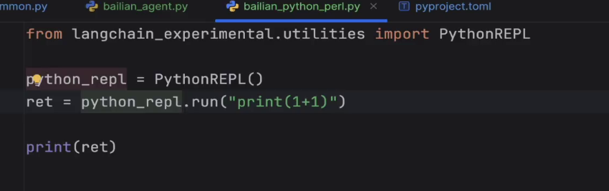
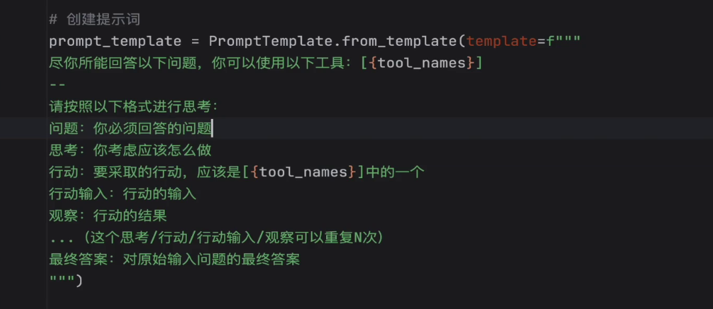
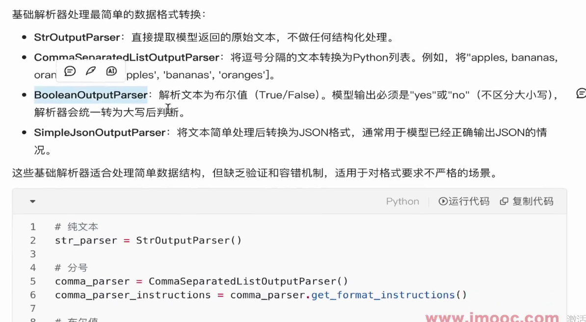
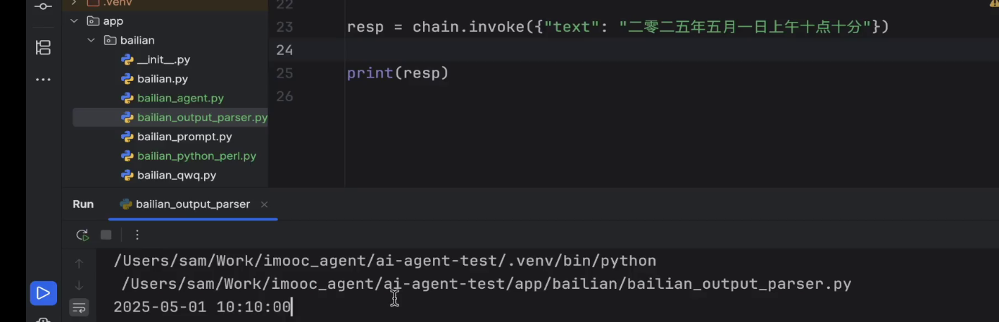

## **内置工具调用_返回体控制**
> 最重要的一步，创建智能体，由智能体调用Tool并返回结果
> 步骤如下
> 
> **1 使用agents库快速完成智能体开发搭建**
> 初始化工具
> 
> 创建大模型
> 
> 创建智能体
> 
> 智能体调用
> 
> 结果如下
> 
> 
> **2 应用JsonOutputParser规范智能体返回值**
> agent type选项
> 
> 对返回体的结构化，希望返回json格式
> 
> 
> 对返回的结果进行了说明，
> 
> promt提示词更新 
> 
> 
> **3 内置工具perl**
> 比较常用的工具（文件管理等等）
> 
> perl工具 可以执行python代码
> 
> 使用perl_tool
> 
> **4 perl使用实例**
> 智能体创建
> 
> 提示词创建
> 
> invoke推理
> 
> 结果如下：
> 
> **5 LangChain output_parsers库详解**
> output parse 需要实现文本到结构化的转变
> 
> 有如下几个关键的解析器
> 
> 基础解析器：
> 
> 
> 
>  
> 时间解析器
> 
> 
> 一些其他的解析器
> 
> 
