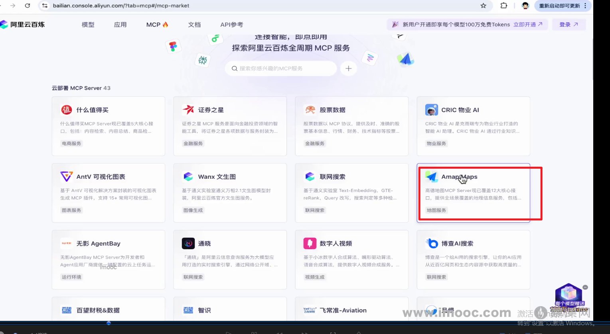

## **MCP介绍**
> **1 MCP介绍**
> 大模型和外部工具交互的标准化协议
> 
> **2 MCP原理**
> mcp原理 客户端-》协议中心-》服务端
> 核心原理是将各个服务封装成ai能理解的tools
> 两类服务（远程服务，本地服务）
> 
> 
> MCP的应用
> 
> 开源社区 mcp server
> 
> 基于mcp的智能体架构
> 
> **高德MCP服务接入**
> mcp服务
> 
> 接入 MCP Server
> sse 远程接入
> 
> 
> 代码实现
> 高德MCP服务集成
> 
> 开发mcp客户端
> 
> 
> 查看有哪些tools
> 
> **结合智能体具备位置提供能力**
> 
> 获取mcp工具
> 
> 
> 创建智能体
> 
> 提示词
> 
> 异步运行智能体
> 
> **高德mcp可视化展示**
> 提示词优化
> 
> 结合本地文件工具
> 增加文件工具
> 
> 扩展智能体工具
> 
> **MCP通讯协议之stdio——实现本地MCP服务端和客户端**
> 三种通信方式（stdio \sse \streamable http）
> stdio 本地进程间通讯
> 
> 基于stdio的服务搭建
> 四个步骤
> 
> 总体架构
> 