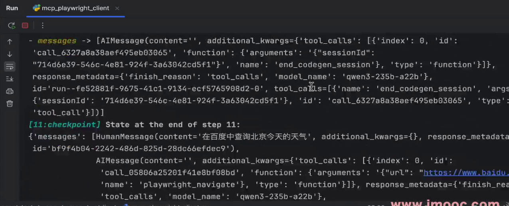
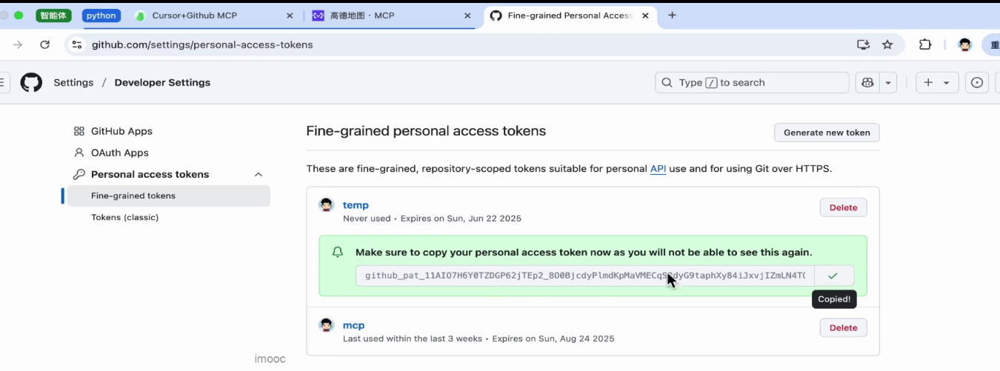

## **Cursor+mcp接入**
> 魔塔mcp市场
> 
> Node环境搭建，js脚本的解释器
> nvm安装nodejs
> 
> 
> 全局安装 playwright-mcp-server
> 
> npx安装，不在本地全局安装，临时安装，使用后删除
> **1 langchain+mcp读取playright**
> 配置使用playwright服务器
> 
> 两种方式获取mcp工具
> 
> **2 langgraph+create_react_agent创建智能体**
> 使用官方推荐的库创建llm
> 
> 
> 结果如下
> 
> 
> 
> 输出的结构化处理
> 
> 结果如下
> 
> **3 cursor简介**
> cursor功能
> 
> mcp 功能
> 
> cursor+高德mcp
> 引入高德开发key
> 
> 
> 
> **4 cursor+github MCP工具集成**
> 步骤1 ： 集成Github MCP工具
> 使用mcp工具查询个人仓库
> 
> 
> 
> 
> 开发实现
> 实现vue-element快速迭代
> 
> **5 langgraph agent接入github MCP服务**
> 接入mcp client
> 
> 创建智能体
> 