## **多轮对话能力实现**
> 项目目标
> 
> 架构设计
> 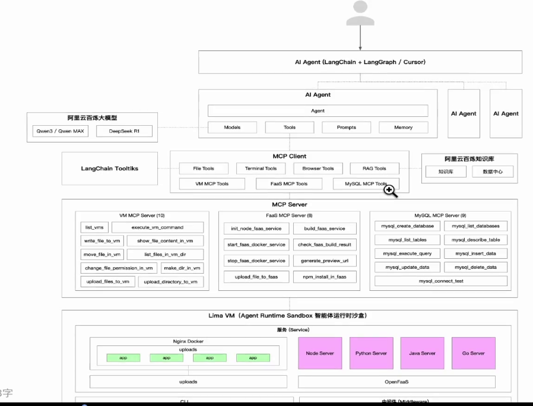
> 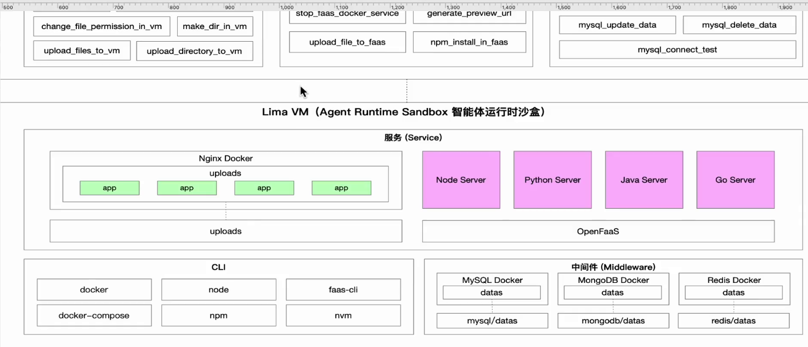
> 能力要求
> 多agent协同（langGraph），mcp工具太多会产生问题，需要对agent进行分工
> 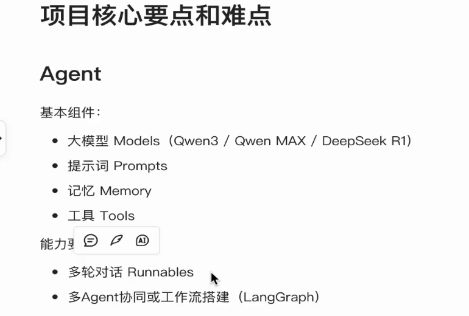
> mcp部分
> 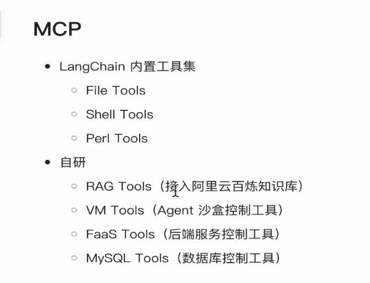
> **1 多轮对话能力原理介绍**
> 构建session级别的多轮对话能力
> 架构如下
> 核心原理在于chatpromptTemplate
> 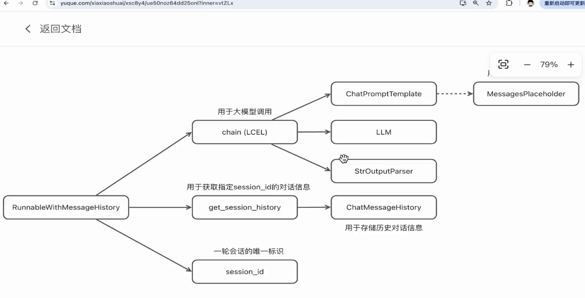
> 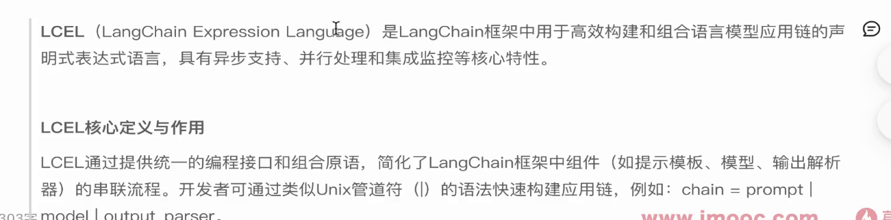
> 构建提示词模板，用于注入对话历史
> 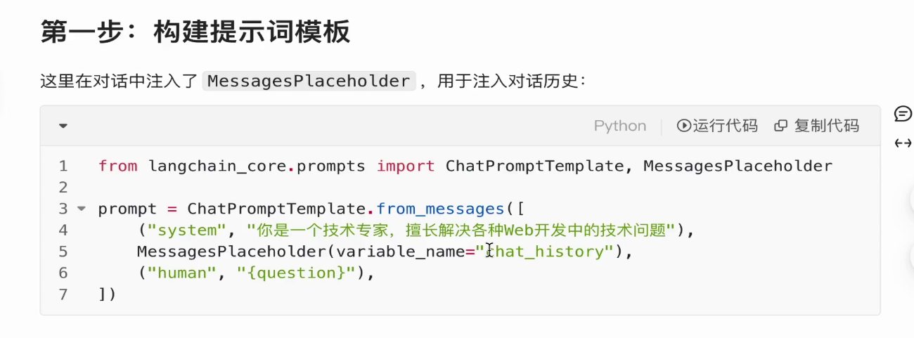
> 这次的会话需要与session绑定
> 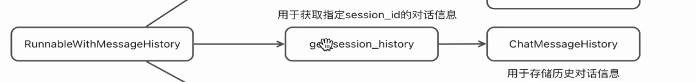
> **2 多轮对话LELC实现**
> 1 大模型
> 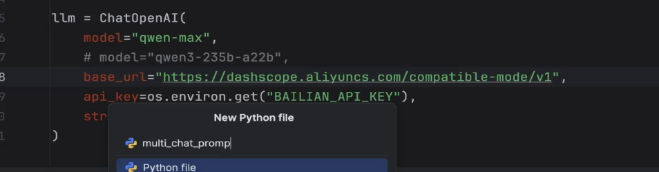
> 2 prompt提示词 history
> 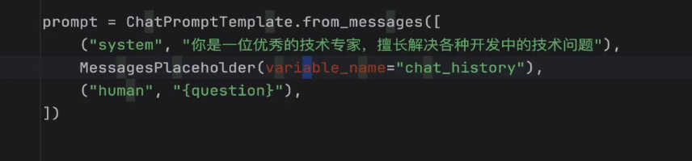
> 3 创建chain
> 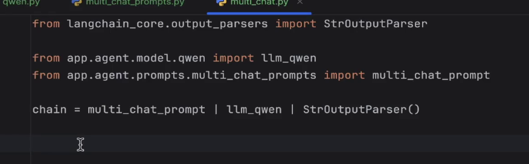
> 4 构建基于历史消息的Runnable实例
> 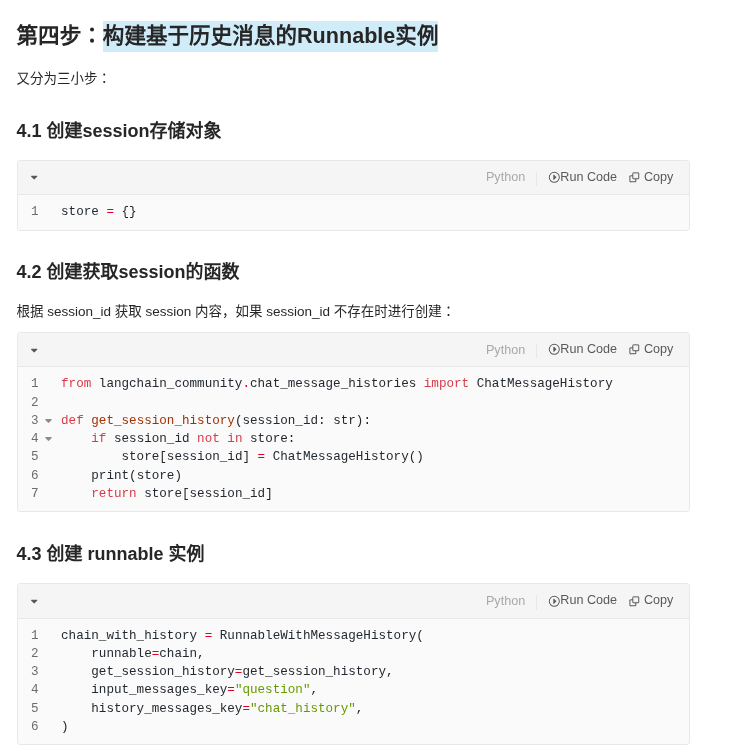
> 5 构建多轮对话
> 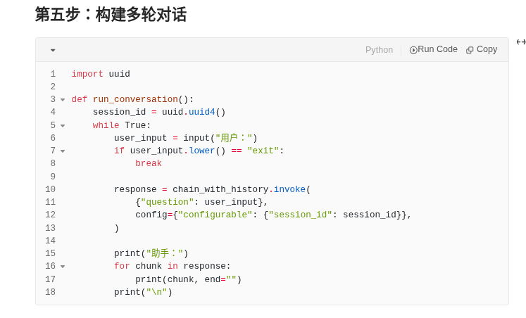
> 6 运行多轮对话
> 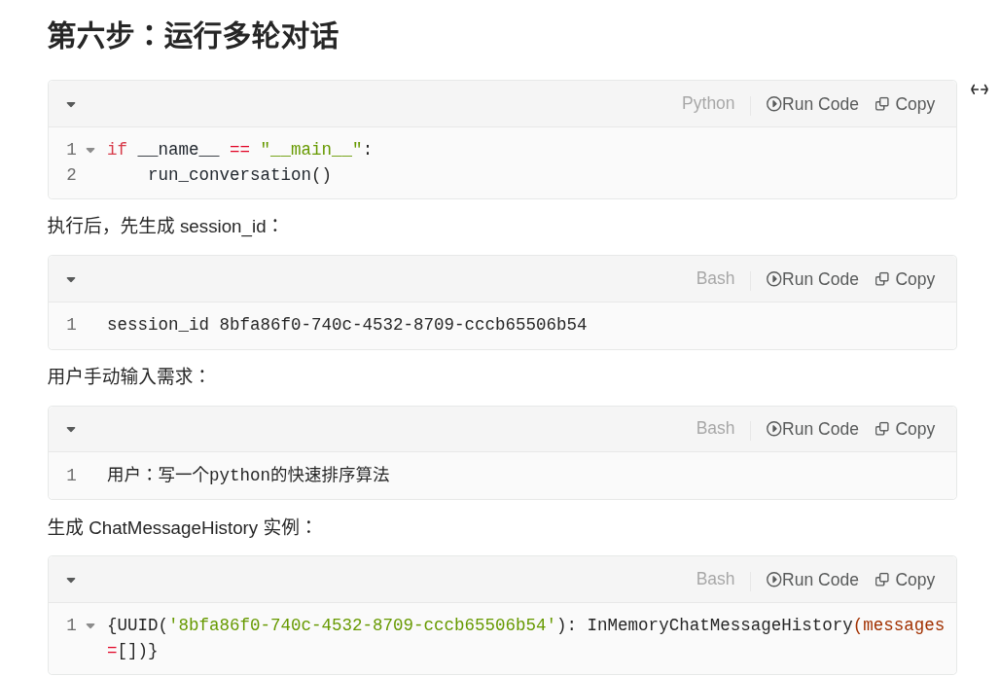
> **3 session持久化**
> 步骤如下
> 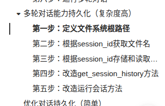
> 第一步：定义文件系统根路径
> 第二步：根据session_id获取文件名
> 第三步：根据session_id存储和读取对话json文件内容
> 第四步：改造get_session_history方法
> 第五步：改造运行会话方法
> 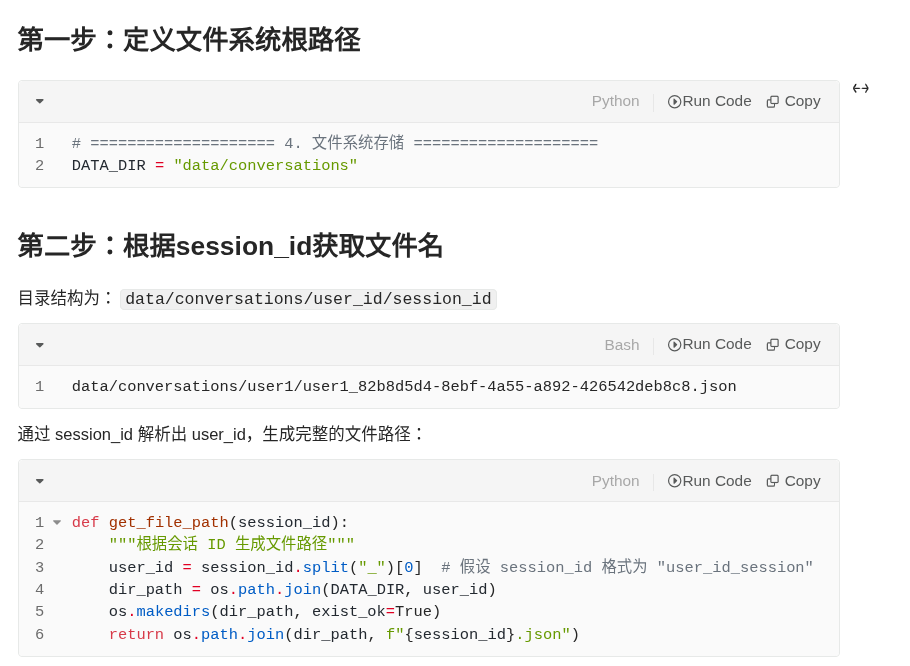
> 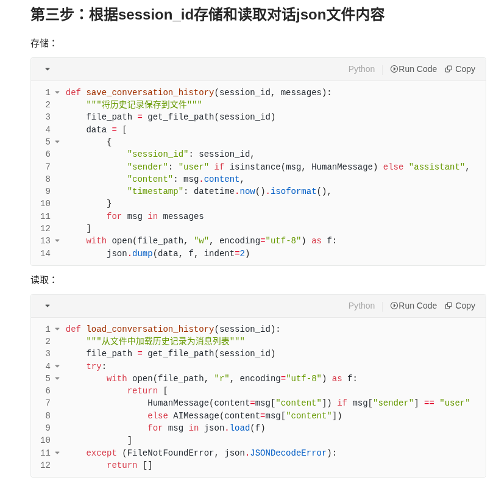
> 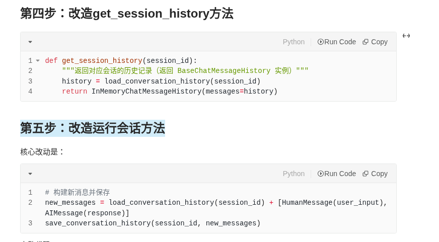
> 优化持久化
> 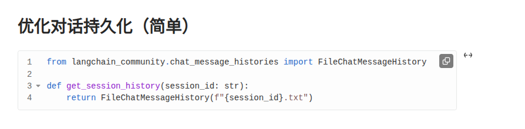