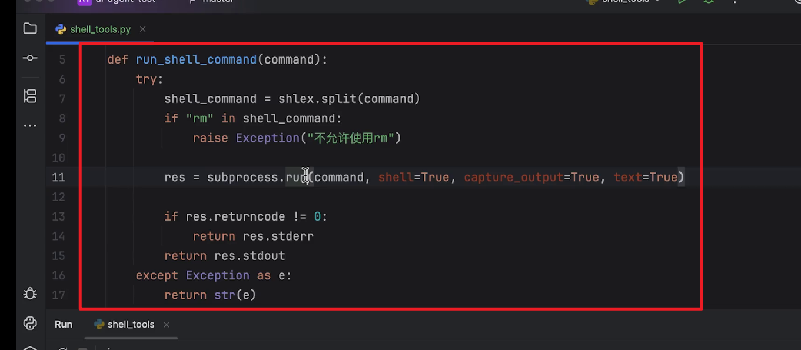
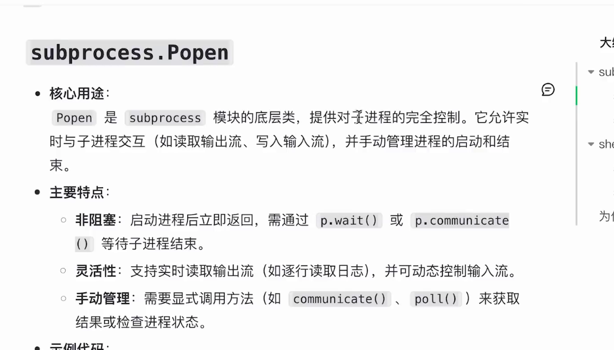
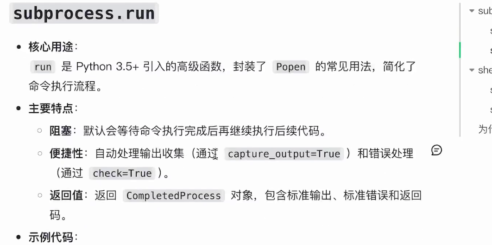
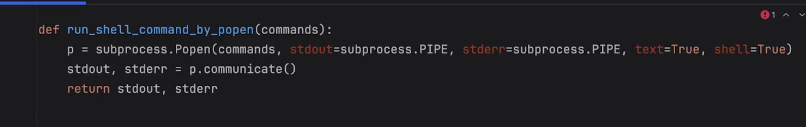
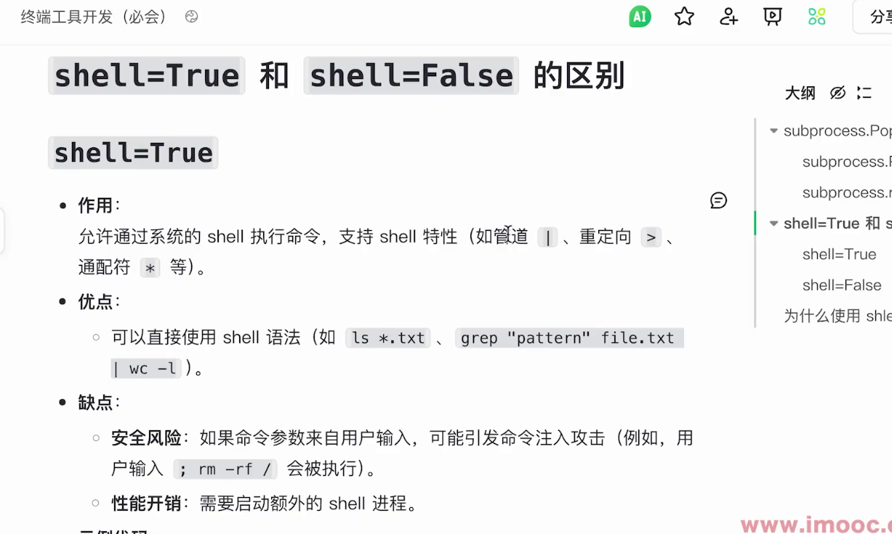
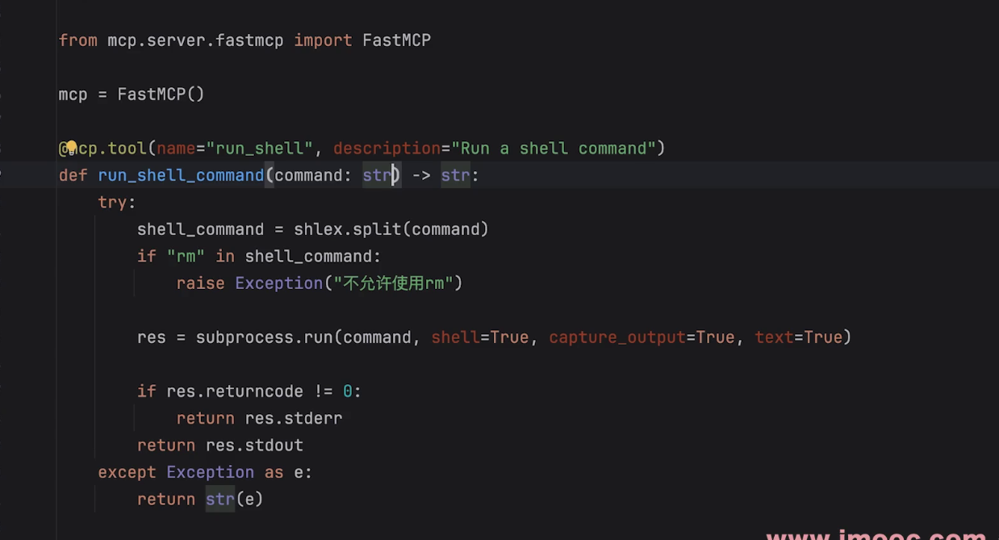
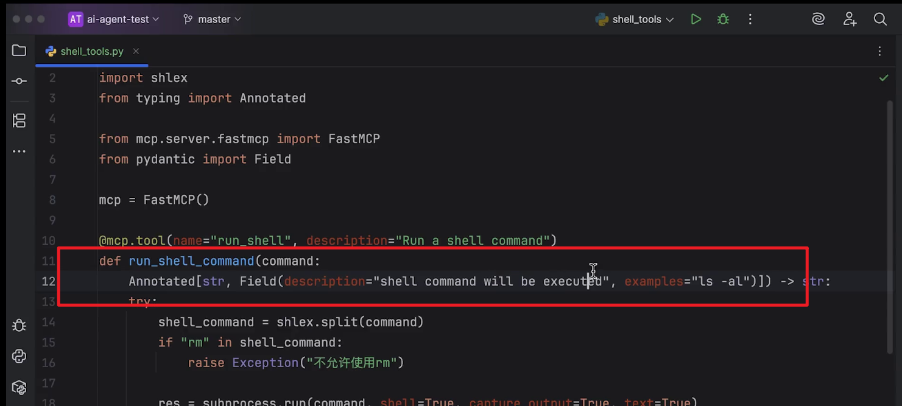
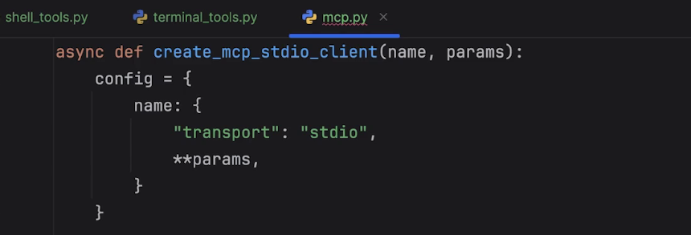
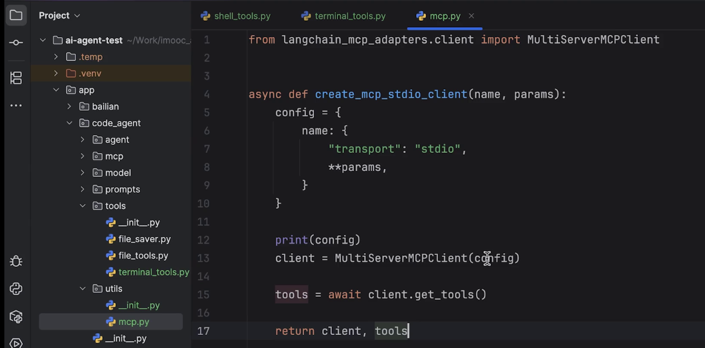
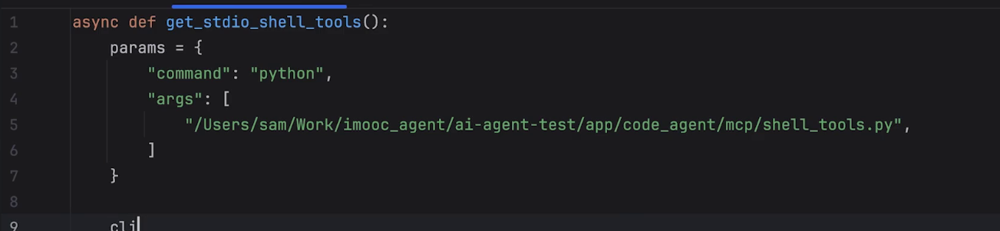

## **终端控制能力**
> **1 提供终端控制工具 subprocess方法**
> 使用langchain 默认工具进行命令行控制
> 使用subprocess库
> 
> 创建一个shell tool
> 
> **2 popen方法**
> 
> 
> popen方法编码
> 
> shell 选项区别
> 
> **3 mcp服务封装**
> 
> 
> 客户端
> 
> 
> 
> **4 智能体流式输出+输出结果优化**