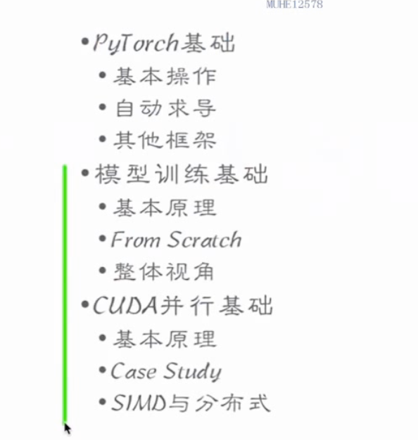
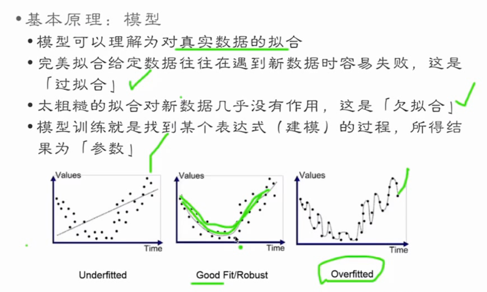
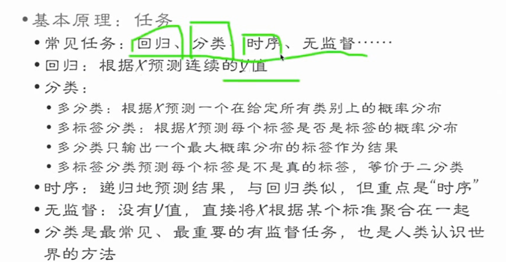

## 01 LLM 进化路线 领域微调 及NLP应用
> 目录
> 
> **模型训练基础目录**
> 
> **1.1 基本pipeline**
> 
> **1.2 训练模型基础**
> 
> 
> 
> 
> ## **2 cuda并行基础**
> **目录**
> 
> **2.1基本结构**
> 
> 性能指标 性能差距巨大
> 
> 内存模型
> 
> 
> **case study 矩阵乘法**
> 
> 
> 
> ## **3 LLM进化路线**
> **langchain 理论**
> 
> 
> **transformer系列演化**
> bert代表的encoder-only
> gpt代表的decoder-only
> 
> 
> ## **3.1大模型研发阶段**
> 预训练（时间最长）
> sft->rm->rlhf 微调->奖励->强化学习
> 
> **预训练模型分为两类 NLU和NLG**
> NLU bert 自然语言生成 (输出范围确定，评级方法明确)
> NLG 预训练模型 （输出自由度高，评价方法难，更具创造性）
> 
> **大模型的涌现能力（大力出奇迹）**
> 
> **gpt的模型演化之路**
> 
> **大模型本质-概率统计**
> 缩放法则（参数量越大，loss一定会降低）
> 
> 训练过程-无监督训练
> 
> 有监督微调 - SFT
> 通常采用混合预训练任务损失和下游微调损失
> 
> 
> 强化学习（PPO） 奖励学习（计算kl散度，调整loss函数）
> 
> 
> **大模型生成原理**
> 
> **top-k  top-p temperature策略**
> k值变大，选择范围变大，输出更加多样化但精度会降低
> 
> 
> 
> **大模型transformer**
> 
> 模型嵌入 绝对位置编码
> 
> 前馈层
> 
> 残差归一化
> 
> 编码解码
> 
> **预训练语言模型实践**
> 预训练词元分析器
> 
> 
> 模型训练，模型使用
> 