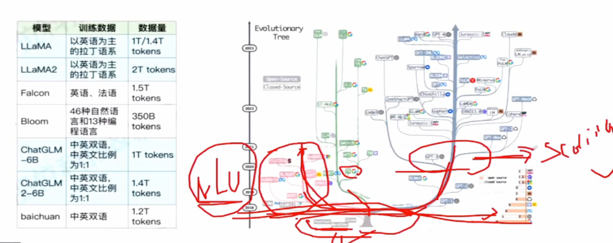
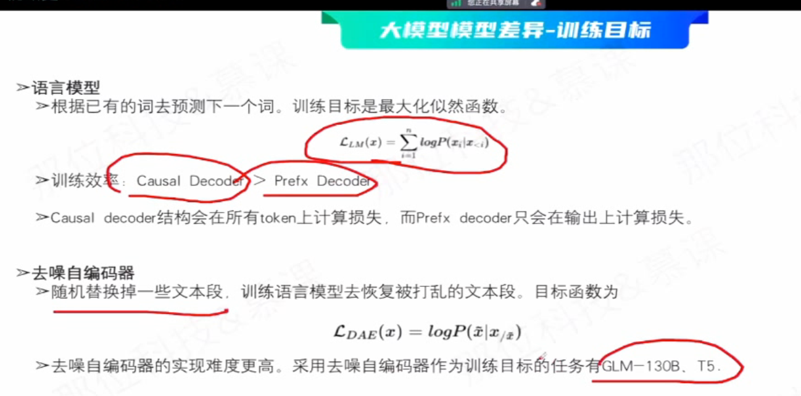
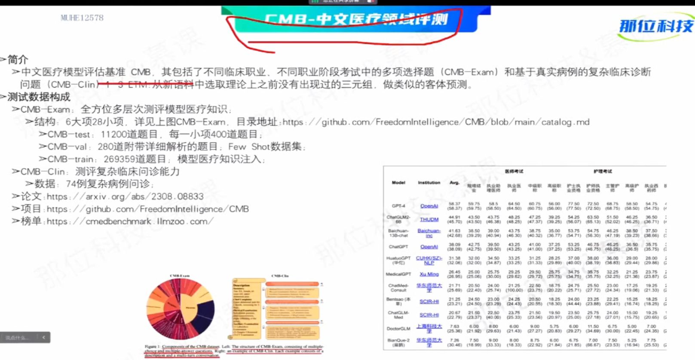
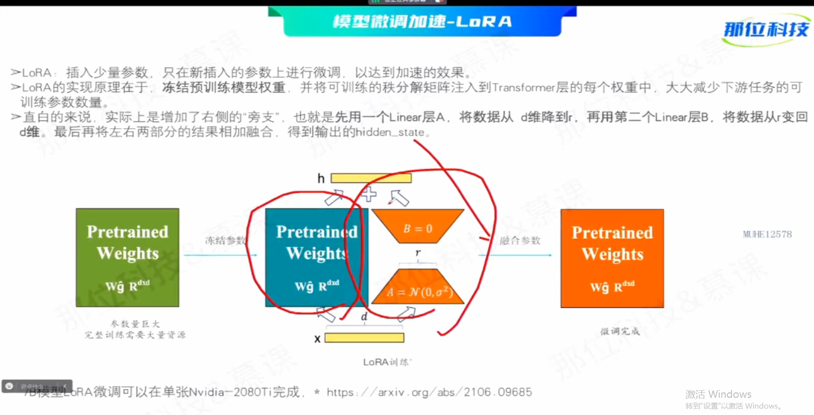
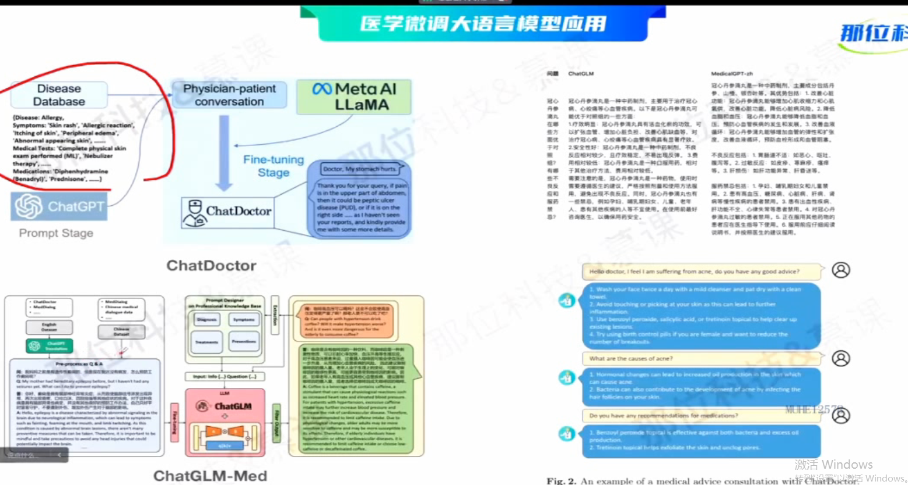

## 01 LLM 进化路线 领域微调 及NLP应用
> 目录
> 
> **模型训练基础目录**
> 
> **1.1 基本pipeline**
> 
> **1.2 训练模型基础**
> 
> 
> 
> 
> ## **2 cuda并行基础**
> **目录**
> 
> **2.1基本结构**
> 
> 性能指标 性能差距巨大
> 
> 内存模型
> 
> 
> **case study 矩阵乘法**
> 
> 
> 
> ## **3 LLM进化路线**
> **langchain 理论**
> 
> 
> **transformer系列演化**
> bert代表的encoder-only
> gpt代表的decoder-only
> 
> 
> ## **3.1大模型研发阶段**
> 预训练（时间最长）
> sft->rm->rlhf 微调->奖励->强化学习
> 
> **预训练模型分为两类 NLU和NLG**
> NLU bert 自然语言生成 (输出范围确定，评级方法明确)
> NLG 预训练模型 （输出自由度高，评价方法难，更具创造性）
> 
> **大模型的涌现能力（大力出奇迹）**
> 
> **gpt的模型演化之路**
> 
> **大模型本质-概率统计**
> 缩放法则（参数量越大，loss一定会降低）
> 
> 训练过程-无监督训练
> 
> 有监督微调 - SFT
> 通常采用混合预训练任务损失和下游微调损失
> 
> 
> 强化学习（PPO） 奖励学习（计算kl散度，调整loss函数）
> 
> 
> **大模型生成原理**
> 
> **top-k  top-p temperature策略**
> k值变大，选择范围变大，输出更加多样化但精度会降低
> 
> 
> 
> **大模型transformer**
> 
> 模型嵌入 绝对位置编码
> 
> 前馈层
> 
> 残差归一化
> 
> 编码解码
> 
> **预训练语言模型实践**
> 预训练词元分析器
> 
> 
> 模型训练，模型使用
> 
> ### 4 大模型差异
> 预训练数据规模
> 
> 训练架构差异
> （encoder-decoder）\(causal decoder)\(prefic decode)
> 
> 
> TOKENizer 差异
> bype-pair (BPE)、wordpiece、sentencepiece
> 
> 训练目标差异
> 
> 位置编码差异
> 
> 正则化位置差异
> 
> 
> 激活函数差异
> 
> 注意力机制差异
> 
> 
> ### 5 主流大模型-结构
> llama 结构
> 
> glm 结构
> 
> bloom 结构
> 
> 主流模型对比-tokenizer (llama token对于中文支持不好，容易乱码，而且非常慢)
> 想要修改的话需要改此表和微调
> 
> 
> 综合对比
> 
## 6 大模型评估
> 评估的对象 （基础模型 sft模型）
> 
> 基于GPT自动化评分 （打分、投票）
> 
> 
> 案例- LLMZoo自动化评测
> 
> 
> 基于特定任务评估-GLUE\CEVAL
> 
> 
> MT-Bench多轮评测
> 
> longBench长文本评测
> 
> CEVAL/CMMLU等知识评测
> 
> CMB-中文医疗领域评测
> 
> FinEval中文金融领域评测
> 
> 大模型评测汇总（https://github.com/MLGroupJLU/LLM-eval-survey）
> 
> ## **领域微调模型落地范式**
> 落地范式
> 
> 
> 具体例子
> 选择基座->买卡->数据->clean
> peet(lora)微调-》形成cama
> 
> 大模型推理，显存预估 （训练阶段，推理阶段）
> 
> 微调加速 - freeze
> 
> 微调加速 - LORA
> 
> 医学微调大模型
> 
> 大模型构造（多模态）
> 
> 
> 
> ## 7 赋能传统NLP
> 大模型应用前提认知
> 大模型封装成黑盒，之后做二次开发，
> 
> 大模型用于文档问答
> 
> 
> 表格问答
> 
> 问答范式
> 
> 文档智能范式
> 
> 大模型用于数据标注123
> 
> 知识图谱构建
> 
> 
> 
> 
> 
> 
> 数据库问答
> 