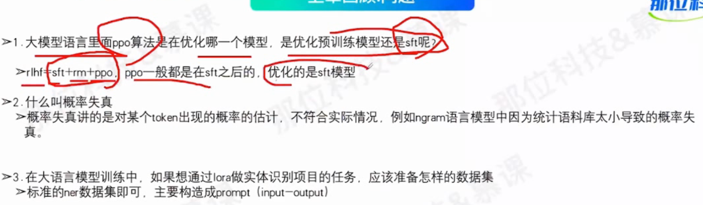
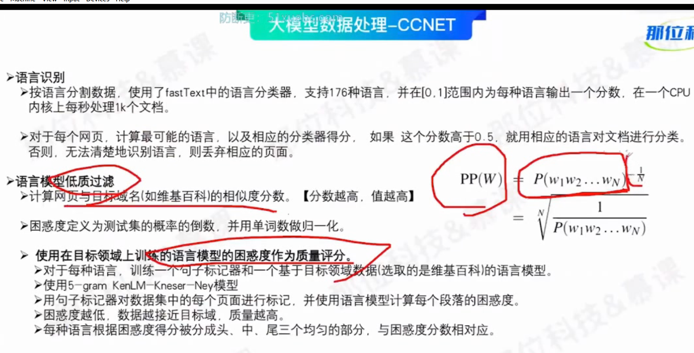

## **目录**
> 
> 之前的问题回顾
> ppo优化sft模型
> 
> ## **1 现有开源大模型研发背后的数据构成与配比**
> 预训练数据构成
> 
> 
> 
> 
> 
> 
> 开源数据集
> 
> 
> ## **2 常用数据清洗与处理方案**
> 质量过滤（关键词过滤） 冗余去除（） 隐私消除 词元切分
> 
> 低质过滤（正负样本）
> 
> 冗余去除（主要是文档级别的去重）
> 
> 大模型数据处理-ccnet
> 
> simhash去重方法（局部敏感），最后计算距离判断相似性
> 
> 
> 语言识别，困惑度作为质量评分
> 5-gram kenLM-Kneser-Ney模型
> 
> 大模型数据处理-wechatLM (有大量的规则)
> 去重，减少数据污染，数据平衡重采样
> 隐私消除
> 
> 
> 
> 大模型数据处理-slimpajama
> 
> 
> 
> 大模型数据处理 规模影响 （参数量与词元至少20倍关系）
> 
> 
> 大模型数据处理 质量影响
> 数据重复也会显著影响性能
> 
> 
> 
> 大模型的记忆能力
> 
> 大模型数据处理-多样性影响
> 
> ## **3现有大模型微调指令数据的多样性生成方案**
> SFT数据生成 ： self-instruct
> 核心思想：蒸馏chatgpt的能力，直接和chatgpt交互获取需要的数据
> 
> 经典的sft 三段论与两端论
> 
> 指令生成
> 
> 输入优先，输出优先，数据过滤与处理
> rogue-l 、rogue-n 计算给定分本和生成文本的相似度
> 
> 判断指令是否属于分类任务的操作
> 初始指令通过人来写
> 
> SFT数据生成：baize
> self-chat template
> 
> sft数据生成：evol-instruct
> 
> 
> 
> sft数据生成：self-QA
> 根据无监督的文本生成指令
> 
> sft数据生成：ultra-chat
> 
> 
> 
> ## **4现有大模型指令数据的常用评估方法**
> sft数据评估：topic 聚类/分类
> 
> ngram用词分析
> 
> ## **5现有开源指令微调数据集**
> coig数据集
> 
> pclue数据集
> 
> firefly数据集
> 
> belle
> 
> ppo数据集
> 