## **1结合代码理解 transformer模型**
> 相关资料
> 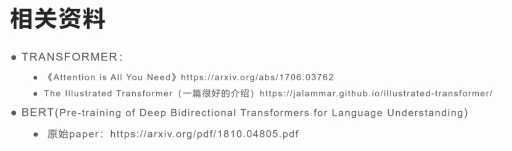
> NLP的各种任务（NLU分词，NLG文本生成）
> 演进:rnn lstm transformer bert llm
> 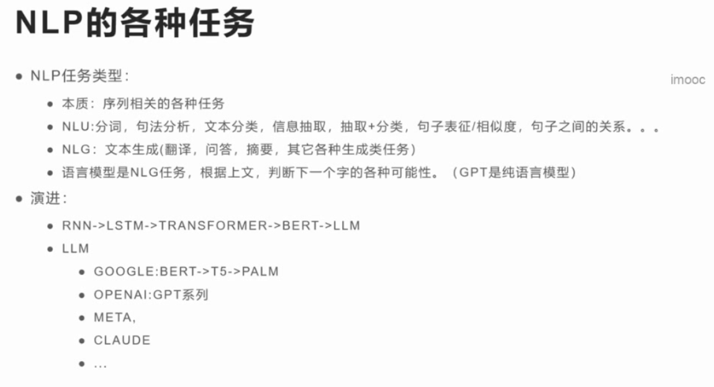
> transformer 整体结构
> 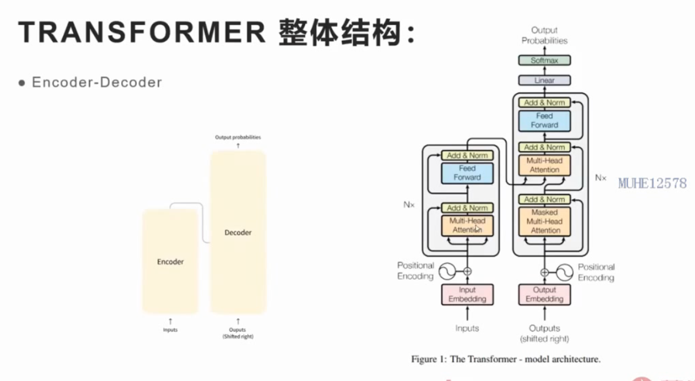
> 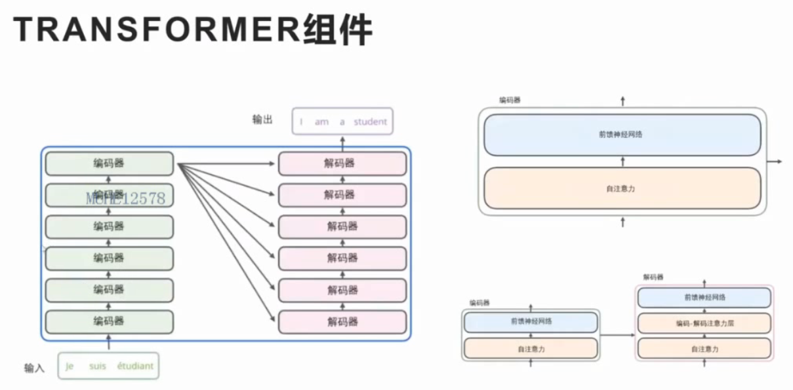
> 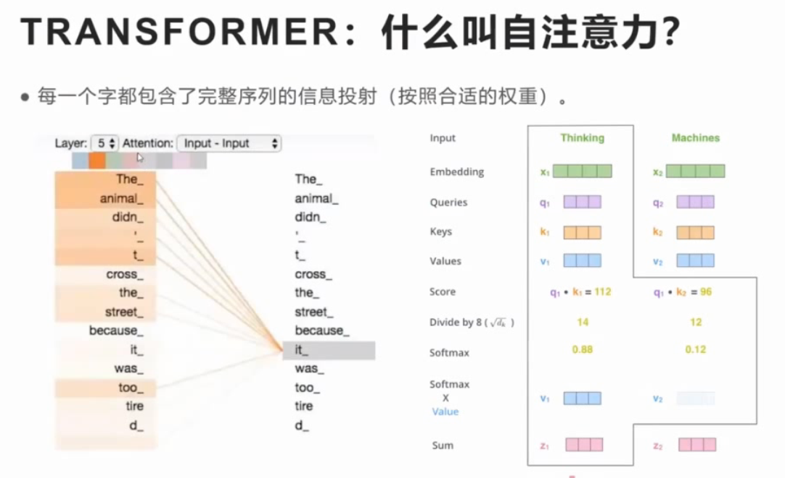
> **BERT结构**
> 只保留了ENcoder结构
> 采用MLM训练。随机mask掉一些字，然后猜测字是什么
> 隐层训练好后，进行下游任务：句子分类，关系推理，信息抽取
> 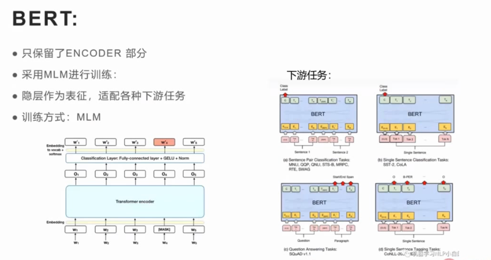
> **llm的诞生：gpt **
> 是使用了生成类任务
> 采用auto-regressice方式训练，预测下一个字是什么
> 只保留了Decoder层
> 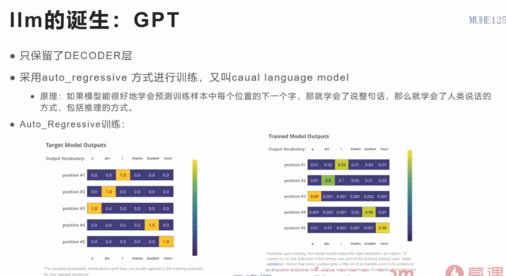
> **transformers**
> 每一家的基础框架
> huggingface提供的开源框架
> 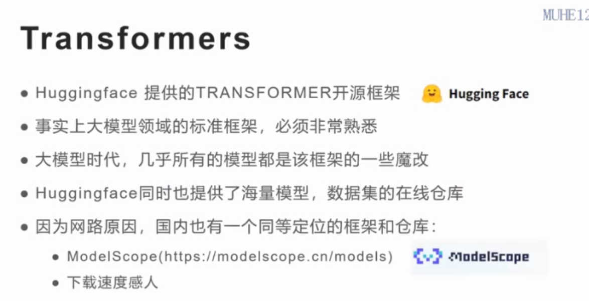
> 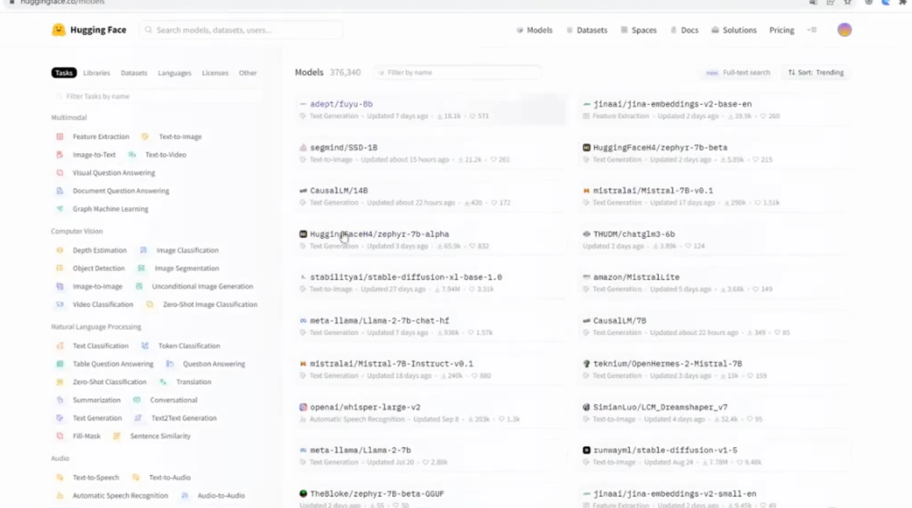
> ## **程序实战部分**
> **tokinizer**
> 文本序列的入模
> 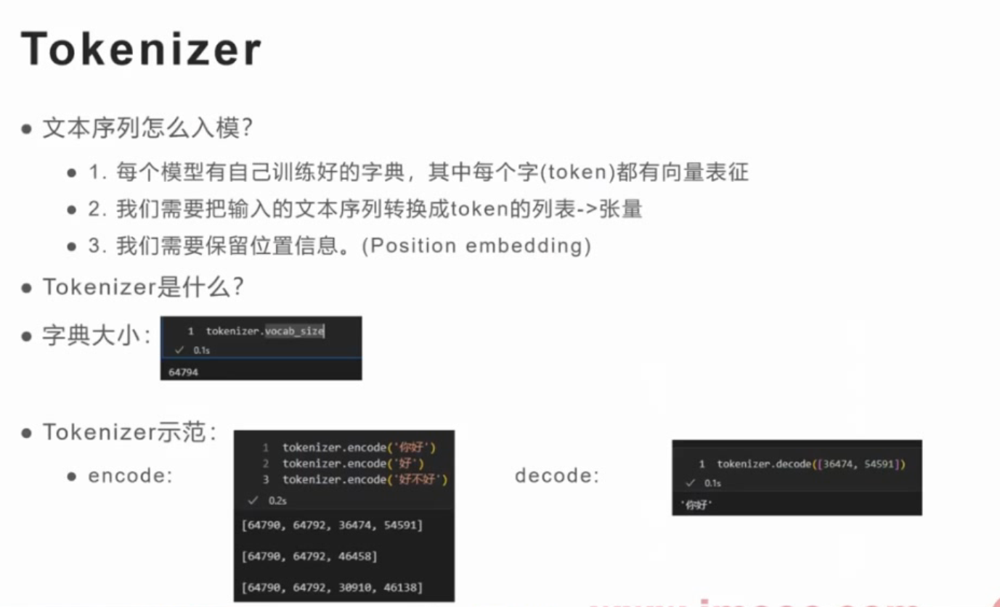
> 字典大小，encode decode
> 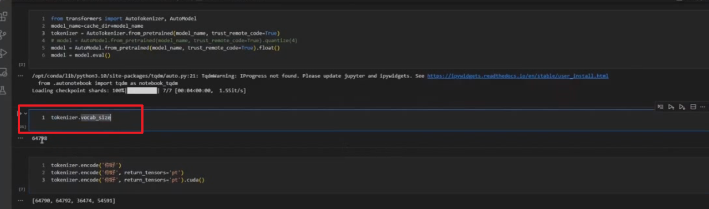