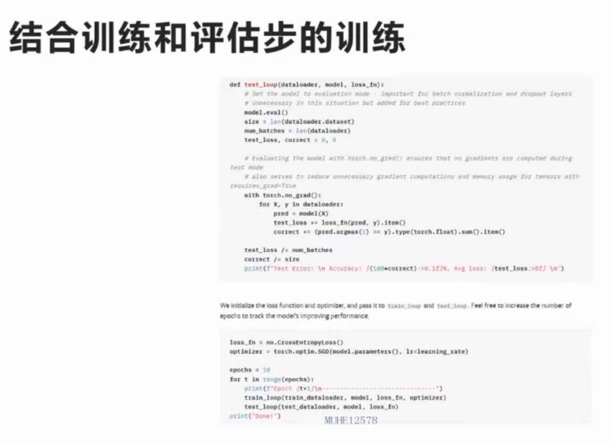

## **LLM的训练方法**
> ## **1 基础训练流程**
> 
> 结合训练和评估步的训练
> 
> LLM的loss
> loss的直观理解，计算困惑度
> 
> 
> 
> trainner 是集成度很高的训练框架
> 
> 预训练和sft的区别
> 预训练：整句学习，没有masking，学习说话的方法（basemodel，并不会基础对话）
> sft:领域微调，让模型学会特定领域的知识或回答范式
> 大多数NLU任务可以转换成指令问答形式
> 通用的指令遵循数据集：ALPACA
> 
> 代码讲解
> 
> ## **2 数据准备**
> datacollect的准备
> 
> ## **3 sft训练范式**
> sft训练范式
> 全量参数与部分参数训练
> lora:极为节约显存的训练方式
> 
> **lora**
> 模型本身参数冻结，新加一个减质矩阵（大压缩）
> h = (w+ba)x
> 两种加载方式：分别加载，和merge加载
> 
> 
> 
> **pretrain需要多少训练参数**
> 
> **RLHF介绍文档**
> 教会模型分辨好坏 （无害，真实，有帮助）
> 强化学习
> 
> 获得整体的最优，（而不是局部的最优）
> 某种方式对模型的生成结果进行评估
> policy：给定序列 value：预期收益
> 目标是，优化模型预判的每个位置的policy，让总体收益最大化
> 
> **RLHF和SFT/PREtrain的区别**
> RLHF价值观的评估，同时不能离原有大模型太远
> 
> **RLHF反馈机制**
> 
> **通过相对标注训练奖励函数**
> ELO算法
> 
> **PPO训练过程，一种强化方法**
> online,需要持续的与模型互动，
> 
> ppo Loss
> 