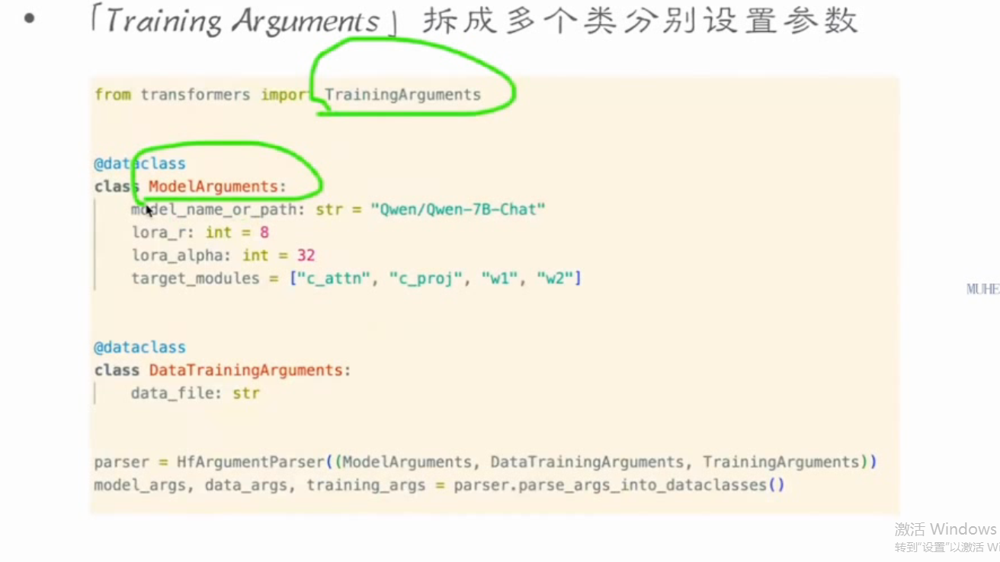
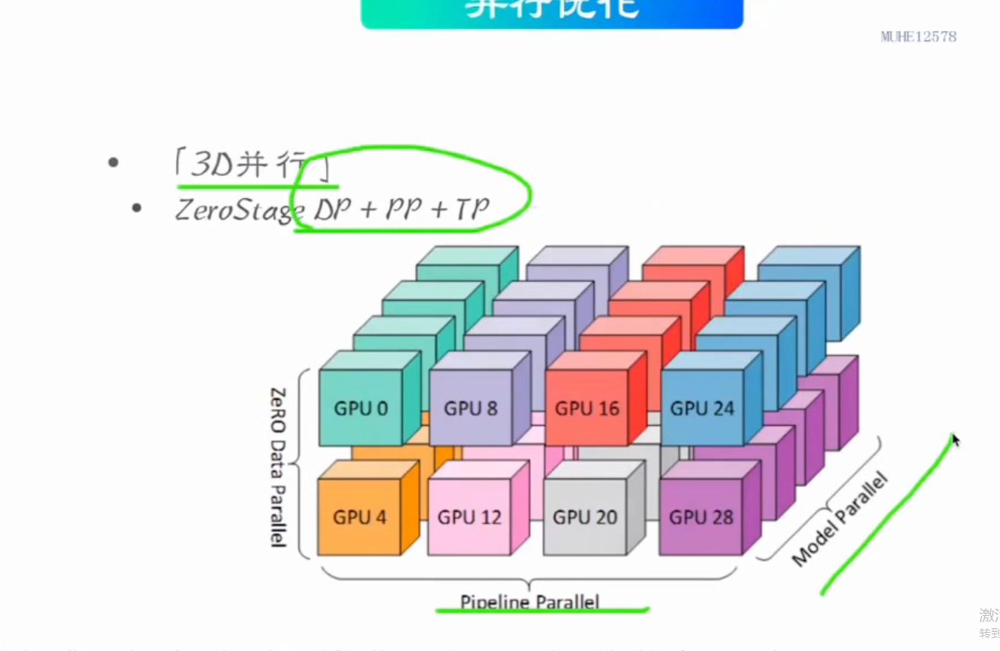

## **目录**
> 
## **第一部分 模型训练**
> 
> ### **1.1 trainer**
> trainer arguments 封装成一个类
> 
> 简单用法
> 
> training auguments 拆成多个类分别设置参数
> 
> 
> ### **1.2 input processing基本流程**
> promt（已经包含了上下文，不计算损失函数）和completion 序列化 转化成dataset
> dataset（注意长度，promt前面截断） padding mask ，转为batch化
> 
> 示例
> 
> 
> ### **1.3 evaluate and save**
> 评估模型当前性能
> 一般用ppl困惑度，token预测精度衡量
> 
> 示例
> 
> ## **2 训练超参介绍**
> 
> **2.1 steps概览**
> 
> **2.2 learningRate**
> 
> **2.3 zerostage概览**
> 不同的阶段节省显存
> 
> ## **3 优化器介绍**
> 高效调节模型参数
> 
> 
> adam和adamw概览 使用权重衰减来防止过拟合
> 
> 
> group parameters 
> 
> ## **第二部分 训练优化**
> 
> **1 精度优化**
> 低精度表示高精度
> 
> bf16，google提出的一个小数表示方法
> 
> 整数表示
> 
> 
> 混合精度
> 
> **2 显存优化**
> **gradient checkpoint**
> 定点保存前向结果，并非全部保存
> 
> 
> **zero stage 回顾**
> 不同阶段优化显存方案
> 显存需求降低，速度变慢
> 
> zero stage具体意思
> 
> **offload**
> 将梯度和优化器状态卸载到cpu上，在cpu上更新参数
> 
> 
> **其他优化**
> 
> **3 并行优化**
> **DP 并行优化**
> data parallelism 数据并行
> 借助之前介绍的zerostage和cpuoffload
> 多卡跑多个batch
> 
> **pp pipeline 并行优化**
> 把模型不同部分放到不同卡上
> 
> **TP tensor 模型并行**
> 张量并行
> 
> **3d并行**
> 