## **03 框架选型和推理优化**
> ### **第一部分 大模型框架选择**
> **大模型框架选择**
> 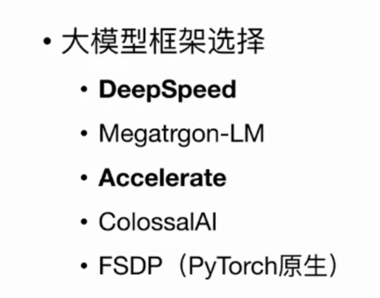
> 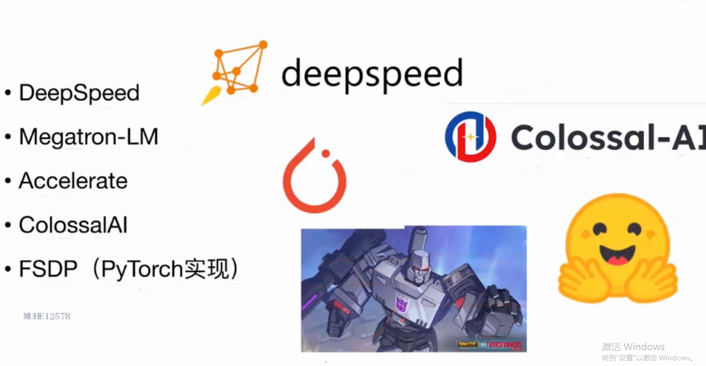
> 各大框架的优缺点
> deepspeed+megatron 预训练更为常用
> accelerate更适用于微调
> 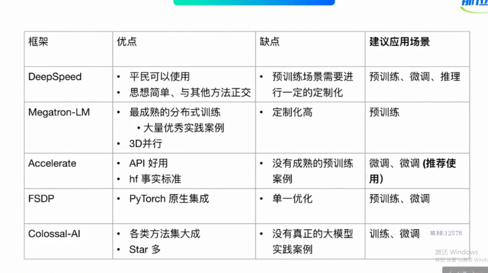
> **数据并行 zero分片**
> dp\ddp\fsdp
> 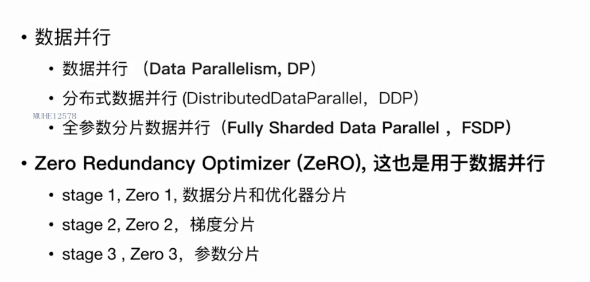
> **dp 数据并行**
> 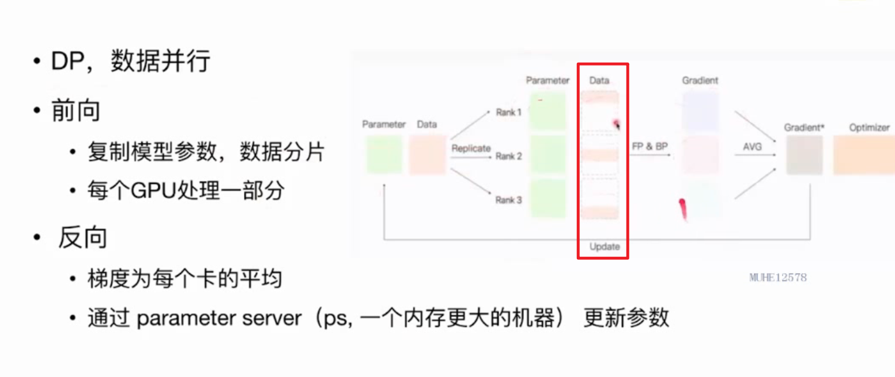
> **算子介绍**
> reduce-scatter\all-gather\all-reduce
> 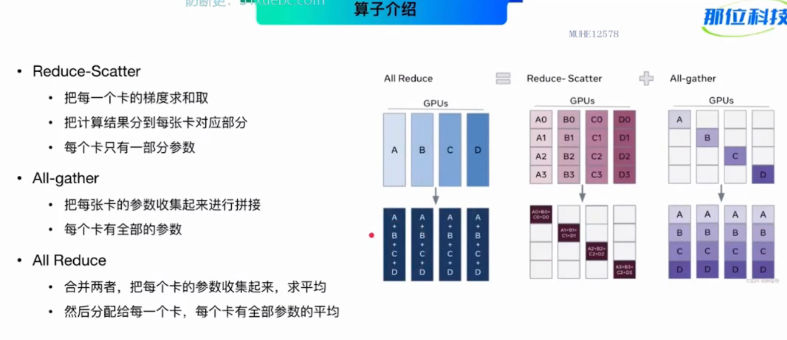
> **ddp 分布式数据并行**
> 没有ps,参数服务器
> 
> **zero阶段**
> zero 1 阶段 数据并行
> 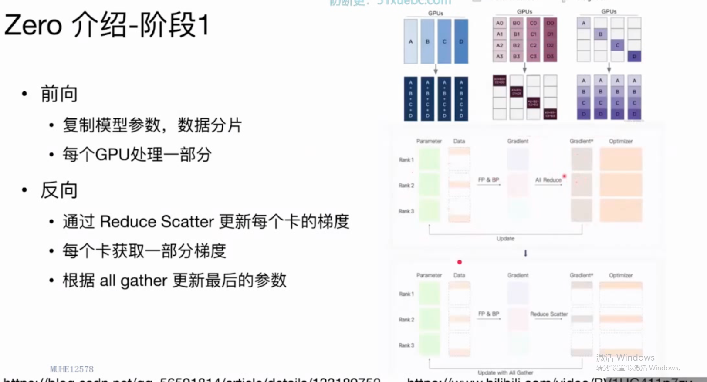
> 2阶段 分层更新梯度
> 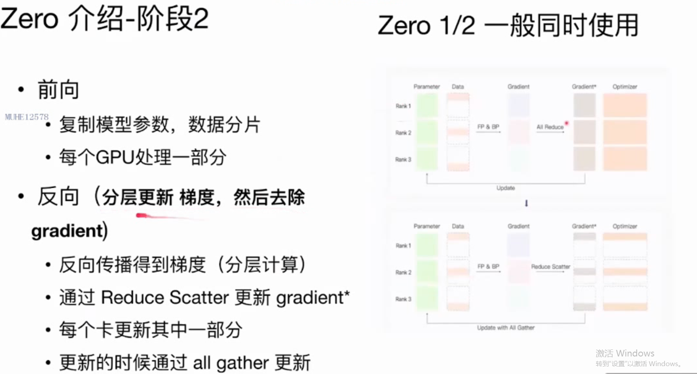
> 3阶段
> 
> **accelerate使用**
> 增加一行，使用accelerator的并行
> 重新包装下
> 
> 运行
> 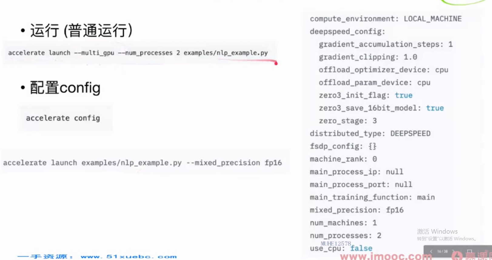
> **各个模型框架使用场景**
> 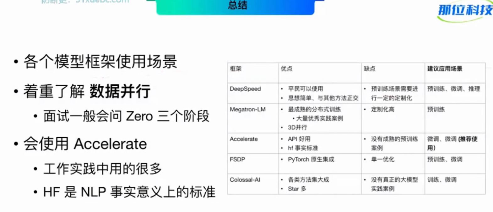
> ## **第二部分模型推理优化**
> 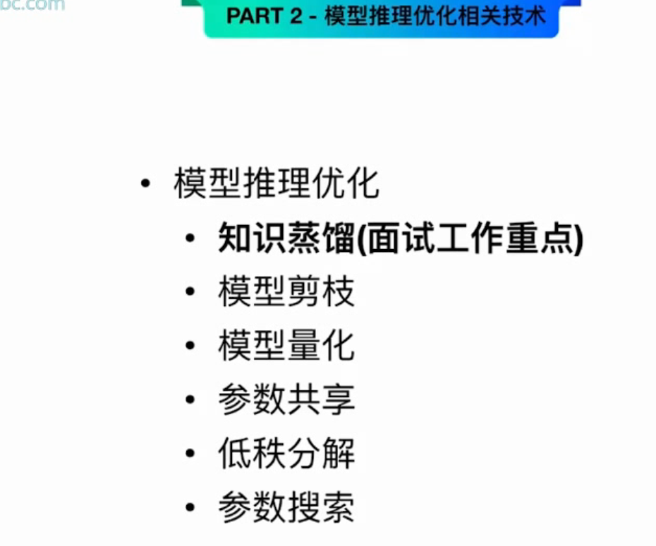
> 模型推理压缩优化
> 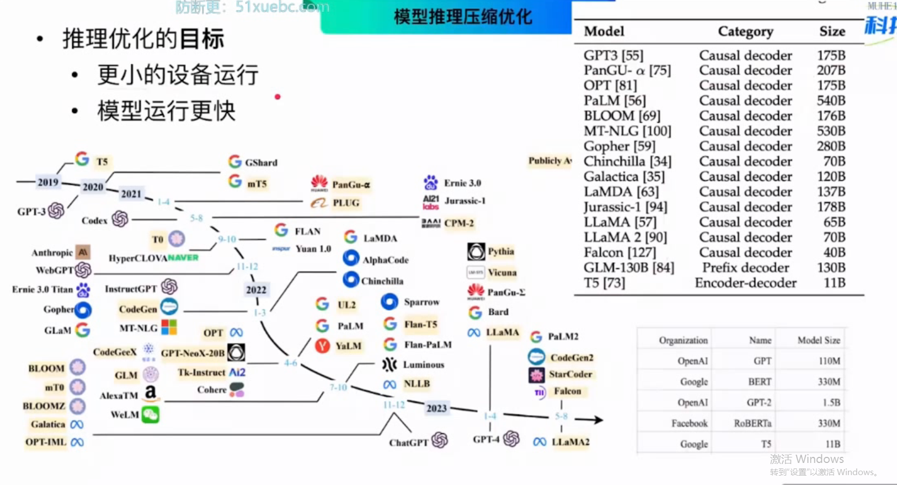
> **知识蒸馏**
> 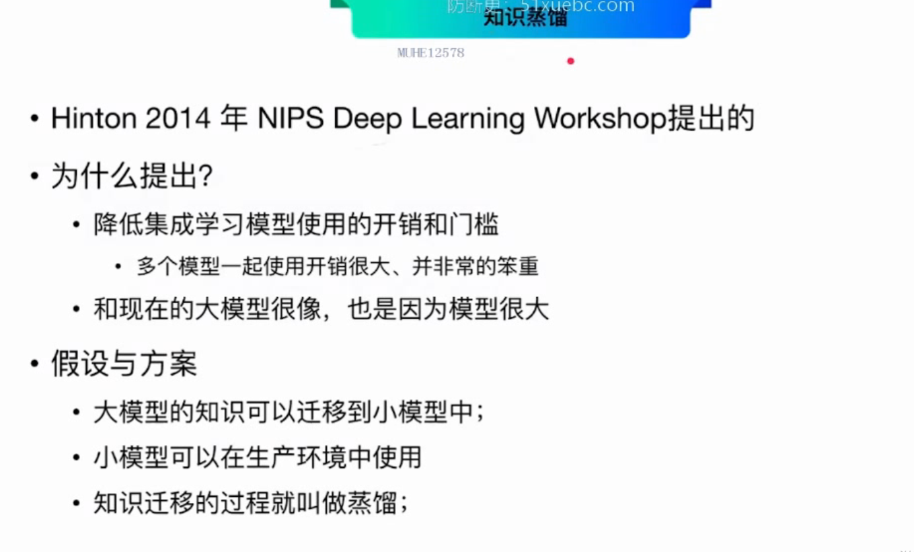
> 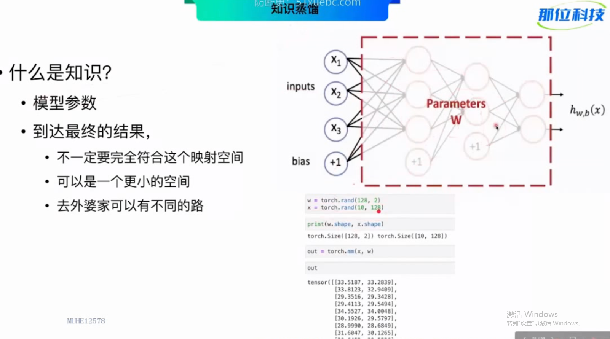
> 让两个模型最后一层输出尽量相似，kl散度和l2距离
> 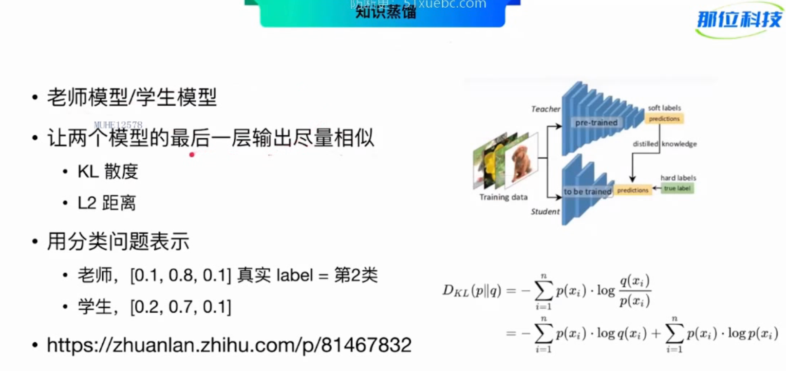