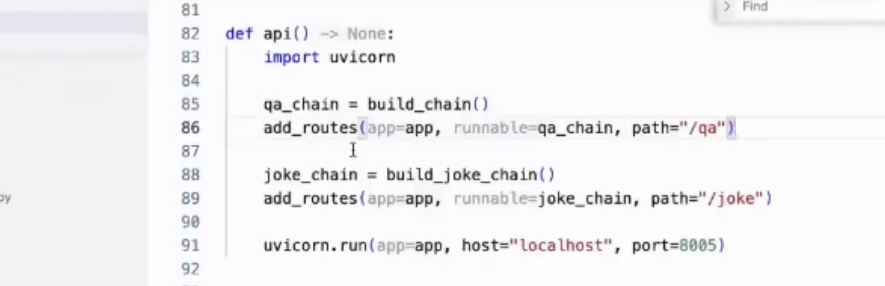

## **langchain进阶实战 外挂知识库**
> rag中最重要的是一个retrieval模块 存储检索
> 检索后需要进行业务截断与重排
> 
> 代码讲解
> 
> 加载文件 chunk化（split,overlap）
> 
> 存到database (faiss) 序列化的内容
> 多使用 logger库 tyro loguru
> 
> 相关化搜索（similarity_search,bm25搜索）
> 多搜索融合ensembleRetriever
> 
> 
> 
> 构造promt (先定义一个template)
> 
> 定义一个chain (也是一个函数，函数就是一个DAG图)
> 解读chain 一系列runnable 序列
> search->template->prompt->model
> 
> 
> prompt会基于模板生成
> 
> 有无参考rag的比对
> 
> **## 第二部分 复杂化RAG**
> 复杂处理
> 
> 
> chain构建（标准问法）
> 
> 
> 重排documents
> 把检索的document也返回
> 
> chain两种输入，promt和dict
> 
> 部署过程fastapi
> 
> 
> 
> 面试时需要注意的问题
> 