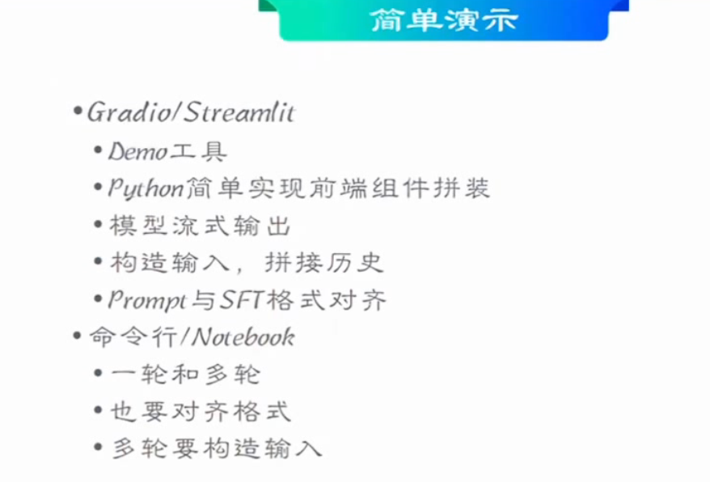

## **SFT实践**
> sft一般说的是instuction tuning
> ft说的是广义上的微调
> 
> **prompt learning和instruction learning**
> 提示学习和指令学习
> 
> 例子 instruct 让模型有理解能力
> 
> **代码讲解**
> 
> sft流程
> 加载数据-》tokenize
> 基本原则
> 样本质量高
> 不需要很多（2000 5000）
> sft的时候不要算prompt的loss
> 
> 
> 
> **第二部分实际操作理论**
> **目录**
> 
> **2.1 gradio/streamlit**
> gradio官方例子
> 
> 
> temperature 概率生成超参数
> 按照概率采样
> 
> 简单演示参数说明
> 主要是调整调整temperature
> 
> 
> **2.2 本体推理**
> 
> GGML(GGUF)
> 本地量化
> 
> 
> GPTQ量化方法 针对GPU优化
> 
> 
> **2.3 服务端推理**
> tritonServer
> 张量并行
> 
> 使用示例
> 
> 
> SSE
> 
> **2.4 推理框架**
> 
> 
> 