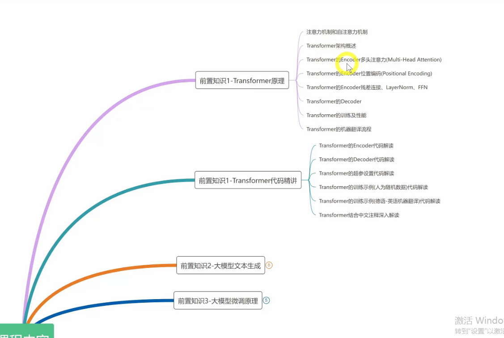
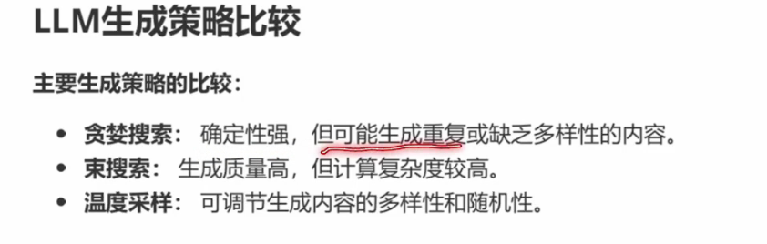
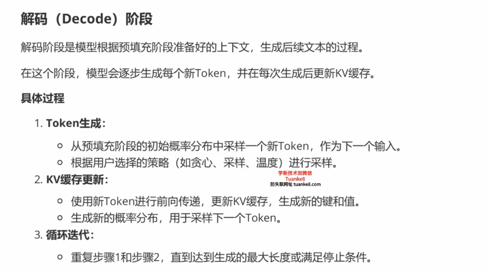

## **理论基础**
> **目录**
> 
> 
> **注意力机制**
> 
> **Transformer原理**
> 
## **LLM的文本生成**
> LLM推理方式分为两种：预填充和续写
> 
> 通过这两种方式生成
> 
> 模型并无对话和上下文记忆功能，而是将之前所有的对话作为输入,生成新的token。
> 无真正的记忆
> 尽管大模型支持长度比较长，但还是要控制上下文长度
> 
> 
> ## **LLM的文本生成模式**
> 自回归模式生成，输出作为下一步的输入
> 
> LLM文本生成模式，completion模式和chat模式
> 文本补全和聊天
> 
> completion模式，最基础，给定提示自动补全
> 
> chat模式，模拟多轮对话，连贯互动
> 
> 小结
> chat模式还引入一些专门的技术 角色指令，rag
> 
> ## **LLM的文本生成策略**
> 文本生成的方法
> 
> greedy sampling
> 选择概率最高的token,但可能导致生成重复
> 
> beam search
> 考虑K个token
> 选择整体概率最高的分支
> 
> 
> Normal random sampling 正常随机抽样
> 
> random sampling with temperature
> 随机温度抽样
> 高温度适用于创意写作，低温度适用于事实回答
> 
> 
> 
> top-k sampling (top-k抽样)
> 
> top-p抽样
> 避免top-k引入不确定
> 选择累计概率
> 
> 
> 
> 生成策略比较与建议
> 
> 
> **token与分词器**
> 可能是单词 或是字符或是子词
> 
> 分词器 tokenizer->送入到embedding
> 
> 分词器常用分词方式
> 字典分词、BPE、SentiencePiece、WordPiece
> 
> 还有一些特殊token标识不同功能
> cls\sep\pad\unk\mask
> 
> llama3用的tiktoken分词器
> 平均每个单词会被分成1.3个token
> 
> 示例
> 
> llama2使用bpe和sentencepiece分词器
> 迭代地合并语料库中最频繁出现的字符
> 
> llama3分词器，更大的词汇量和TikToken
> 
> **LLM的文本生成过程**
> 主流LLM生成过程 decoder-only
> 
> 过程包括一下：
> 输入阶段-》分词-》嵌入-》位置编码-》transformer处理-》输出转换-》softmax-》采样-》生成文本-》后处理
> 位置编码：由于transformer模型不具备捕捉顺序的能力，通常会给每个嵌入向量添加一个位置编码
> 
> 
> 
> 举例
> 
> 
> 
> 解释
> 
> 
> 
> 
> 
> **prefill和decoder阶段**
> LLM生成文本过程中，通常会涉及两个阶段：预填充（prefill）和解码(decode)
> 首先需要一个开头
> 
> 
> prefill阶段：用于准备初始上下文，模型会处理输入的初始文本，并生成相应的内部状态（KV缓存）
> 
> 解码阶段：根据预填充阶段准备好的上下文，生成后续文本过程，逐步生成token，并在每次生成后更新kv缓存
> 
> 两个阶段的意义
> prefill提供出初始上下文，decode逐步生成文本
> 
> **LLAMA3 生成过程**
> 1) 经过分词器，产生一个seq_len(8k上下文窗口)的输入token序列，并且会将tokens映射到词汇表（128k）中对应的token IDs
> 2) 通过嵌入矩阵，映射成seq_len x 4096的嵌入表示矩阵，4096是llama指定的特征维度 
> 3) 经过transformer block层，32层堆叠
> 4) 最后转换回128k
> 
> 
> **文本生成时的qkv**
> query\key\value
> 