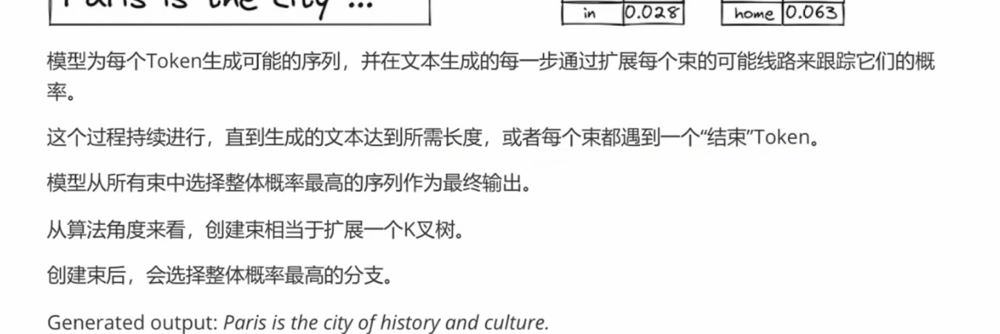
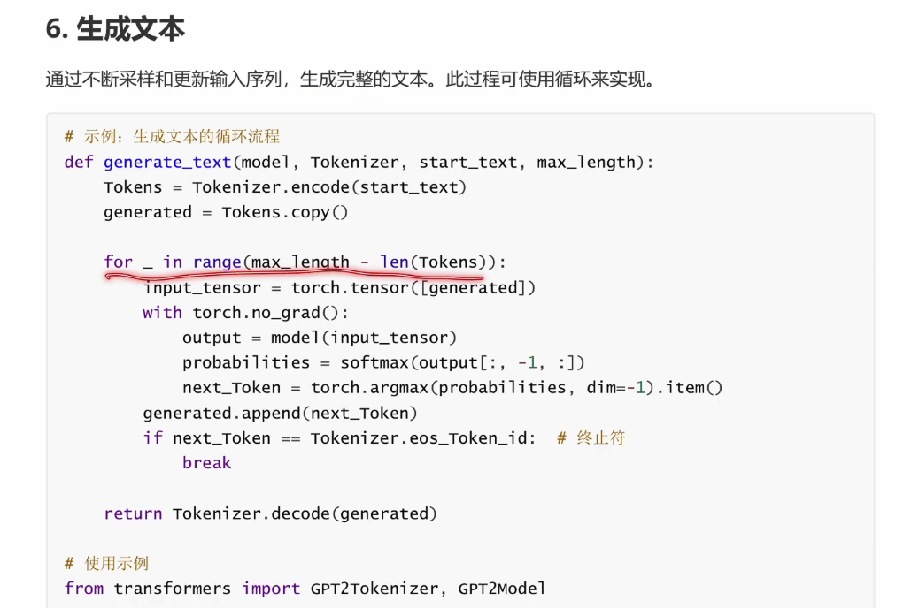

## **理论基础**
> **目录**
> 
> 
> **注意力机制**
> 
> **Transformer原理**
> 
## **LLM的文本生成**
> LLM推理方式分为两种：预填充和续写
> 
> 通过这两种方式生成
> 
> 模型并无对话和上下文记忆功能，而是将之前所有的对话作为输入,生成新的token。
> 无真正的记忆
> 尽管大模型支持长度比较长，但还是要控制上下文长度
> 
> 
> ## **LLM的文本生成模式**
> 自回归模式生成，输出作为下一步的输入
> 
> LLM文本生成模式，completion模式和chat模式
> 文本补全和聊天
> 
> completion模式，最基础，给定提示自动补全
> 
> chat模式，模拟多轮对话，连贯互动
> 
> 小结
> chat模式还引入一些专门的技术 角色指令，rag
> 
> ## **LLM的文本生成策略**
> 文本生成的方法
> 
> greedy sampling
> 选择概率最高的token,但可能导致生成重复
> 
> beam search
> 考虑K个token
> 选择整体概率最高的分支
> 
> 
> Normal random sampling 正常随机抽样
> 
> random sampling with temperature
> 随机温度抽样
> 高温度适用于创意写作，低温度适用于事实回答
> 
> 
> 
> top-k sampling (top-k抽样)
> 
> top-p抽样
> 避免top-k引入不确定
> 选择累计概率
> 
> 
> 
> 生成策略比较与建议
> 
> 
> **token与分词器**
> 可能是单词 或是字符或是子词
> 
> 分词器 tokenizer->送入到embedding
> 
> 分词器常用分词方式
> 字典分词、BPE、SentiencePiece、WordPiece
> 
> 还有一些特殊token标识不同功能
> cls\sep\pad\unk\mask
> 
> llama3用的tiktoken分词器
> 平均每个单词会被分成1.3个token
> 
> 示例
> 
> llama2使用bpe和sentencepiece分词器
> 迭代地合并语料库中最频繁出现的字符
> 
> llama3分词器，更大的词汇量和TikToken
> 
> **LLM的文本生成过程**
> 主流LLM生成过程 decoder-only
> 
> 过程包括一下：
> 输入阶段-》分词-》嵌入-》位置编码-》transformer处理-》输出转换-》softmax-》采样-》生成文本-》后处理
> 位置编码：由于transformer模型不具备捕捉顺序的能力，通常会给每个嵌入向量添加一个位置编码
> 
> 
> 
> 举例
> 
> 
> 
> 解释
> 
> 
> 
> 
> 
> **prefill和decoder阶段**
> LLM生成文本过程中，通常会涉及两个阶段：预填充（prefill）和解码(decode)
> 首先需要一个开头
> 
> 
> prefill阶段：用于准备初始上下文，模型会处理输入的初始文本，并生成相应的内部状态（KV缓存）
> 
> 解码阶段：根据预填充阶段准备好的上下文，生成后续文本过程，逐步生成token，并在每次生成后更新kv缓存
> 
> 两个阶段的意义
> prefill提供出初始上下文，decode逐步生成文本
> 
> **LLAMA3 生成过程**
> 1) 经过分词器，产生一个seq_len(8k上下文窗口)的输入token序列，并且会将tokens映射到词汇表（128k）中对应的token IDs
> 2) 通过嵌入矩阵，映射成seq_len x 4096的嵌入表示矩阵，4096是llama指定的特征维度 
> 3) 经过transformer block层，32层堆叠
> 4) 最后转换回128k
> 
> 
> **文本生成时的qkv**
> query\key\value
> 
> 
> 
> 注意力机制示例
> 
> **LLM的开发过程**
> 四个关键阶段：预训练、有监督微调、奖励建模、强化学习
> 
> 预训练 pretraining 基座模型
> 
> 有监督微调 sft
> 使用标准好的数据集，目的让模型更加精准地理解和执行特定任务、用户提问和期望的答案
> 
> 奖励建模
> 比较不同输出的优劣为他们排序
> 
> 强化学习（带有人类反馈）
> 利用上一阶段的RM模型评估SFT模型输出，并据此调整SFT模型的参数，以生成更高质量的文本
> 
> **LLM模型构建不同阶段的划分（其他模式）**
> 
> 
> **从语言模型到聊天智能：基座模型到对话模型的转变**
> sft的目标是生成连贯、自然且上下文相关的对话回复
> 
> 第一步：预训练LLM基础模型
> 自监督学习，大量无标签预测下一个词或恢复被掩盖的词
> 
> 
> 第二步：使用sft进行任务适应
> 通常准备由人类对话组成的数据集，样本包括一个对话历史（上下文）和一个人类回复（目标）
> 但回复可能存在一些问题（不够流畅，不够贴切）
> 
> 第三步：使用RLHF提高对话质量
> 使用带有人类回复的反馈来学习和改进行为策略
> 
> 第四步：模型部署和持续优化
> 
> **从哪个模型微调，基座模型还是对话模型**
> 预训练模型微调优缺点
> 优点：可塑性强 缺点：领域适应性差，对话连贯性不足
> 
> 聊天模型SFT微调
> 优点：更好的领域适应性，缺点：对话偏见、知识覆盖不足
> 选择：通用模型选择预训练sft,专业模型选择聊天模型微调
> 
> **LLM微调方法**
> full-tuning、freeze-tuning、LoRA、QLoRA
> 全量微调（full-tuning）
> 对预训练模型全部调整，需要大量资源和成本
> 
> 
> 冻结部分参数微调（freeze-tuning）
> 只冻结部分参数，适应能力受到限制
> 
> LoRA低秩适应的参数高效微调
> 在每个transformer层中引入一个低秩分解矩阵，并只训练这些新增的低秩矩阵，而保持原有的权重不变
> 底摸+外挂的模式
> 核心思想是通过少量的额外参数（低秩矩阵）来捕捉下游任务的特定模式，而不改变预训练权重。
> 一些特定任务上可能达不到full-tuning的性能水平，以及低秩假设不一定总成立
> 
> 
> QloRA：低秩适应的量化优化
> 核心思想是应用LoRA进行模型调优前，先对预训练模型的基础模型进行量化
> 减小体积、加速推理、参数高效
> 
> 小结,LLM训练的不同思路和方法
> 
> **LoRA微调**
> 轻量级微调技术
> LoRA 将模型权重矩阵分解为低秩矩阵并进行训练的微调技术
> 
> 数学原理
> 讲该矩阵表示为两个低秩矩阵的乘积
> r远远小于d,k
> 
> 
> A矩阵高斯分布初始化，B初始化为0
> 
> lora通查插入在transformer架构的注意力模块和前馈网络中
> 
> 参数量对比
> 
> 
> 缩放因子的使用
> 增加或减少低秩权重对最终权重的贡献
> 调整和应用策略
> 
> 
> LoRA有效的依据
> 大模型往往具有低内在维度，低秩也可以在该空间高效求解
> 
> 
> 可以选择只对Q和V的线性映射进行微调
> 减少复杂度，提高q,v的表示能力，避免过拟合
> 
> 
> **QLoRA量化微调**
> 量化微调技术
> 一种结合了LoRA低秩微调和量化技术的创新方法
> 采用四位精度对预训练模型权重进行量化，然后在量化模型上训练LoRA模块
> 采用NF4数据格式、双重量化、分页优化器
> 
> 
> 
> QLoRA的工作流程
> 
> QLoRA的优势
> 个人电脑微调LLM成为可能
> 
> 
> 双重量化，进一步降低量化常数的内存占用
> 
> 
> 分页优化器防止梯度校验导致内存峰值
> 