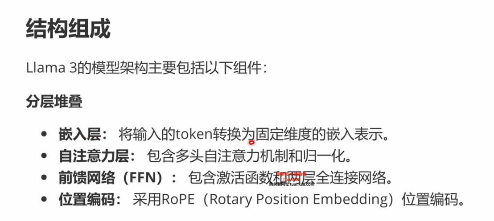
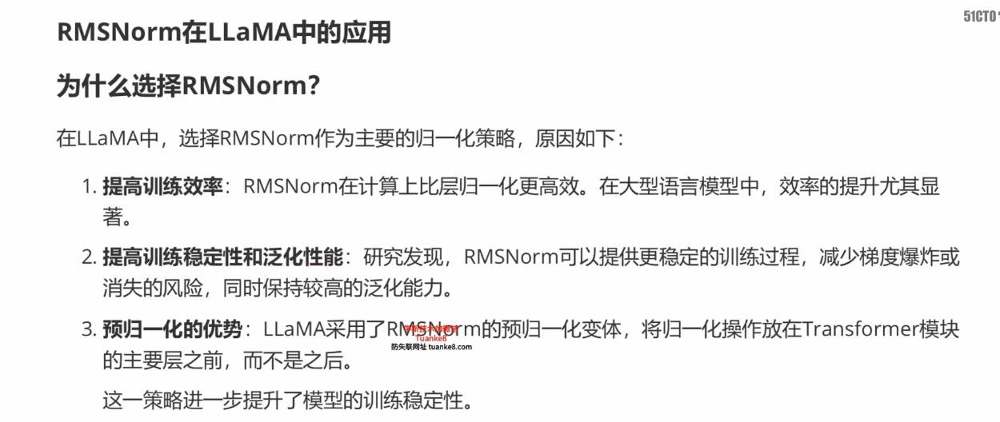
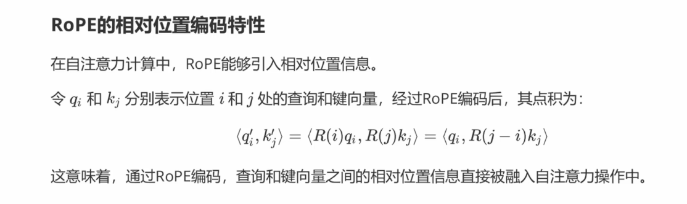

## **LLaMa3详解**
> **LLaMa进化史**
> meta公司退出的开源大模型进化史
> llama3 上下文8192个token，词表128k
> 
> 
> 
> 
> 
> **llama3模型类型**
> 基础模型和指令微调模型
> 
> llama主要的几个变体
> 
> 指令微调变体和基础版模型几个区别
> 训练目标不同、训练数据不同、应用场景不同、交互方式不同、可控性不同、推理效率不同
> 
> **衍生模型**
> 基于LLAMA的微调，alpaca,vicuna,llava
> 
> 
> 一些术语的解释
> 
> alpaca模型（数据开源，性能接近chatgpt）
> 
> llava，一种新型的大型多模态模型，结合NLP和CV
> 
> **LLAMA3 模型架构和代码详解**
> 模型架构对比
> 
> llama3 模型架构
> 基于标准的transformer架构进行了多项改进，包括更高的效率
> 
> 分层堆叠，嵌入层，自注意力层、前馈网络层、前馈网络FFN、位置编码（RoPE）
> 
> 与传统架构的相同处
> 基础结构、前馈网络、多头自注意
> 
> 不同之处
> gqa、swiglu激活函数、rope位置编码
> 
> **RMSNorm归一化**
> 归一化技术，可以提高训练稳定性、加快收敛速度并改善模型泛化能力。
> 
> 两种常用归一化技术：层归一化
> 使得每个样本的激活值在特征维度上具有均值为0、方差为1的分布
> 
> 
> RMSNorm是一种简化版本的层归一化，不要计算均值和标准差
> 
> RMSNorm应用
> 提高训练效率、提高训练稳定性和泛化性能、预归一化的优势
> 相比传统架构，RMS放在自注意力和MLP之前
> 效率能提升10%
> 
> 
> 
> **SwiGLU激活函数**
> 影响模型性能的稳定性和泛化能力
> 
> 常见的激活函数 ReLU
> 
> GELU，基于高斯分布的激活函数
> 
> Swish，平滑且连续的激活函数，Transformer等模型应用广泛
> 
> 
> GLU(Gate linear Unit)
> 门控机制，动态选择机制，在模型中选择性传递信息
> 使用sigmoid输出一个介于0-1之间的权重矩阵，选择性让部分信息通过
> 
> 
> 
> SwiGLU激活函数
> 结合上面两种机制的激活函数
> 
> 
> 
> swiGLU的计算代价与性能优势
> 更好的泛化性能和稳定的梯度流
> 三次矩阵乘法
> 
> **RoPE位置编码**
> 位置编码是transfomer中确保模型能够理解序列顺序信息的重要部分
> RoPE作为一种新型的位置编码方法，平衡了绝对和相对位置编码的优点
> 
> 位置编码背景
> 绝对位置编码：为序列中的每个位置提供一个固定的嵌入
> 相对位置编码：为序列中每两个token的相对位置信息
> 
> 绝对位置编码
> 
> 相对位置编码，关注的是相对距离，而非绝对位置
> Aij= Qi * Kj + Qi * ri-j
> 
> RoPE的原理
> 结合了绝对和相对位置编码的优点
> 使用旋转矩阵对每个位置进行编码，并将相对位置信息引入自注意力操作中
> 
> 具体计算过程
> 
> 
> 
> 示意图（注意有d和m）,对于不同的m，旋转矩阵是不同的
> 
> 
> RoPE的相对位置编码特性
> q,k的点积，相对信息融入到自注意力机制
> 把m变成了j-i
> 
> 
> RoPE结合了相对位置编码和绝对位置编码的优点
> 具体示例
> 
> 
> RoPE的优点
> 引入相对位置信息，保持绝对位置信息，高效处理长序列
> 