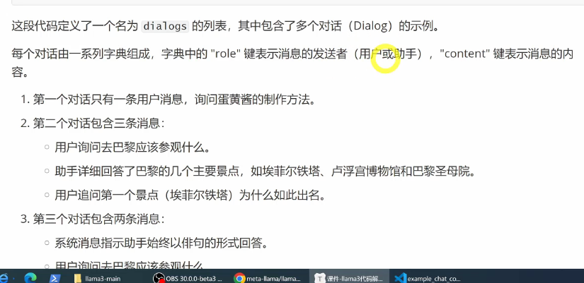
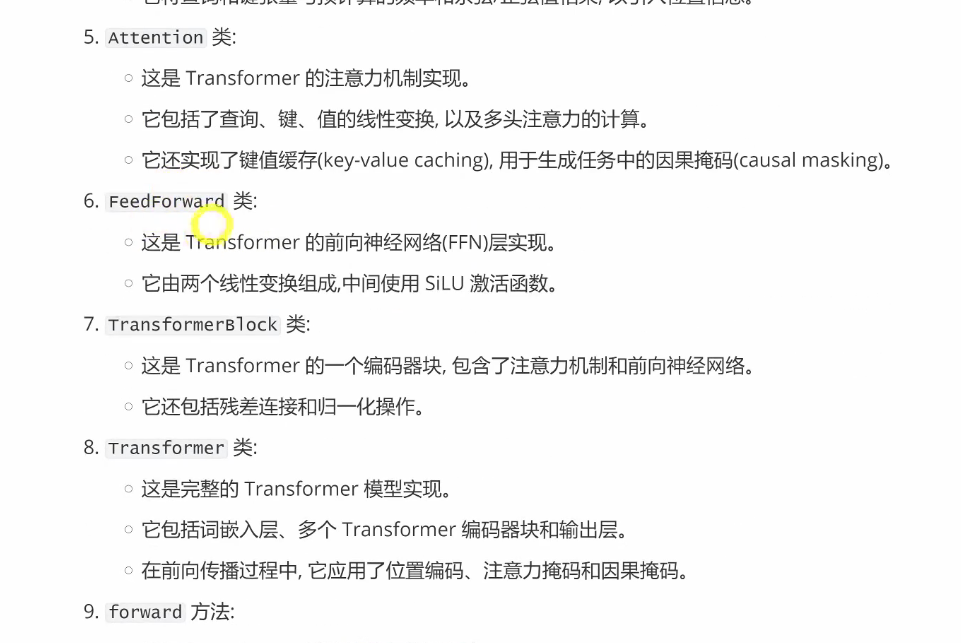

## **Llama 3 代码解析**
> github site
> 
> 各文件功能简要描述
> 
> **completion chat text代码实战**
> chat 是微调模型
> 
> text completion 是预训练
> llama.build传入大模型构建参数
> 
> 
> 
> 补全模式，promt输入
> 
> 
> chat模式 列表输入（包括多轮对话的输入）
> 
> 
> 
> 
> few-shot 和 one-shot promt,提示中提供示例
> few-shot 提供了多个示例，提供了更好的上下文
> 
> 额外工具，fire是一个由google开发的python库，旨在将python函数快速转换为命令行接口（CLI）
> 适合快速创建和部署可以从终端运行的脚本
> 
> 
> **generation py文件解析**
> 使用pytorch和fairScale实现的llama3模型生成器
> 构建和加载模型检查点的方法，以及针对给定提示生成文本序列的功能，还定了处理文本完成和对话生成的方法，通过调用语言生成模型来生成文本。
> 模型加载、文本生成、对话生成
> 
> 代码主要组成部分
> 
> 
> 
> 
> generate方法和处理过程
> 
> 
> 
> 
> text补全模式和chat模式调用generate的方法
> 提高代码的重用性和模块化
> 
> 两种模式在生成prompt_tokens时有一些不同
> token编码方式也不相同
> 生成目标不同
> 生成结果后处理也不同
> 
> 
> 
> 
> 总结：completionPrediction和chat prediction区别
> 
> 下面给出两种编码后的tokens格式
> text模式
> 
> 
> 
> chat模式 添加特殊bos编码
> 角色非常重要，提供上下文信息，提供角色扮演
> 还需要经过tokenizer中定义的encode方法处理，添加特殊标记
> 
> 
> **model文件解析**
> 定义了transforemer模型
> 定义了完整的模型。包括词嵌入，位置编码、多头注意力机制
> 
> 
> 
> 
> model-args类
> 
> 类之间的关系
> 
> 