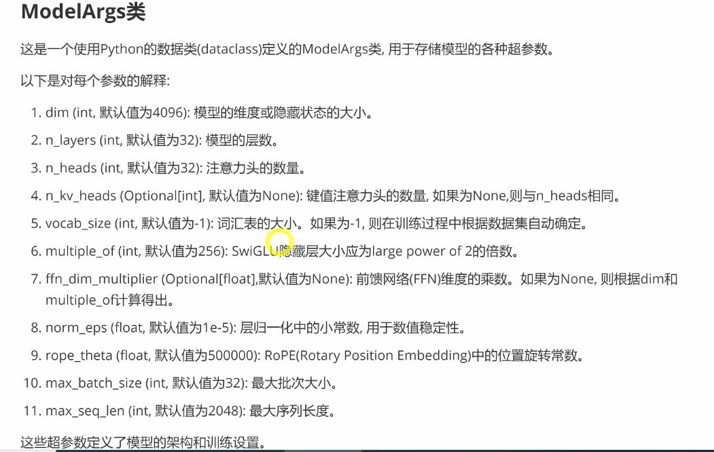
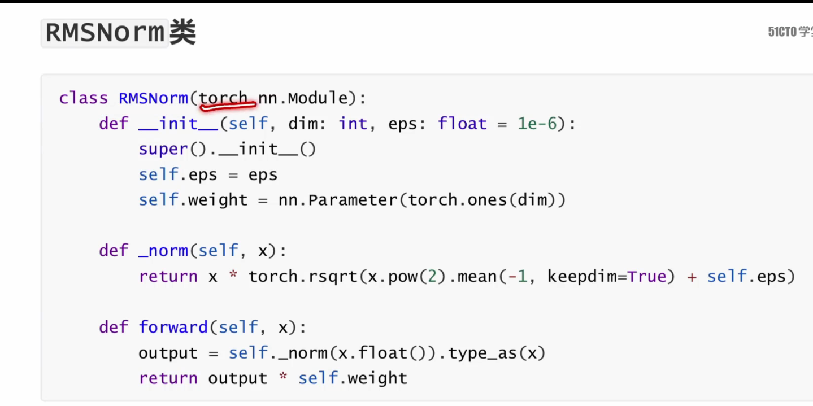
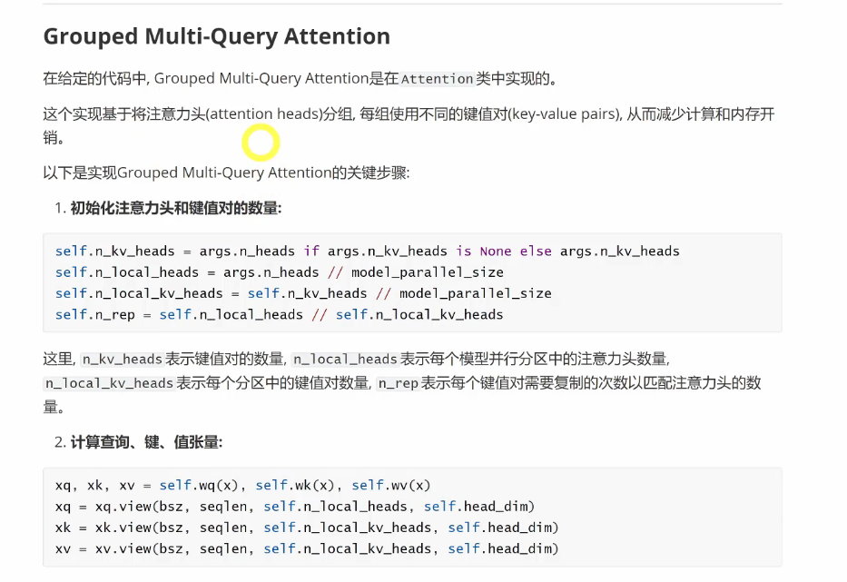

## **Llama 3 代码解析**
> github site
> 
> 各文件功能简要描述
> 
> **completion chat text代码实战**
> chat 是微调模型
> 
> text completion 是预训练
> llama.build传入大模型构建参数
> 
> 
> 
> 补全模式，promt输入
> 
> 
> chat模式 列表输入（包括多轮对话的输入）
> 
> 
> 
> 
> few-shot 和 one-shot promt,提示中提供示例
> few-shot 提供了多个示例，提供了更好的上下文
> 
> 额外工具，fire是一个由google开发的python库，旨在将python函数快速转换为命令行接口（CLI）
> 适合快速创建和部署可以从终端运行的脚本
> 
> 
> **generation py文件解析**
> 使用pytorch和fairScale实现的llama3模型生成器
> 构建和加载模型检查点的方法，以及针对给定提示生成文本序列的功能，还定了处理文本完成和对话生成的方法，通过调用语言生成模型来生成文本。
> 模型加载、文本生成、对话生成
> 
> 代码主要组成部分
> 
> 
> 
> 
> generate方法和处理过程
> 
> 
> 
> 
> text补全模式和chat模式调用generate的方法
> 提高代码的重用性和模块化
> 
> 两种模式在生成prompt_tokens时有一些不同
> token编码方式也不相同
> 生成目标不同
> 生成结果后处理也不同
> 
> 
> 
> 
> 总结：completionPrediction和chat prediction区别
> 
> 下面给出两种编码后的tokens格式
> text模式
> 
> 
> 
> chat模式 添加特殊bos编码
> 角色非常重要，提供上下文信息，提供角色扮演
> 还需要经过tokenizer中定义的encode方法处理，添加特殊标记
> 
> 
> **model文件解析**
> 定义了transforemer模型
> 定义了完整的模型。包括词嵌入，位置编码、多头注意力机制
> 
> 
> 
> 
> model-args类
> 
> 类之间的关系
> 
> 
> fairscale 优化和加速深度学习模型的训练过程
> 
> 
> **Tokenizer文件解读**
> tokenizer类用于将文本进行表计划和编解码
> chatformat类使用tokenizr类编码不同角色和内容的消息
> 
> 正确使用分词器非常重要
> 
> 
> 代码提供了一个强大的分词器和聊天格式化工具，将文本转为token序列，并将聊天对话格式转为模型能理解的
> 
> 分词器的作用，
> 文本分词(BPE）、token到id的映射(词汇表)、特殊标记的处理（加入bos,eos）、编码解码、处理大型文本
> 
> llama3中使用的特殊标记
> start_header_id、end_header_id、begin_of_text
> 引入特性标记和提示格式为与模型进行结构化交互提供了强大的机制
> 
> 
> special_tokens（meta定义）和tiktoken分词器（google开发）的词汇表之前有如下关系
> 主要应用在chat模式中，text补全模型并没有明确使用这些特殊标记
> 
> 
> 
> 特殊标记的添加方法
> system prompt\user\assistant
> 
> Message和Dialog的关系：
> Dialog是有多个Message组成的完整对话序列
> 
> 举例说明分词器处理流程
> 添加bos标记，添加userid
> 
> 
> 
> 
> **RMSNorm文件**
> 对每个时间步的隐藏状态向量进行归一化
> 每个时间步的输入向量被独立归一化，适用于处理变长序列和保持时间步间的独立性
> 
> 
> 
> 计算公式如下：
> 
> 
> 
> **swiglu激活函数**
> 
> **GQA实现**
> 
> **RoPE实现**
> 
> **KVCache实现**
> 初始化-》更新-》追加
> 
> 
> 代码中实现KVCache的方式
> 