## **llama3部署**
> **阿里云实例创建**
> 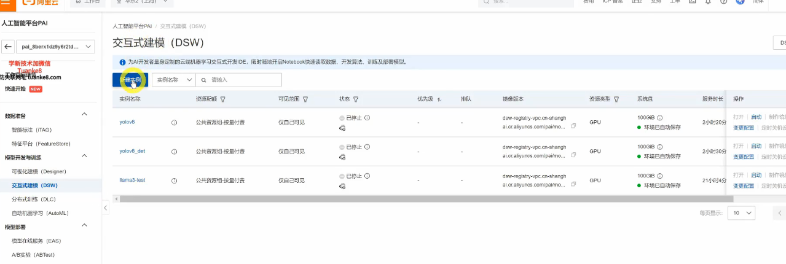
> **ollama介绍**
> ollama支持的model
> 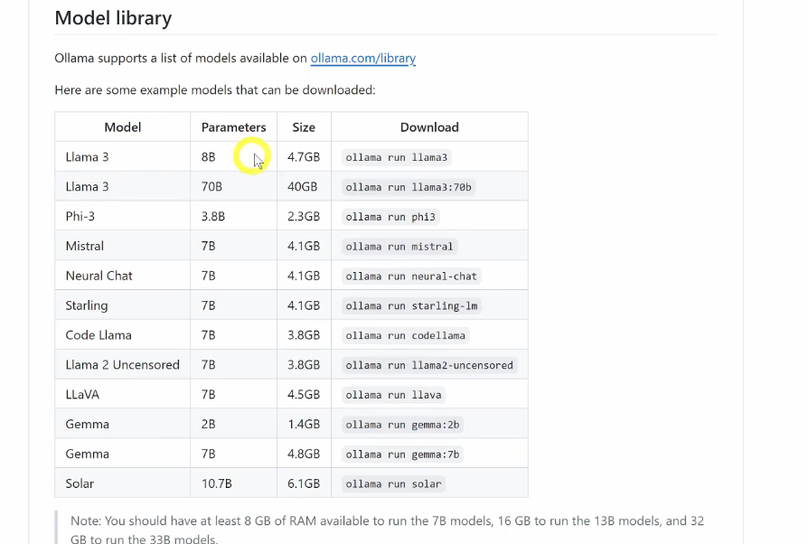
> **ollama部署llama3**
> ollama主要特点，包括本地化部署，模型管理，open-webUi集成，命令行交互，优化与微调
> 允许用户会模型进行优化，包括微调和强化学习
> 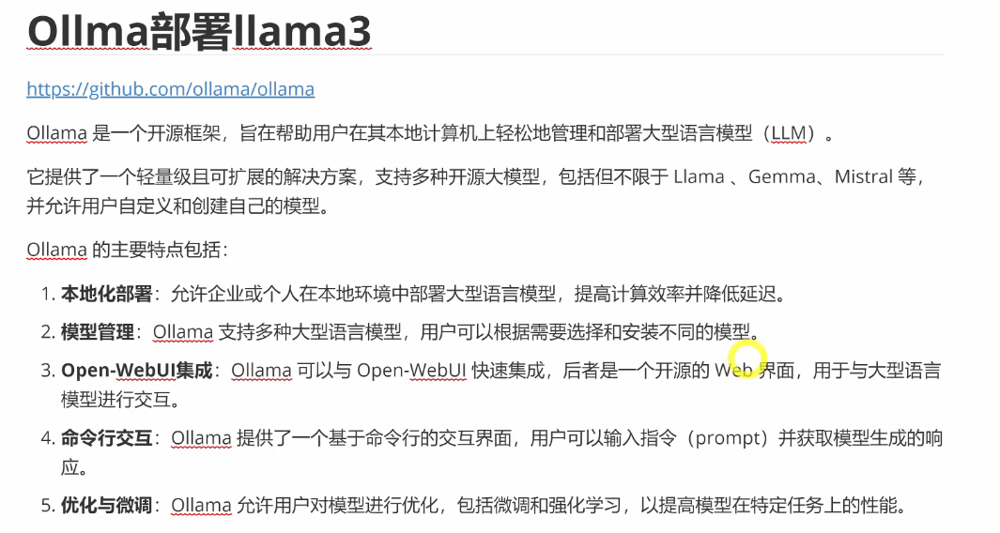
> 部署步骤
> 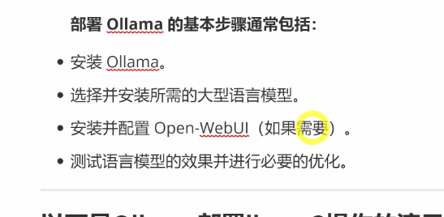
> 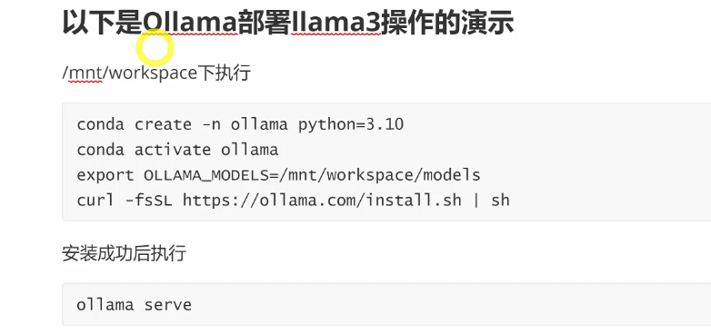
> 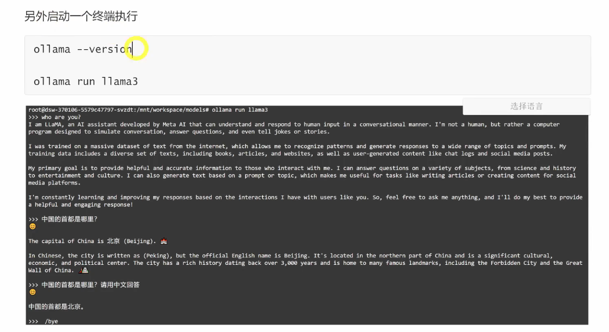
> **ollama3推理**
> 使用rest api 交互
> ollama有一个rest api 用于交互模型
> 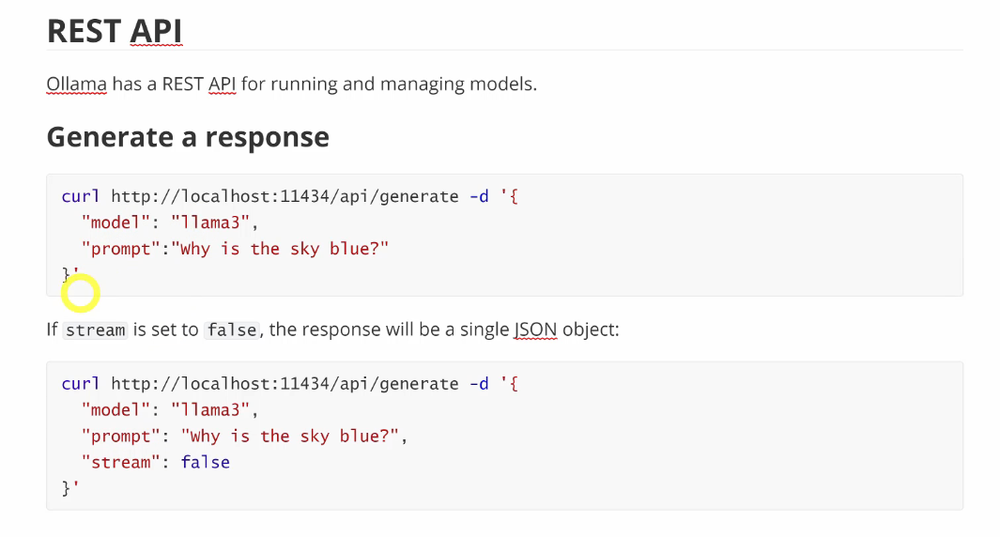
> 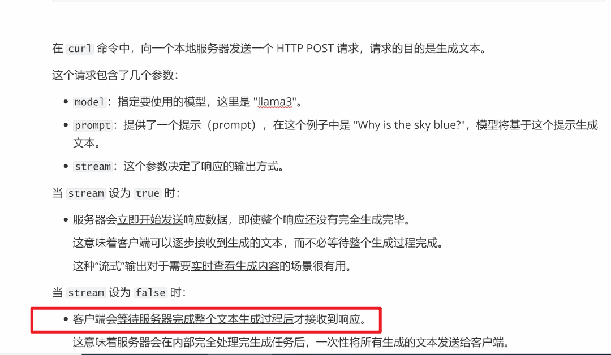
> chat with a model
> 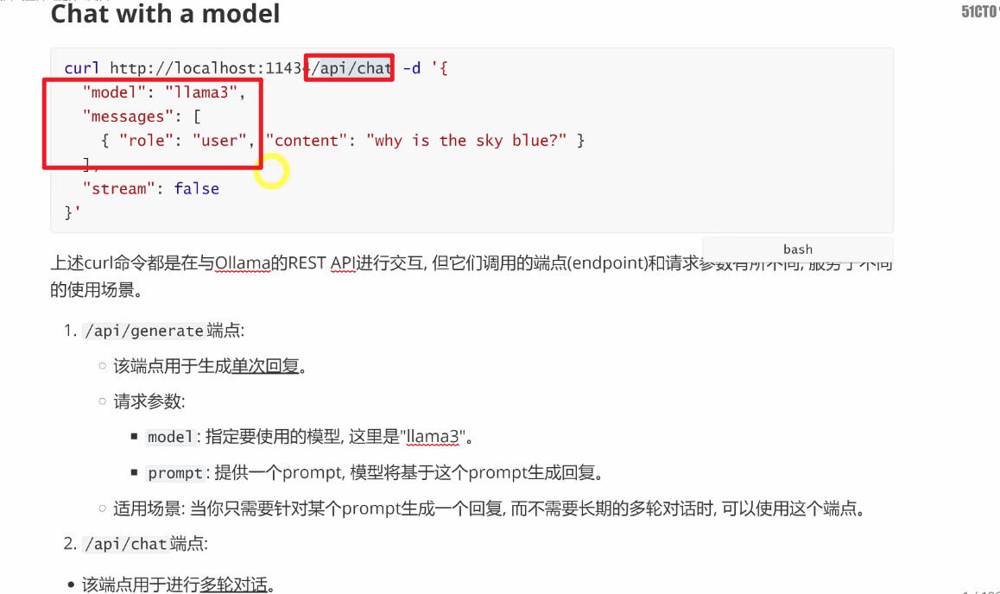
> 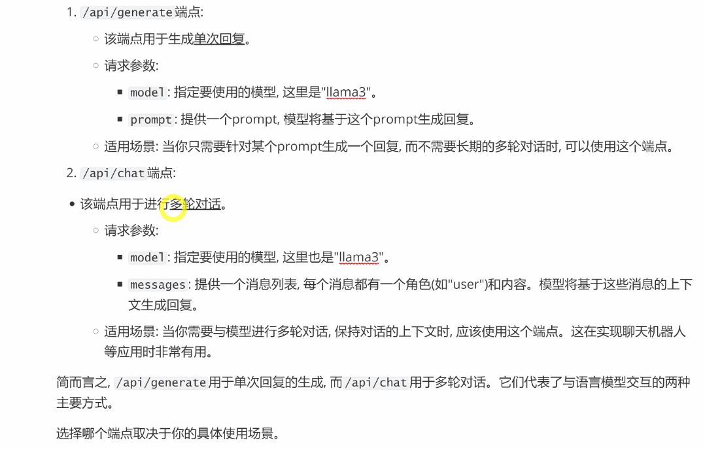
> 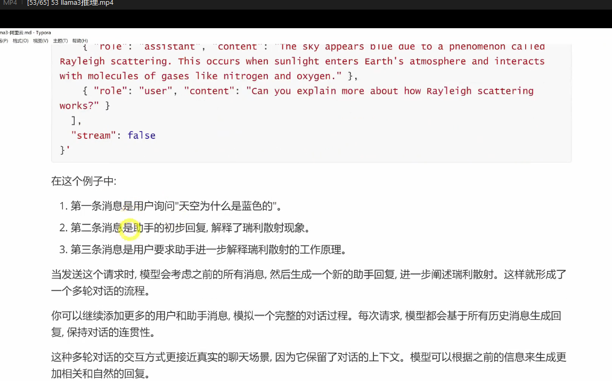
> 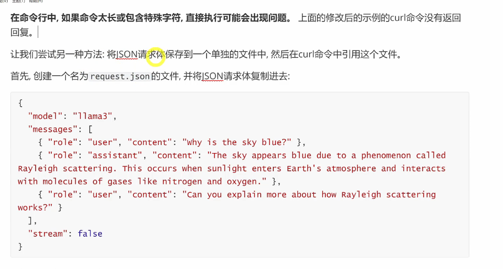
> **vllm部署llama3-8b-instruct**
> vllm是一个用于大模型推理和服务的库
> 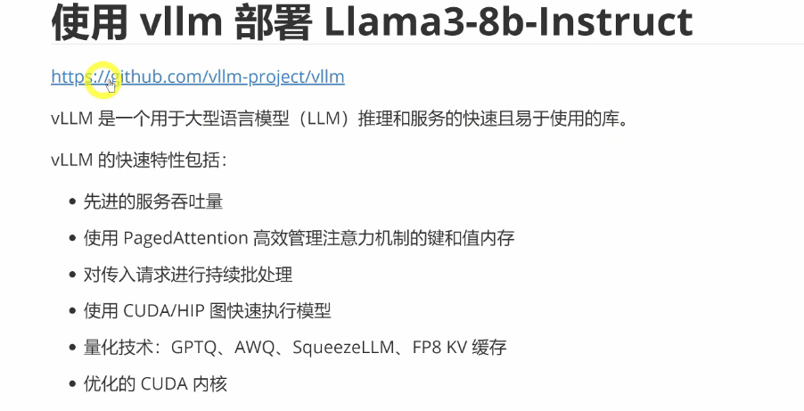
> 下载llama3模型文件
> 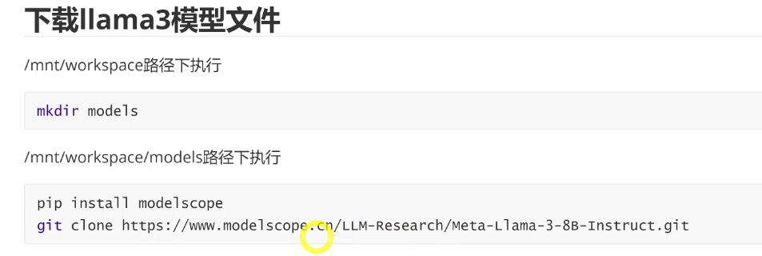
> 安装vllm
> 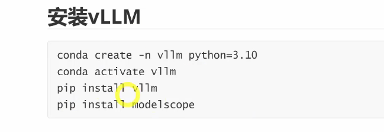
> 模型推理 两个模式
> 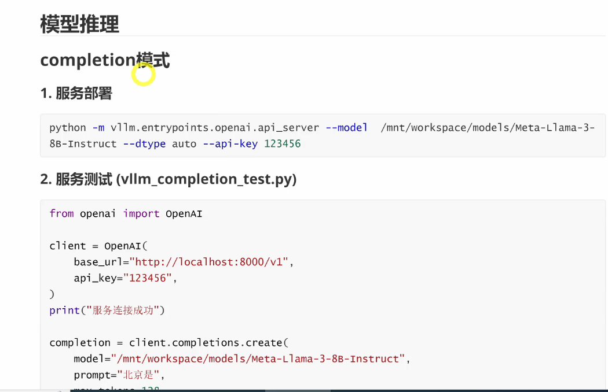
> 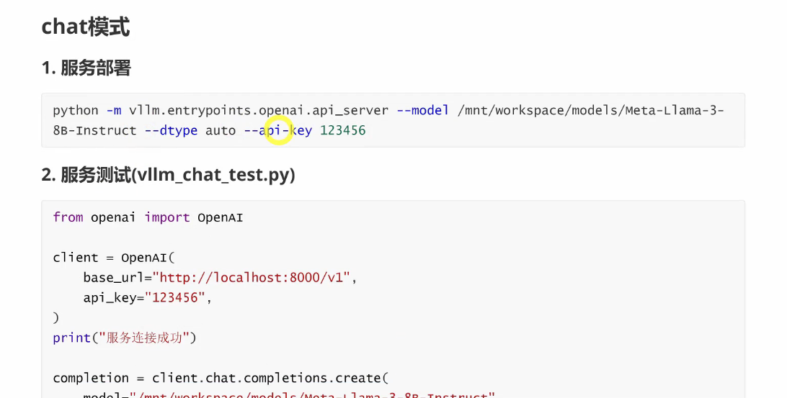
> **llama-factory 微调llama3模型**
> llama-factory 一种用于大型语言微调的工具
> 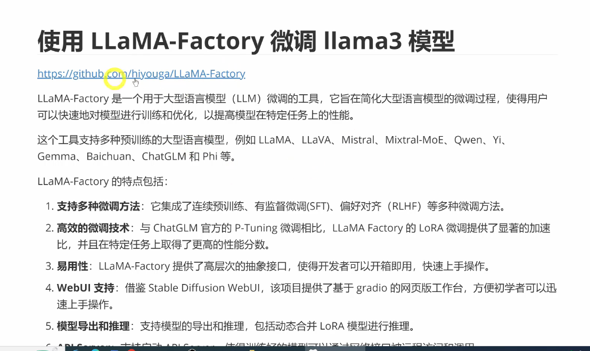
> 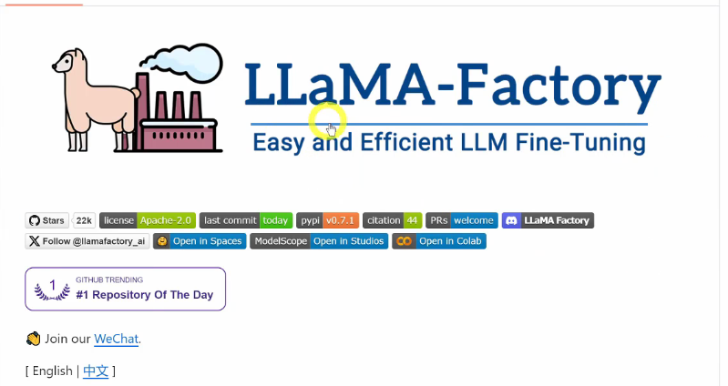
> 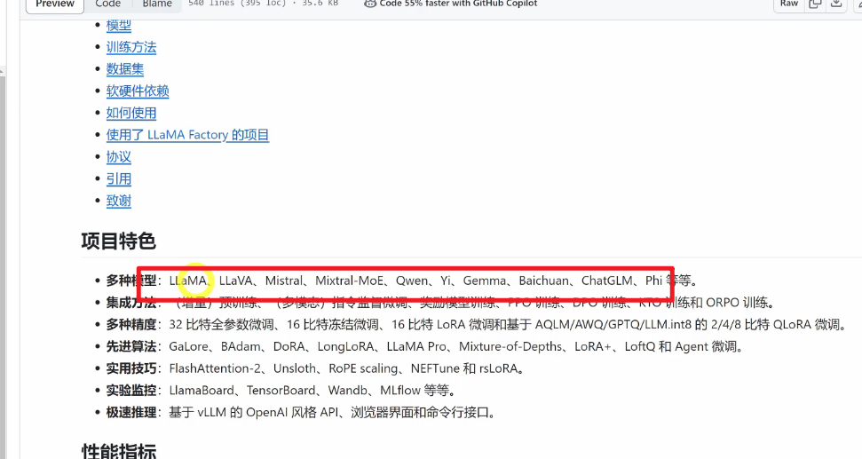
> 相比chatglm官方的p-tuning微调项目，提供了3.7倍加速比
> 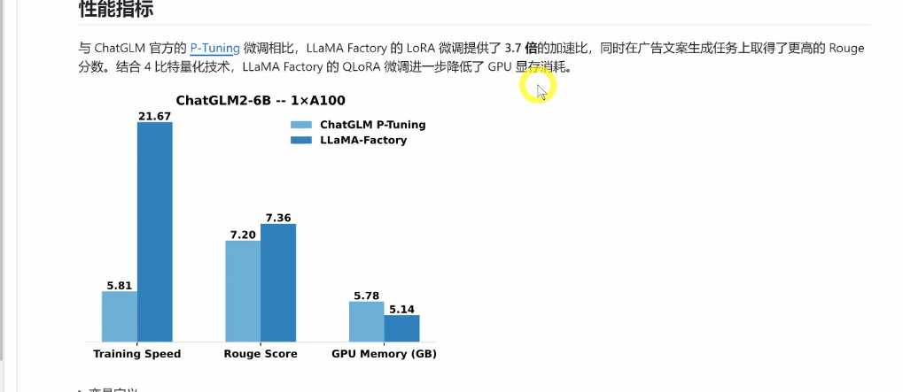
> 支持的训练方法
> 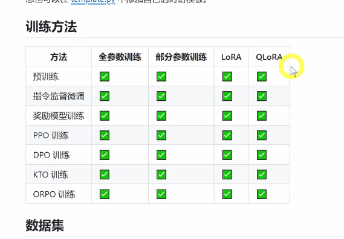