## swintransformer
### 1 swintransformer整体概述
> 简介 新一代backbone
> 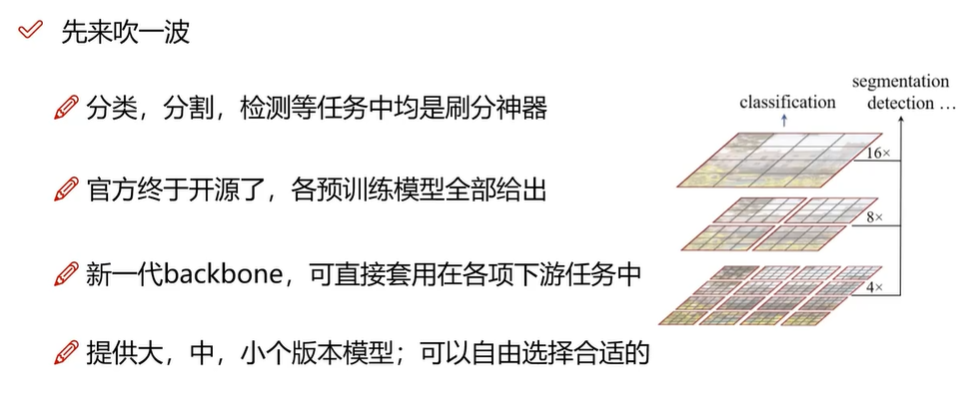
### 2 要解决的问题及其优势分析
> 解决问题
> 用窗口和分层的形式替代长序列方法
> 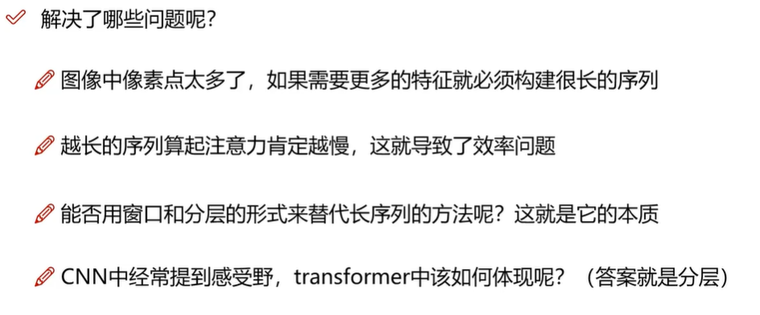
### 3 swintransformer整体网络结构
> 整体网络结构 首先对原始图像卷积，提取特征图
> 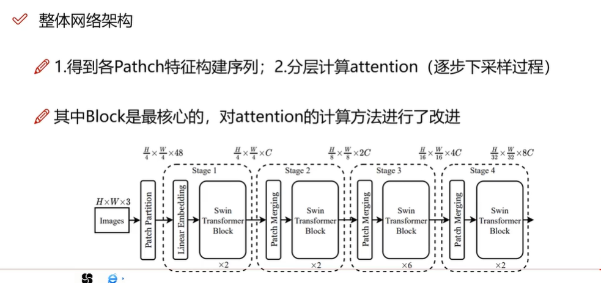
> 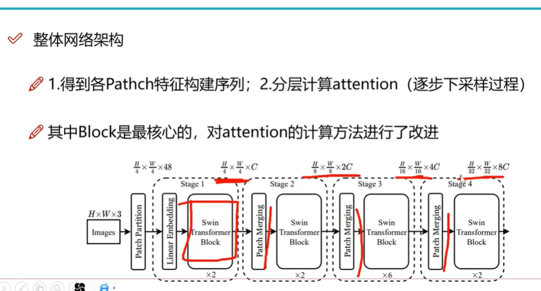
> 对attention机制的改进 窗口注意力机制
>  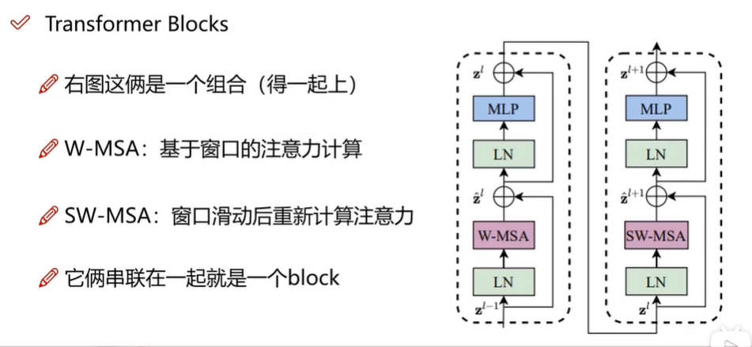
> 第一层 patch embedding
> 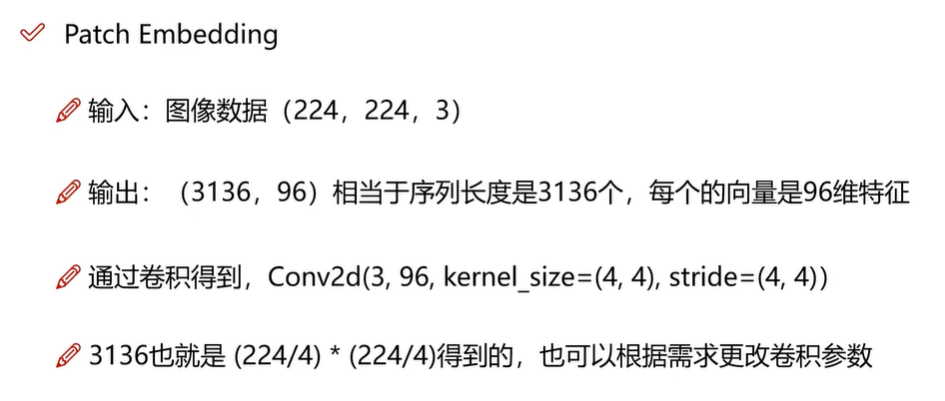
> 重要 window_partition 窗口 再次细分窗口
> reshape操作
> 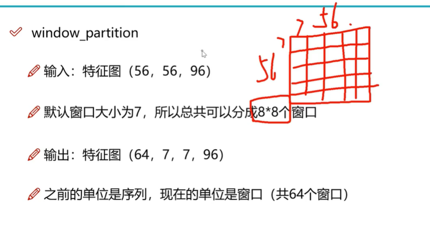
### 4 基于窗口的注意力机制解读
> wmsa window multi-head self attention
> 注意输入输出维度
> 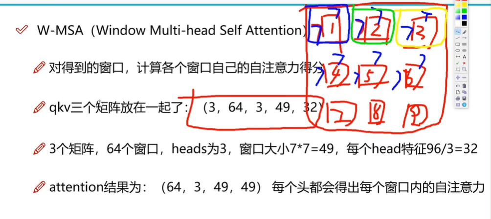
> window reverse
> 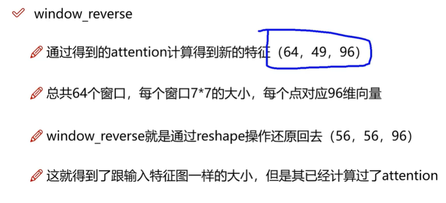
> sw-msa shifted window
> 滑动窗口
> 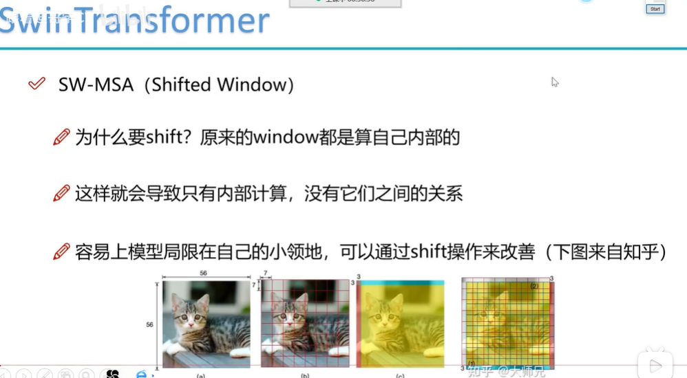
> 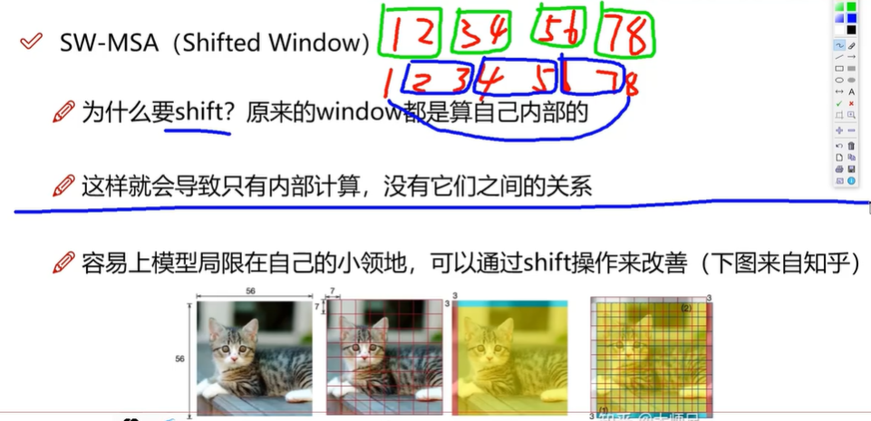
### 5 偏移细节分析及其计算量概述
> 位移中的细节 保持计算量相同
> 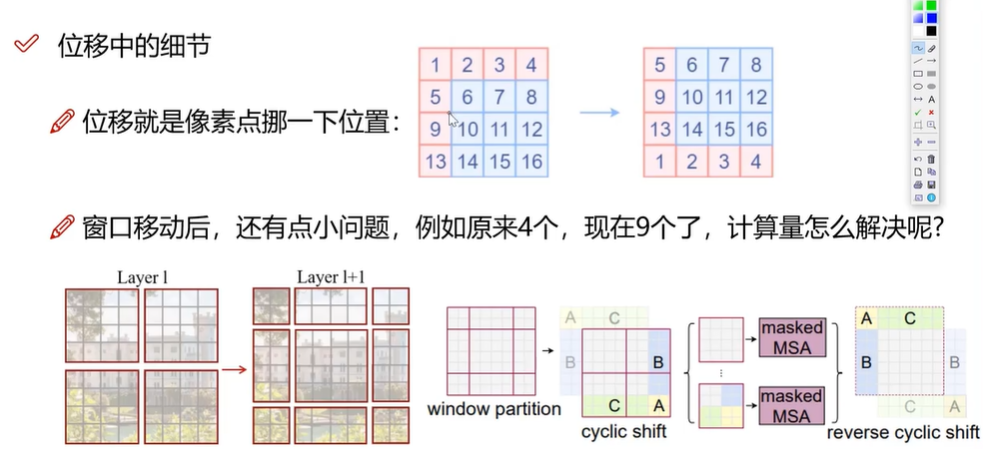
> 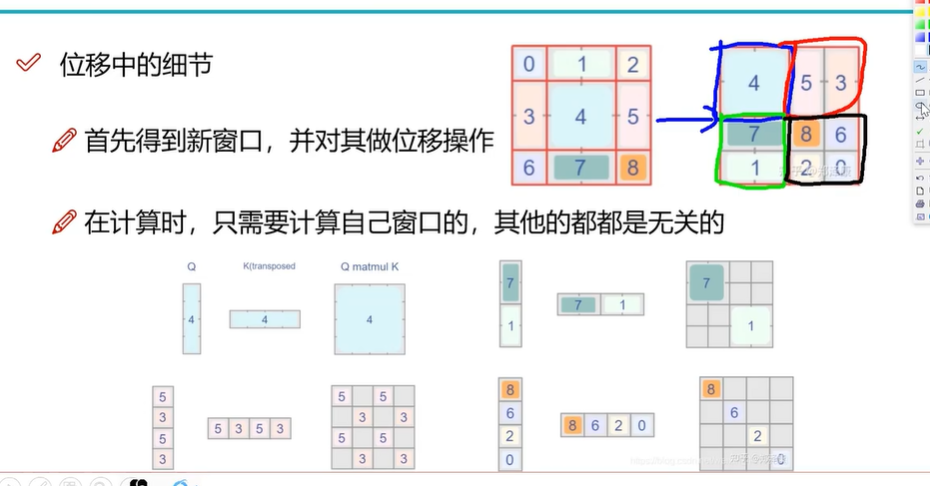
> 设置好对应位置的mask 
> 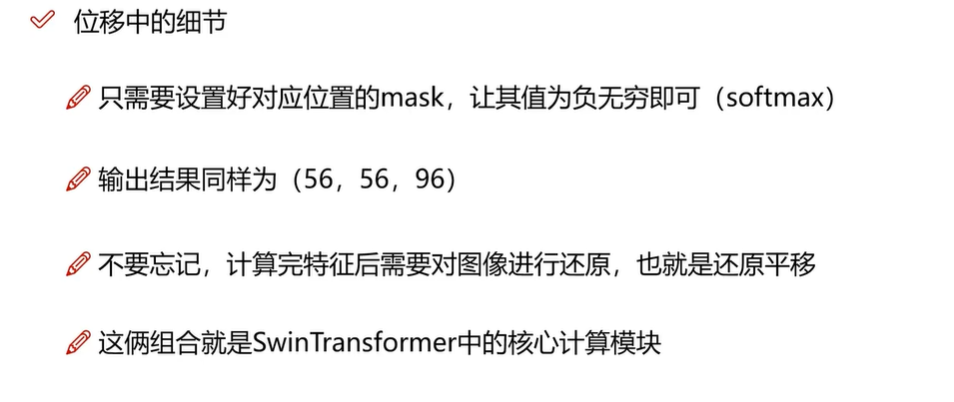
> 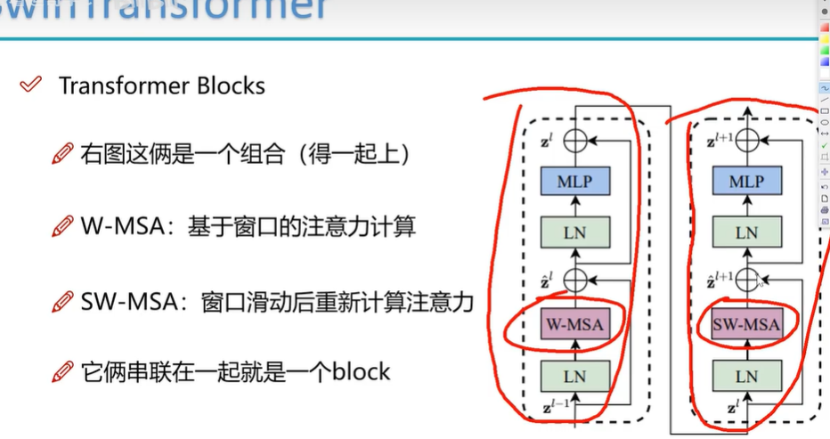

### 6 下采样操作实现方法
> 不同于池化 间隔采样
> 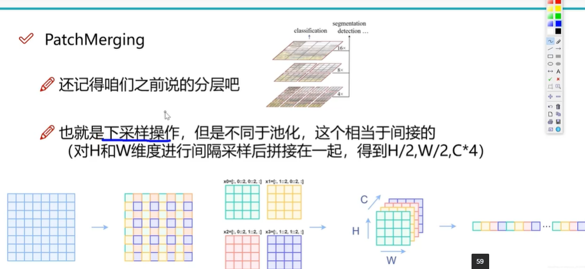
> patch merge
> 
### 7 分层计算方法 
> 根据任务来选择合适的head 
> 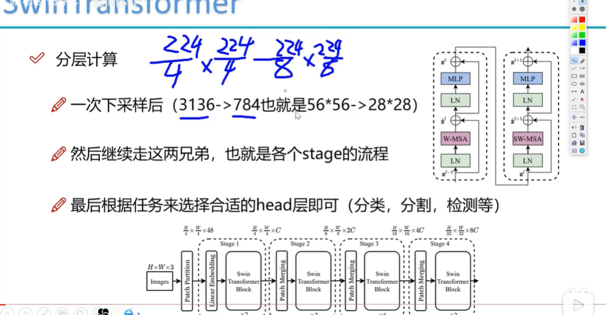

### 8 模型分层解读
> 图像数据与patch编码
> 输入图片 4，3，224，224 batch为4
> 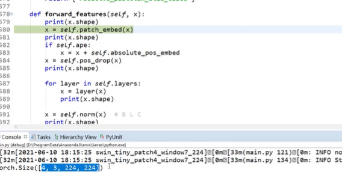
> patch embedding 4,3136,96 
> 最开始有个4的卷积核 224/4 * 224/4 = 3136
> 96个卷积核
> 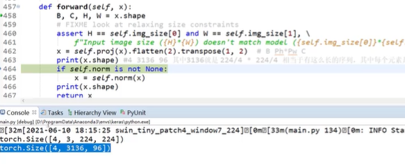
> WMSA 4,8,7,8,7,96 共有64个窗口
> 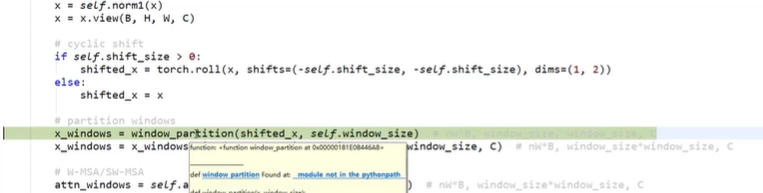
> 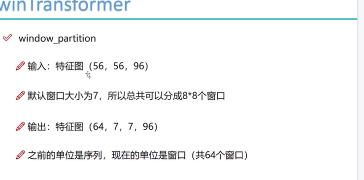
> 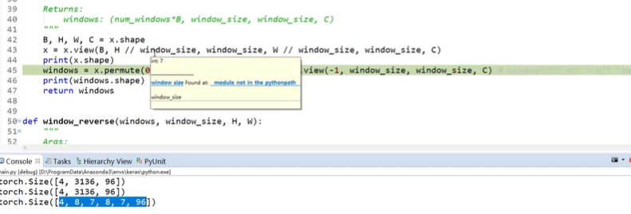
> 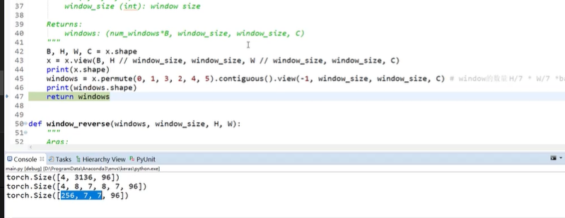
> attention 多头注意力机制
> 3（qkv），256(4*64窗口)，3(3个多头)，49，32（每一头的向量个数 3*32=96）
> 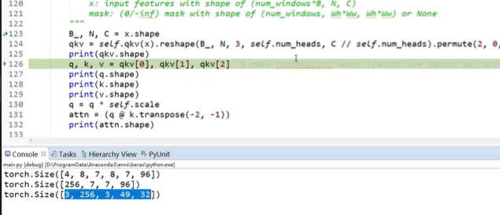
> 单独的qkv 矩阵维度256，3，49，32 
> 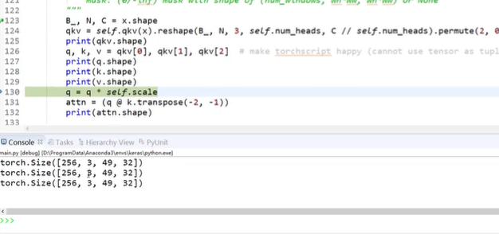
> attention输出结果
> 256 3 49 49
> 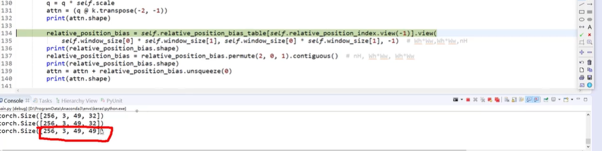
> softmax 新的窗口值
> 256 49 96
> 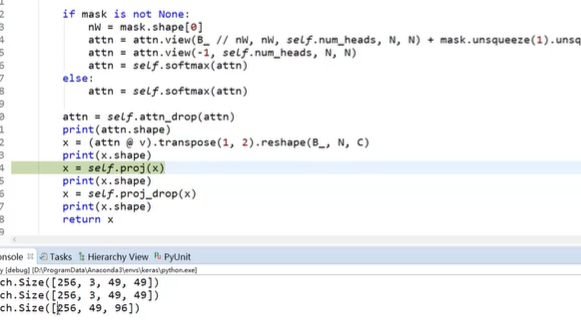
> 下采样
> 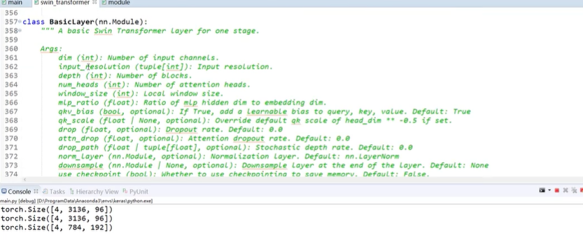
> 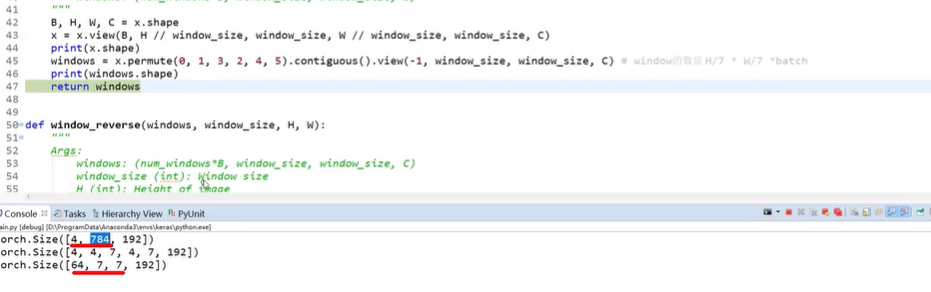
> 