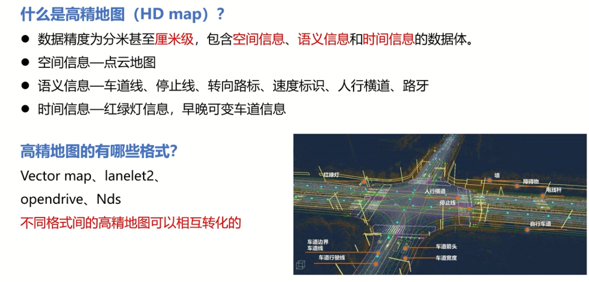

## 02建图

### 章节目录
> 

### 2.1 高精地图与经典建图算法
> 高精地图概述 格式可以互相转化
> 
> 点云地图的构建 （定位与建图）
> 
> 高精地图生产流程
> 
> 经典slam算法
> 
> 
> 

### 2.2 map_file模块（上）
> 讲解流程
> 
> map file 包
> 
> 关键function
> 

### 2.3 map_file模块实践
> launch文件
> 
> new_map.launch
> 
> 源码文件
> 
> 发布pcd path
> 
> vector_map 解析csv文件
> 
> 
> 

### 2.4 NDT_mapping 模块介绍及源码解析
> 模块介绍
> 
> 关键func
> 
> 源码解析 输入输出
> 
> #### point 回调
> 点云过滤 第一帧点云插入 体素滤波
> 
> 
> ndt优化 调用pcl库
> 
> guess pose
> 
> 
> 
> NDT 算法
> 
> 坐标系转换
> 
> 计算两帧之间的差值
> 
> 差值大时 更新点云
> 
> #### imu 回调
> 

### 2.6 基于NDT_MAPPING建立地图
> 运行my_mapping.launch
> 
> 修改参数 点云插入 更密集的点云
> 
> 
> 只编译某个包指令
> --cmake-args --packages-select
> 
> 当imu初值不正常时
> 
> 点云地图的保存
> 
> rosbag转成pcd
> 

### 2.7 矢量地图搭建
> 
> 在点云地图上绘制
> 
> 