## chapter5 仿真
### 目录
> 

### 5.1 仿真的必要性及常见仿真工具介绍
> 仿真的意义
> 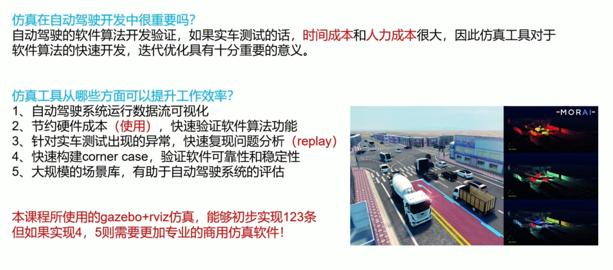
> 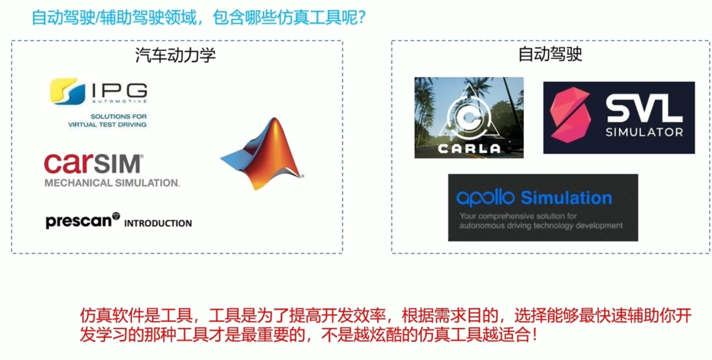

### 5.2 仿真模块介绍及源码分析
> 模块介绍
> 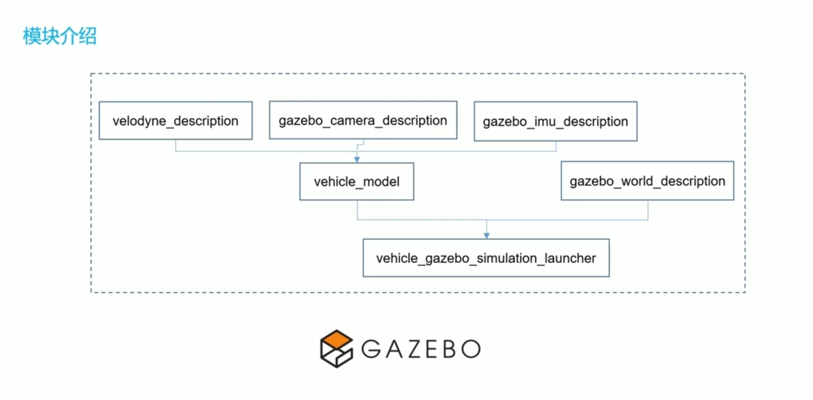
> 代码分析及实践
> mini_sil_env
> 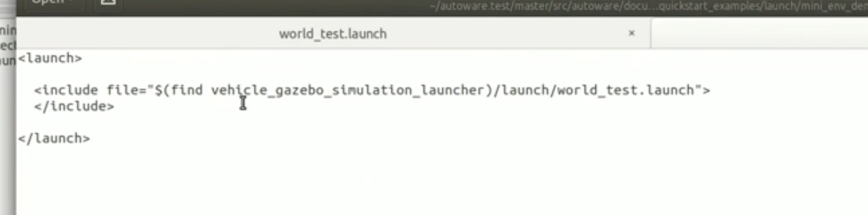
> 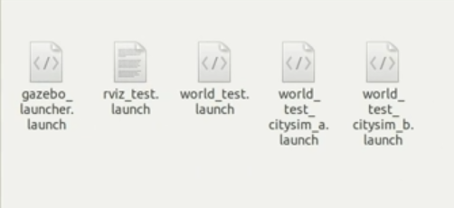
> 车辆模型
> 
> world模型
> 
> 解析车辆模型的插件
> 
> 车辆动力输入的插件
> 
> 车辆控制的输入 底盘控制
> 
> tf坐标变换
> 
> 读取车辆基本信息 订阅 发布
> 与gazebo交互桥梁
> 
> #### 切换仿真环境 
> 
> world文件解析
> 加载了个插件
> 
> 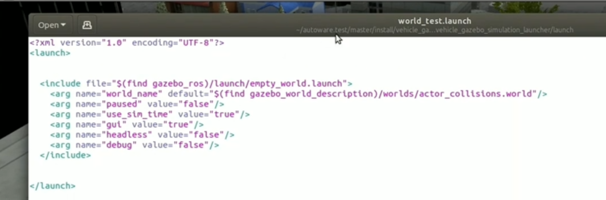
> 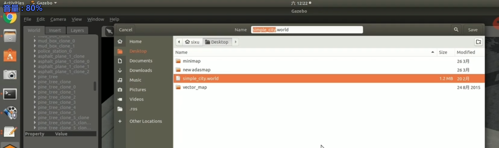
> 车辆urdf文件解析
> urdf 传感器插件
> 
> 车辆基本参数
> 
> 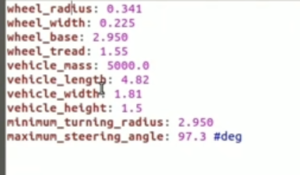
> 
> 传感器配置
> 
> 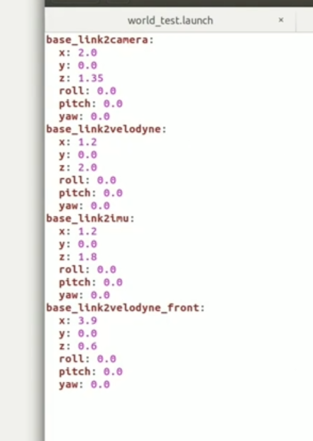

### 5.3 实践：车辆加入传感器
> 
> 
> 

### 5.4 仿真环境下的感知与定位
> 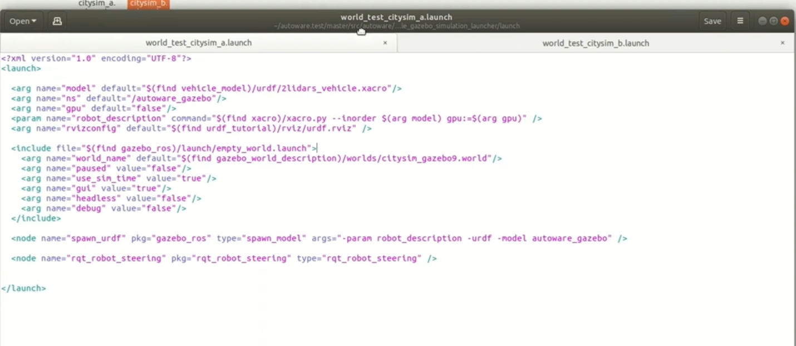
> 有和gazebo通信的bridge需要启动
> 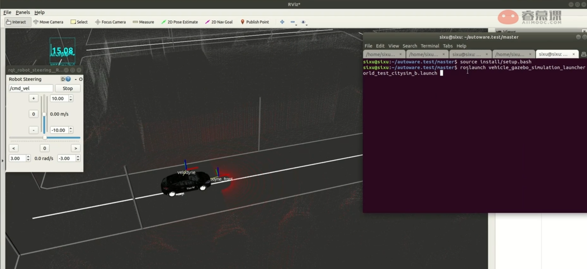
> 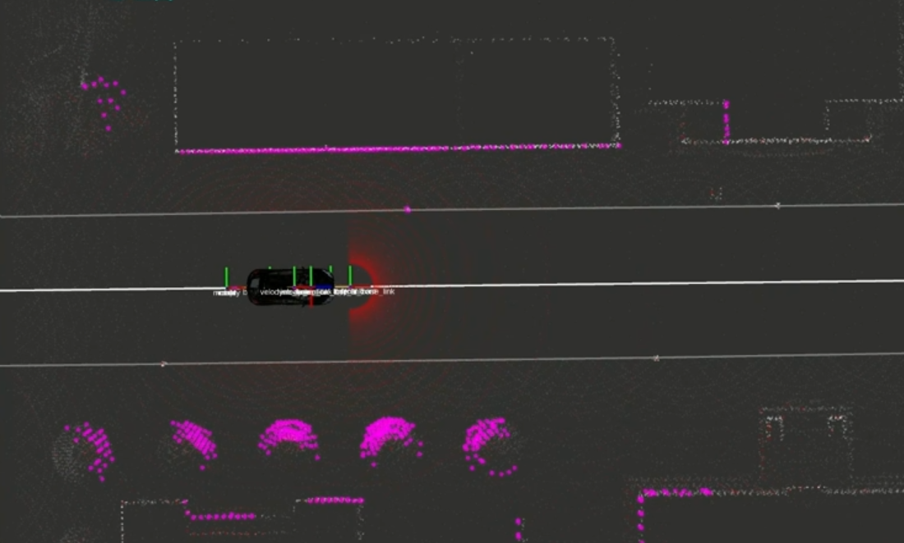

### 5.5 作业讲解
> 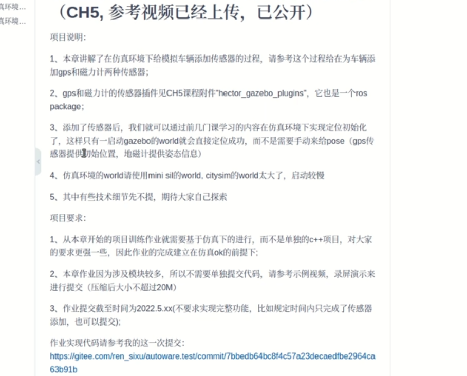
> 
> 
> 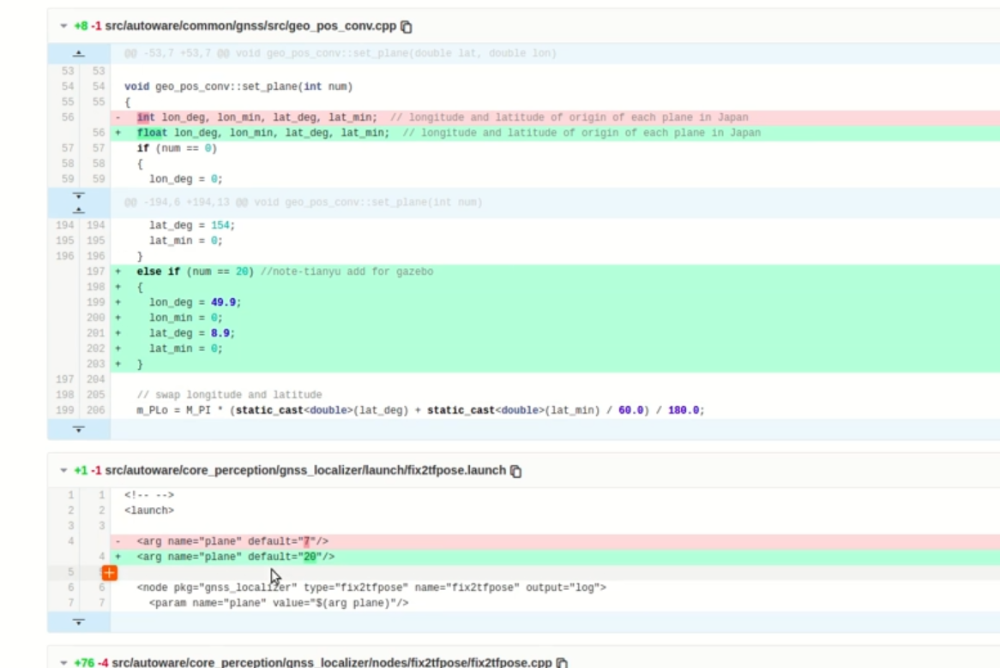