## bev感知方法介绍
> 目录
> 

### 1 bev感知算法概念
> bev概念（鸟瞰图，俯视图）
> 尺度变化小，遮挡小 
> 反应人脑对外界的响应
> 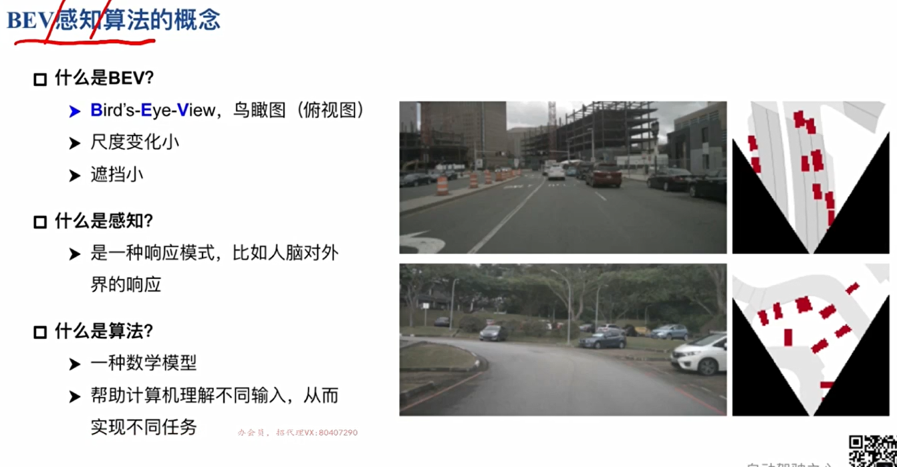
> bev感知算法的概念
> 建立在众多子任务上的概念（分类 检测 分割）
> 输入: camera lidar gps ...
> 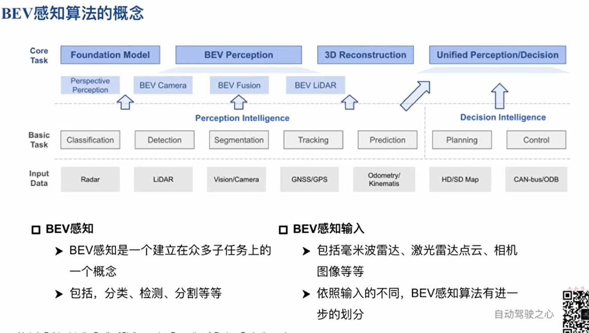
### 2 bev感知算法数据形式
> 图像
> 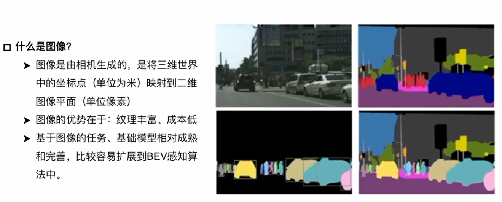
> 图像数据的处理
> 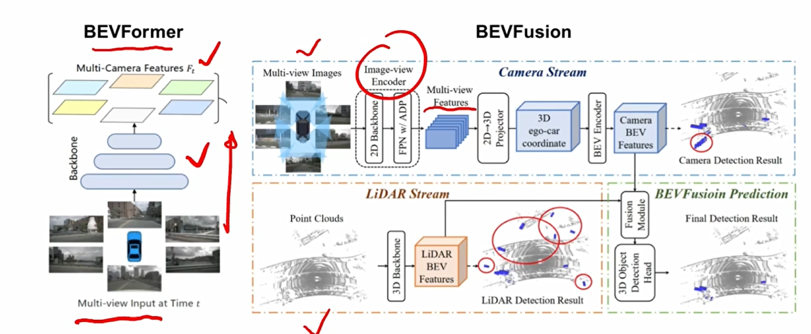
> 点云（稀疏性点云，无序，远少近多）
> 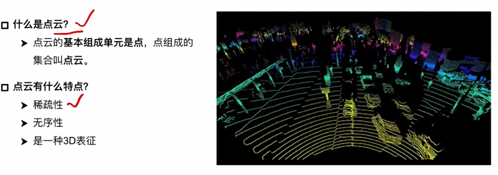
> 如何提取点云特征（point based, voxel based）
> 需要一些聚合方法，结合局部空间
> 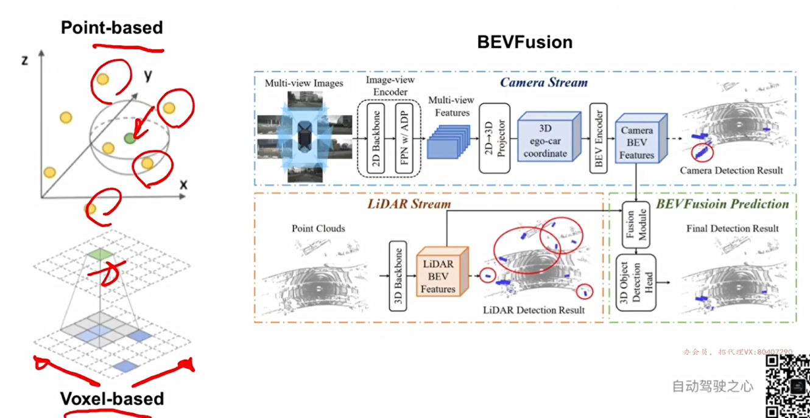
### 3 bev开源数据集介绍
> kitti数据集
> 
> 转换矩阵
> 
> 目标标注（遮挡+角度+2d框+长宽高+3维框中心坐标+置信度）
> 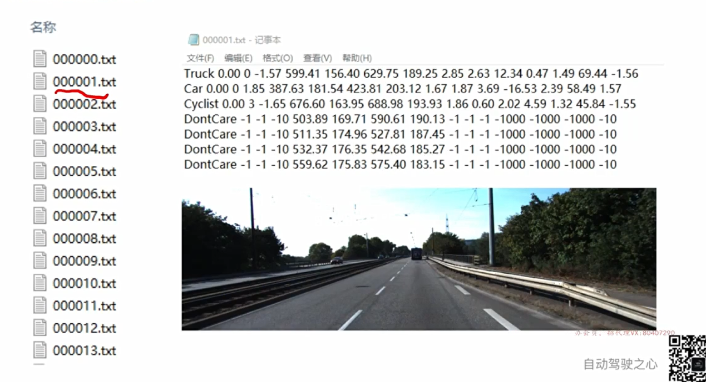
> 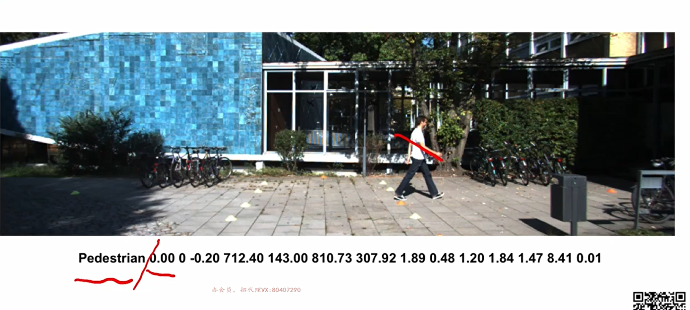
> nuscenes 数据集
> 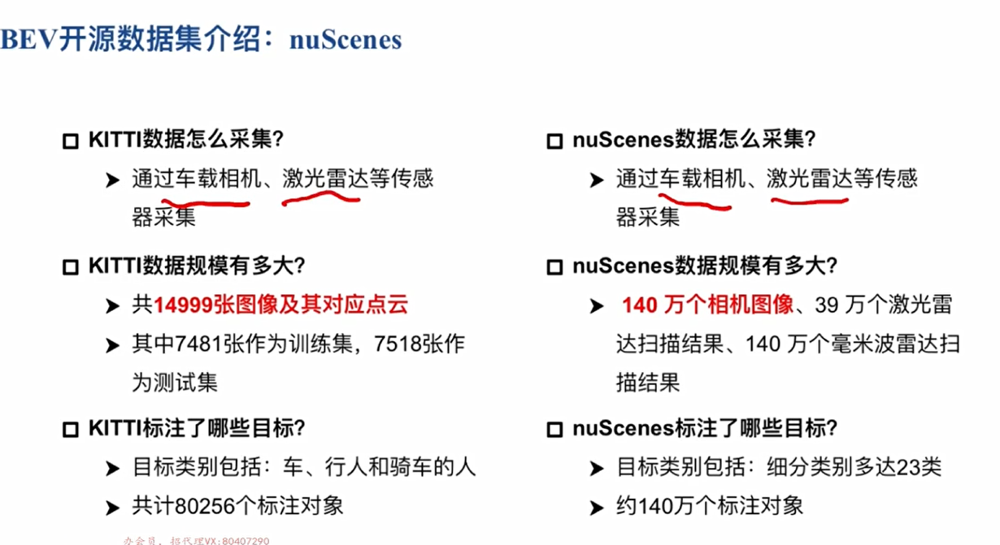
> 图像、点云、转换、标注
> 
> 四个文件夹（map用于决策，samples关键帧, sweeps其余帧未标注，v1.0json文件包括所有的meta数据）
> 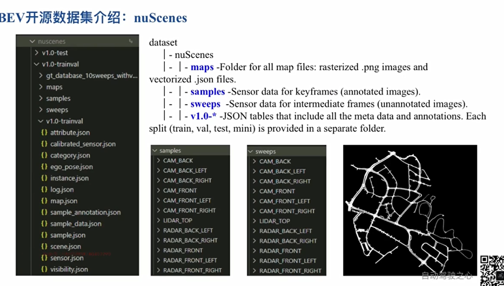
> json文件（转换矩阵，类别分类，sample样例，boundingbox信息）
> 
### 4 bev感知方法分类
> bev lidar（pre bev(3d特征提取),post bev（2d特征提取））
>  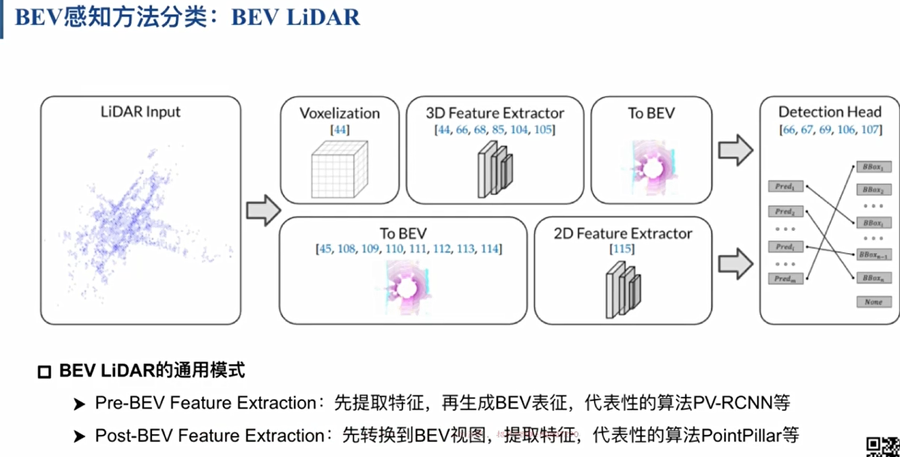
> pv-rcnn(pre bev)
> 3d->2dbev特征 拍扁
> 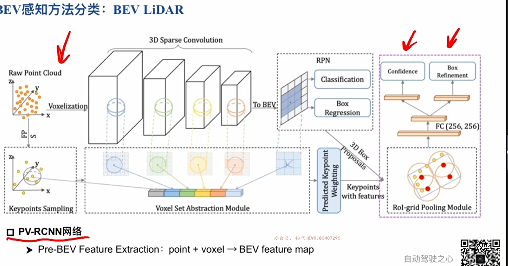
> bev camera 通用模式
> 关键：shared feature, view transformation(两种模式，2d->3d,3d->2d)
> 视角转换非常重要
> 
> 典型的框架 bevformer
> 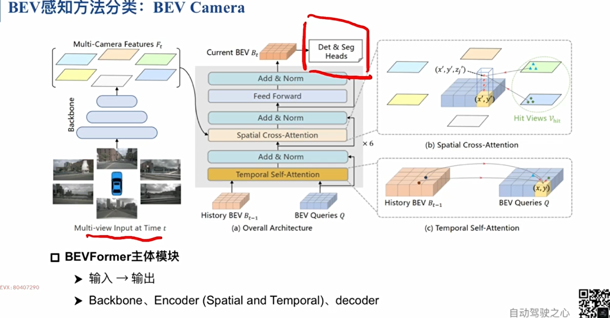
> bevfusion 算法 框架
> 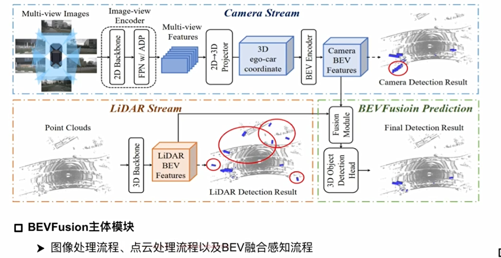
### 5 bev感知算法的优劣
>  通用3d检测结构 bev感知算法结构
> 
> bev鸟瞰图
> 
> bev感知算法对学术研究的意义
> 有利于探讨2d到3d的转换过程
> 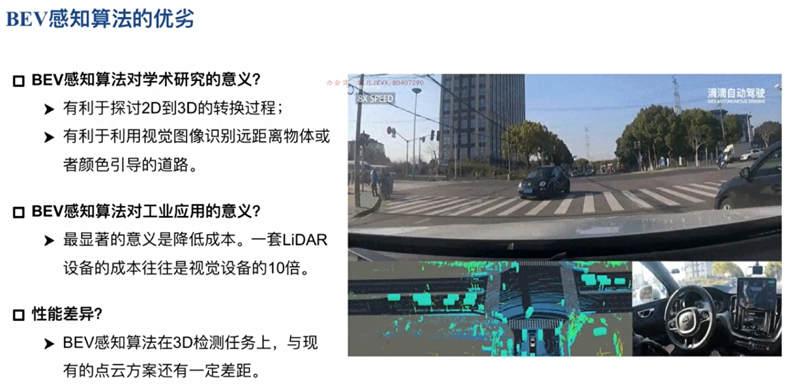
### 6 bev感知算法的应用介绍
> 三家公司的bev方案
> 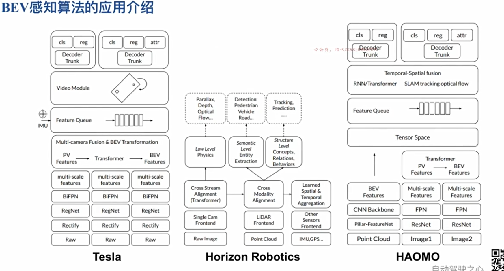
> 需要一个投射把pv 转换到 bev,而不是直接做融合
> 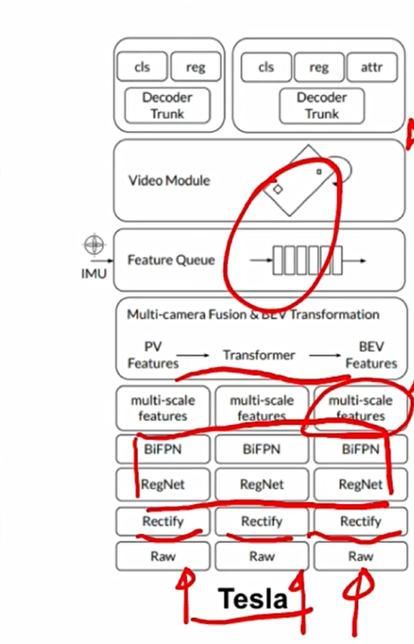
### 7 课程框架介绍与配置
> 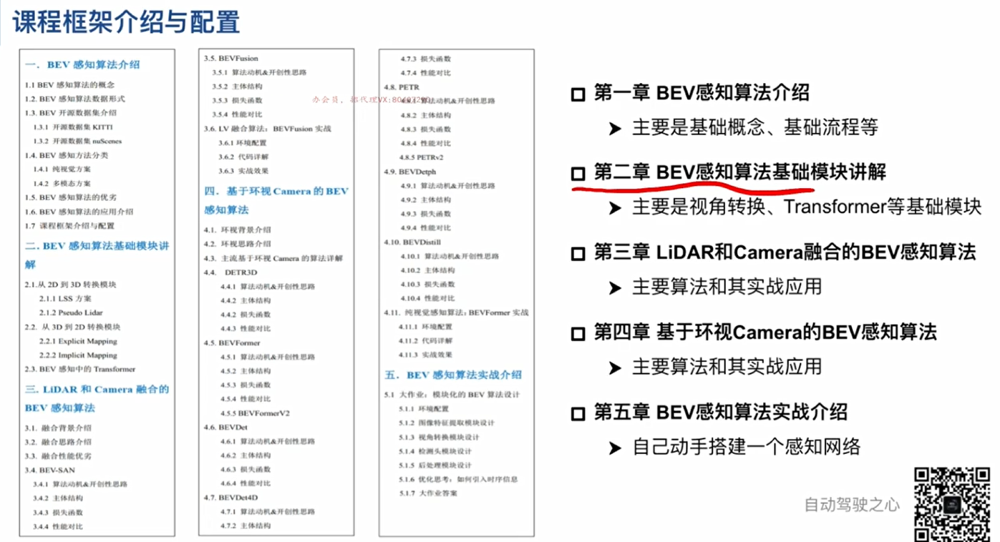