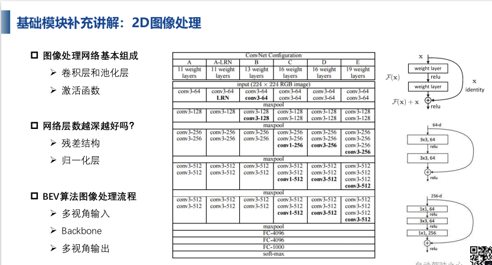

## 基础模块
> 目录
> 

### 基础模块补充讲解
> 2d图像处理
> 
> 3d特征之点处理方案（point based, voxel based）
> point based，利用点展开
>   
> voxel based
> 先将点云分为体素，提取体素内特征，进一步再提取体素的稀疏表示
> 无序->有序 
> 
### 2d到3d的转换模块
> 构建bev视角下的特征
> 
> 转换模块，在一条射线上，并不是一一对应的
> 2d图像坐标对应3d空间的一条射线
> 如果方程左侧深度坐标（最重要）已知，则一一对应
> 
> 最经典的LSS算法
> 首先lift 深度估计，splat 特征映射，shoot结果预测
> 
> 深度估计
> 给每条射线设定一个概率分布
> 每个点的维度是d*c 深度离散值 x 像素特征维度
> 先做离散的概率分布
> 
> pseudo lidar 伪点云 方法
> 误差来自深度估计的误差
> 
### 3d到2d的转换模块
> 再已经有的bev空间基础上，找在bev空间上对应的2d空间的点
> 利用bev空间的参考点，从多模态输入中查询对应特征
> 
> 一些基础的网络 detr3d
> 输入是2d图像，输出是3d box
> 基于3d特征的预测
> 3d object query 进行 2d image feature查询
> 基于3d的位置对2d的图像做补充（3d是第一布，2d是第二步）
> 
> FUTR3D 网络（explicit mappxing 显式）
> 通过3d reference point 采样不同模态的特征
> 
> implicit mapping 隐式映射
> detr3d,只适用于局部特征，对于全局特征学习不够充分
> 可以摆脱参考点的限制，自适应学习特征
> PETR（隐式特征）
>  3d点生成器作为另一个输入
> 3d坐标生成，从2d到3d的生成
> 将3d坐标的位置信息编码为图像特征，生成3d position-aware的特征
> 
### bev中的transformer模块
> 注意力机制
> 
> 不同方式的注意力机制
> 
> 
> 
> transformer 自注意力机制
> 查询向量query 键值向量 值向量 相似度计算
> 各自相关度*value 加权
> 
> vit 图像转为序列表示
> 
> swin transforemer
> 
> detr 
> 
> detr3d
> 